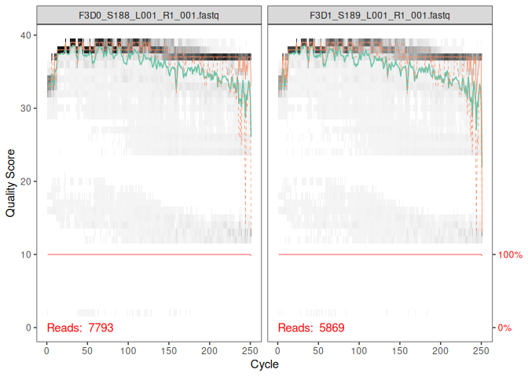

R Notebook
================

``` r
library(dada2)
```

    ## Loading required package: Rcpp

``` r
path <- "/home/rstudio/Dada2/MiSeq_SOP" # CHANGE ME to the directory containing the fastq files after unzipping.
list.files(path)
```

    ##  [1] "F3D0_S188_L001_R1_001.fastq"   "F3D0_S188_L001_R2_001.fastq"  
    ##  [3] "F3D1_S189_L001_R1_001.fastq"   "F3D1_S189_L001_R2_001.fastq"  
    ##  [5] "F3D141_S207_L001_R1_001.fastq" "F3D141_S207_L001_R2_001.fastq"
    ##  [7] "F3D142_S208_L001_R1_001.fastq" "F3D142_S208_L001_R2_001.fastq"
    ##  [9] "F3D143_S209_L001_R1_001.fastq" "F3D143_S209_L001_R2_001.fastq"
    ## [11] "F3D144_S210_L001_R1_001.fastq" "F3D144_S210_L001_R2_001.fastq"
    ## [13] "F3D145_S211_L001_R1_001.fastq" "F3D145_S211_L001_R2_001.fastq"
    ## [15] "F3D146_S212_L001_R1_001.fastq" "F3D146_S212_L001_R2_001.fastq"
    ## [17] "F3D147_S213_L001_R1_001.fastq" "F3D147_S213_L001_R2_001.fastq"
    ## [19] "F3D148_S214_L001_R1_001.fastq" "F3D148_S214_L001_R2_001.fastq"
    ## [21] "F3D149_S215_L001_R1_001.fastq" "F3D149_S215_L001_R2_001.fastq"
    ## [23] "F3D150_S216_L001_R1_001.fastq" "F3D150_S216_L001_R2_001.fastq"
    ## [25] "F3D2_S190_L001_R1_001.fastq"   "F3D2_S190_L001_R2_001.fastq"  
    ## [27] "F3D3_S191_L001_R1_001.fastq"   "F3D3_S191_L001_R2_001.fastq"  
    ## [29] "F3D5_S193_L001_R1_001.fastq"   "F3D5_S193_L001_R2_001.fastq"  
    ## [31] "F3D6_S194_L001_R1_001.fastq"   "F3D6_S194_L001_R2_001.fastq"  
    ## [33] "F3D7_S195_L001_R1_001.fastq"   "F3D7_S195_L001_R2_001.fastq"  
    ## [35] "F3D8_S196_L001_R1_001.fastq"   "F3D8_S196_L001_R2_001.fastq"  
    ## [37] "F3D9_S197_L001_R1_001.fastq"   "F3D9_S197_L001_R2_001.fastq"  
    ## [39] "filtered"                      "HMP_MOCK.v35.fasta"           
    ## [41] "Mock_S280_L001_R1_001.fastq"   "Mock_S280_L001_R2_001.fastq"  
    ## [43] "mouse.dpw.metadata"            "mouse.time.design"            
    ## [45] "stability.batch"               "stability.files"

``` r
# Forward and reverse fastq filenames have format: SAMPLENAME_R1_001.fastq and SAMPLENAME_R2_001.fastq
fnFs <- sort(list.files(path, pattern="_R1_001.fastq", full.names = TRUE))
fnRs <- sort(list.files(path, pattern="_R2_001.fastq", full.names = TRUE))
# Extract sample names, assuming filenames have format: SAMPLENAME_XXX.fastq
```

``` r
sample.names <- sapply(strsplit(basename(fnFs), "_"), `[`, 1)
```

``` r
plotQualityProfile(fnFs[1:2])
```

<!-- --> 250pb ligne
verte = moyenne des scores de qualité pour les 7793 seq pour chaque
position

``` r
plotQualityProfile(fnRs[1:2])
```

<!-- -->

``` r
# Place filtered files in filtered/ subdirectory
filtFs <- file.path(path, "filtered", paste0(sample.names, "_F_filt.fastq.gz"))
filtRs <- file.path(path, "filtered", paste0(sample.names, "_R_filt.fastq.gz"))
names(filtFs) <- sample.names
names(filtRs) <- sample.names
```

``` r
out <- filterAndTrim(fnFs, filtFs, fnRs, filtRs, truncLen=c(240,160),
              maxN=0, maxEE=c(2,2), truncQ=2, rm.phix=TRUE,
              compress=TRUE, multithread=FALSE) # On Windows set multithread=FALSE (only needed for filterAndTrim)
head(out)
```

    ##                               reads.in reads.out
    ## F3D0_S188_L001_R1_001.fastq       7793      7113
    ## F3D1_S189_L001_R1_001.fastq       5869      5299
    ## F3D141_S207_L001_R1_001.fastq     5958      5463
    ## F3D142_S208_L001_R1_001.fastq     3183      2914
    ## F3D143_S209_L001_R1_001.fastq     3178      2941
    ## F3D144_S210_L001_R1_001.fastq     4827      4312

``` r
errF <- learnErrors(filtFs, multithread=TRUE)
```

    ## 33514080 total bases in 139642 reads from 20 samples will be used for learning the error rates.

``` r
errR <- learnErrors(filtRs, multithread=TRUE)
```

    ## 22342720 total bases in 139642 reads from 20 samples will be used for learning the error rates.

``` r
plotErrors(errF, nominalQ=TRUE)
```

    ## Warning in scale_y_log10(): log-10 transformation introduced infinite values.

    ## Warning: Removed 164 rows containing missing values or values outside the scale range
    ## (`geom_line()`).
    ## Removed 164 rows containing missing values or values outside the scale range
    ## (`geom_line()`).

<!-- -->

``` r
dadaFs <- dada(filtFs, err=errF, multithread=TRUE)
```

    ## Sample 1 - 7113 reads in 1979 unique sequences.
    ## Sample 2 - 5299 reads in 1639 unique sequences.
    ## Sample 3 - 5463 reads in 1477 unique sequences.
    ## Sample 4 - 2914 reads in 904 unique sequences.
    ## Sample 5 - 2941 reads in 939 unique sequences.
    ## Sample 6 - 4312 reads in 1267 unique sequences.
    ## Sample 7 - 6741 reads in 1756 unique sequences.
    ## Sample 8 - 4560 reads in 1438 unique sequences.
    ## Sample 9 - 15637 reads in 3590 unique sequences.
    ## Sample 10 - 11413 reads in 2762 unique sequences.
    ## Sample 11 - 12017 reads in 3021 unique sequences.
    ## Sample 12 - 5032 reads in 1566 unique sequences.
    ## Sample 13 - 18075 reads in 3707 unique sequences.
    ## Sample 14 - 6250 reads in 1479 unique sequences.
    ## Sample 15 - 4052 reads in 1195 unique sequences.
    ## Sample 16 - 7369 reads in 1832 unique sequences.
    ## Sample 17 - 4765 reads in 1183 unique sequences.
    ## Sample 18 - 4871 reads in 1382 unique sequences.
    ## Sample 19 - 6504 reads in 1709 unique sequences.
    ## Sample 20 - 4314 reads in 897 unique sequences.

``` r
dadaRs <- dada(filtRs, err=errR, multithread=TRUE)
```

    ## Sample 1 - 7113 reads in 1660 unique sequences.
    ## Sample 2 - 5299 reads in 1349 unique sequences.
    ## Sample 3 - 5463 reads in 1335 unique sequences.
    ## Sample 4 - 2914 reads in 853 unique sequences.
    ## Sample 5 - 2941 reads in 880 unique sequences.
    ## Sample 6 - 4312 reads in 1286 unique sequences.
    ## Sample 7 - 6741 reads in 1803 unique sequences.
    ## Sample 8 - 4560 reads in 1265 unique sequences.
    ## Sample 9 - 15637 reads in 3414 unique sequences.
    ## Sample 10 - 11413 reads in 2522 unique sequences.
    ## Sample 11 - 12017 reads in 2771 unique sequences.
    ## Sample 12 - 5032 reads in 1415 unique sequences.
    ## Sample 13 - 18075 reads in 3290 unique sequences.
    ## Sample 14 - 6250 reads in 1390 unique sequences.
    ## Sample 15 - 4052 reads in 1134 unique sequences.
    ## Sample 16 - 7369 reads in 1635 unique sequences.
    ## Sample 17 - 4765 reads in 1084 unique sequences.
    ## Sample 18 - 4871 reads in 1161 unique sequences.
    ## Sample 19 - 6504 reads in 1502 unique sequences.
    ## Sample 20 - 4314 reads in 732 unique sequences.

``` r
dadaFs[[1]]
```

    ## dada-class: object describing DADA2 denoising results
    ## 128 sequence variants were inferred from 1979 input unique sequences.
    ## Key parameters: OMEGA_A = 1e-40, OMEGA_C = 1e-40, BAND_SIZE = 16

``` r
mergers <- mergePairs(dadaFs, filtFs, dadaRs, filtRs, verbose=TRUE)
```

    ## 6540 paired-reads (in 107 unique pairings) successfully merged out of 6891 (in 197 pairings) input.

    ## 5028 paired-reads (in 101 unique pairings) successfully merged out of 5190 (in 157 pairings) input.

    ## 4986 paired-reads (in 81 unique pairings) successfully merged out of 5267 (in 166 pairings) input.

    ## 2595 paired-reads (in 52 unique pairings) successfully merged out of 2754 (in 108 pairings) input.

    ## 2553 paired-reads (in 60 unique pairings) successfully merged out of 2785 (in 119 pairings) input.

    ## 3646 paired-reads (in 55 unique pairings) successfully merged out of 4109 (in 157 pairings) input.

    ## 6079 paired-reads (in 81 unique pairings) successfully merged out of 6514 (in 198 pairings) input.

    ## 3968 paired-reads (in 91 unique pairings) successfully merged out of 4388 (in 187 pairings) input.

    ## 14233 paired-reads (in 143 unique pairings) successfully merged out of 15355 (in 352 pairings) input.

    ## 10528 paired-reads (in 120 unique pairings) successfully merged out of 11165 (in 278 pairings) input.

    ## 11154 paired-reads (in 137 unique pairings) successfully merged out of 11797 (in 298 pairings) input.

    ## 4349 paired-reads (in 85 unique pairings) successfully merged out of 4802 (in 179 pairings) input.

    ## 17431 paired-reads (in 153 unique pairings) successfully merged out of 17812 (in 272 pairings) input.

    ## 5850 paired-reads (in 81 unique pairings) successfully merged out of 6095 (in 159 pairings) input.

    ## 3716 paired-reads (in 86 unique pairings) successfully merged out of 3894 (in 147 pairings) input.

    ## 6865 paired-reads (in 99 unique pairings) successfully merged out of 7191 (in 187 pairings) input.

    ## 4426 paired-reads (in 67 unique pairings) successfully merged out of 4603 (in 127 pairings) input.

    ## 4576 paired-reads (in 101 unique pairings) successfully merged out of 4739 (in 174 pairings) input.

    ## 6092 paired-reads (in 109 unique pairings) successfully merged out of 6315 (in 173 pairings) input.

    ## 4269 paired-reads (in 20 unique pairings) successfully merged out of 4281 (in 28 pairings) input.

``` r
# Inspect the merger data.frame from the first sample
head(mergers[[1]])
```

    ##                                                                                                                                                                                                                                                       sequence
    ## 1 TACGGAGGATGCGAGCGTTATCCGGATTTATTGGGTTTAAAGGGTGCGCAGGCGGAAGATCAAGTCAGCGGTAAAATTGAGAGGCTCAACCTCTTCGAGCCGTTGAAACTGGTTTTCTTGAGTGAGCGAGAAGTATGCGGAATGCGTGGTGTAGCGGTGAAATGCATAGATATCACGCAGAACTCCGATTGCGAAGGCAGCATACCGGCGCTCAACTGACGCTCATGCACGAAAGTGTGGGTATCGAACAGG
    ## 2 TACGGAGGATGCGAGCGTTATCCGGATTTATTGGGTTTAAAGGGTGCGTAGGCGGCCTGCCAAGTCAGCGGTAAAATTGCGGGGCTCAACCCCGTACAGCCGTTGAAACTGCCGGGCTCGAGTGGGCGAGAAGTATGCGGAATGCGTGGTGTAGCGGTGAAATGCATAGATATCACGCAGAACCCCGATTGCGAAGGCAGCATACCGGCGCCCTACTGACGCTGAGGCACGAAAGTGCGGGGATCAAACAGG
    ## 3 TACGGAGGATGCGAGCGTTATCCGGATTTATTGGGTTTAAAGGGTGCGTAGGCGGGCTGTTAAGTCAGCGGTCAAATGTCGGGGCTCAACCCCGGCCTGCCGTTGAAACTGGCGGCCTCGAGTGGGCGAGAAGTATGCGGAATGCGTGGTGTAGCGGTGAAATGCATAGATATCACGCAGAACTCCGATTGCGAAGGCAGCATACCGGCGCCCGACTGACGCTGAGGCACGAAAGCGTGGGTATCGAACAGG
    ## 4 TACGGAGGATGCGAGCGTTATCCGGATTTATTGGGTTTAAAGGGTGCGTAGGCGGGCTTTTAAGTCAGCGGTAAAAATTCGGGGCTCAACCCCGTCCGGCCGTTGAAACTGGGGGCCTTGAGTGGGCGAGAAGAAGGCGGAATGCGTGGTGTAGCGGTGAAATGCATAGATATCACGCAGAACCCCGATTGCGAAGGCAGCCTTCCGGCGCCCTACTGACGCTGAGGCACGAAAGTGCGGGGATCGAACAGG
    ## 5 TACGGAGGATGCGAGCGTTATCCGGATTTATTGGGTTTAAAGGGTGCGCAGGCGGACTCTCAAGTCAGCGGTCAAATCGCGGGGCTCAACCCCGTTCCGCCGTTGAAACTGGGAGCCTTGAGTGCGCGAGAAGTAGGCGGAATGCGTGGTGTAGCGGTGAAATGCATAGATATCACGCAGAACTCCGATTGCGAAGGCAGCCTACCGGCGCGCAACTGACGCTCATGCACGAAAGCGTGGGTATCGAACAGG
    ## 6 TACGGAGGATGCGAGCGTTATCCGGATTTATTGGGTTTAAAGGGTGCGTAGGCGGGATGCCAAGTCAGCGGTAAAAAAGCGGTGCTCAACGCCGTCGAGCCGTTGAAACTGGCGTTCTTGAGTGGGCGAGAAGTATGCGGAATGCGTGGTGTAGCGGTGAAATGCATAGATATCACGCAGAACTCCGATTGCGAAGGCAGCATACCGGCGCCCTACTGACGCTGAGGCACGAAAGCGTGGGTATCGAACAGG
    ##   abundance forward reverse nmatch nmismatch nindel prefer accept
    ## 1       579       1       1    148         0      0      1   TRUE
    ## 2       470       2       2    148         0      0      2   TRUE
    ## 3       449       3       4    148         0      0      1   TRUE
    ## 4       430       4       3    148         0      0      2   TRUE
    ## 5       345       5       6    148         0      0      1   TRUE
    ## 6       282       6       5    148         0      0      2   TRUE

``` r
seqtab <- makeSequenceTable(mergers)
dim(seqtab)
```

    ## [1]  20 293

``` r
# Inspect distribution of sequence lengths
table(nchar(getSequences(seqtab)))
```

    ## 
    ## 251 252 253 254 255 
    ##   1  88 196   6   2

``` r
seqtab.nochim <- removeBimeraDenovo(seqtab, method="consensus", multithread=TRUE, verbose=TRUE)
```

    ## Identified 61 bimeras out of 293 input sequences.

``` r
dim(seqtab.nochim)
```

    ## [1]  20 232

``` r
sum(seqtab.nochim)/sum(seqtab)
```

    ## [1] 0.9640374

``` r
getN <- function(x) sum(getUniques(x))
track <- cbind(out, sapply(dadaFs, getN), sapply(dadaRs, getN), sapply(mergers, getN), rowSums(seqtab.nochim))
# If processing a single sample, remove the sapply calls: e.g. replace sapply(dadaFs, getN) with getN(dadaFs)
colnames(track) <- c("input", "filtered", "denoisedF", "denoisedR", "merged", "nonchim")
rownames(track) <- sample.names
head(track)
```

    ##        input filtered denoisedF denoisedR merged nonchim
    ## F3D0    7793     7113      6976      6979   6540    6528
    ## F3D1    5869     5299      5227      5239   5028    5017
    ## F3D141  5958     5463      5331      5357   4986    4863
    ## F3D142  3183     2914      2799      2830   2595    2521
    ## F3D143  3178     2941      2822      2868   2553    2519
    ## F3D144  4827     4312      4151      4228   3646    3507

``` bash
wget https://zenodo.org/records/14169026/files/silva_nr99_v138.2_toGenus_trainset.fa.gz
```

    ## --2026-09-16 14:57:01--  https://zenodo.org/records/14169026/files/silva_nr99_v138.2_toGenus_trainset.fa.gz
    ## Resolving zenodo.org (zenodo.org)... 188.185.48.75, 188.184.103.118, 137.138.52.235, ...
    ## Connecting to zenodo.org (zenodo.org)|188.185.48.75|:443... connected.
    ## HTTP request sent, awaiting response... 200 OK
    ## Length: 139996892 (134M) [application/octet-stream]
    ## Saving to: ‘silva_nr99_v138.2_toGenus_trainset.fa.gz.2’
    ## 
    ##      0K .......... .......... .......... .......... ..........  0% 6.93M 19s
    ##     50K .......... .......... .......... .......... ..........  0% 16.5M 14s
    ##    100K .......... .......... .......... .......... ..........  0% 32.9M 10s
    ##    150K .......... .......... .......... .......... ..........  0% 14.5M 10s
    ##    200K .......... .......... .......... .......... ..........  0% 56.1M 9s
    ##    250K .......... .......... .......... .......... ..........  0% 14.3M 9s
    ##    300K .......... .......... .......... .......... ..........  0% 56.5M 8s
    ##    350K .......... .......... .......... .......... ..........  0% 10.1M 8s
    ##    400K .......... .......... .......... .......... ..........  0% 6.58M 10s
    ##    450K .......... .......... .......... .......... ..........  0% 65.8M 9s
    ##    500K .......... .......... .......... .......... ..........  0% 5.91M 10s
    ##    550K .......... .......... .......... .......... ..........  0% 85.1M 9s
    ##    600K .......... .......... .......... .......... ..........  0% 8.26M 10s
    ##    650K .......... .......... .......... .......... ..........  0% 12.7M 10s
    ##    700K .......... .......... .......... .......... ..........  0% 90.5M 9s
    ##    750K .......... .......... .......... .......... ..........  0% 13.6M 9s
    ##    800K .......... .......... .......... .......... ..........  0% 90.3M 9s
    ##    850K .......... .......... .......... .......... ..........  0% 6.69M 10s
    ##    900K .......... .......... .......... .......... ..........  0% 88.8M 9s
    ##    950K .......... .......... .......... .......... ..........  0% 9.75M 9s
    ##   1000K .......... .......... .......... .......... ..........  0% 13.0M 9s
    ##   1050K .......... .......... .......... .......... ..........  0% 74.4M 9s
    ##   1100K .......... .......... .......... .......... ..........  0% 17.2M 9s
    ##   1150K .......... .......... .......... .......... ..........  0% 72.1M 9s
    ##   1200K .......... .......... .......... .......... ..........  0% 14.1M 9s
    ##   1250K .......... .......... .......... .......... ..........  0% 86.5M 8s
    ##   1300K .......... .......... .......... .......... ..........  0% 12.4M 9s
    ##   1350K .......... .......... .......... .......... ..........  1% 87.7M 8s
    ##   1400K .......... .......... .......... .......... ..........  1% 14.8M 8s
    ##   1450K .......... .......... .......... .......... ..........  1% 13.3M 8s
    ##   1500K .......... .......... .......... .......... ..........  1% 80.6M 8s
    ##   1550K .......... .......... .......... .......... ..........  1% 14.1M 8s
    ##   1600K .......... .......... .......... .......... ..........  1% 16.4M 8s
    ##   1650K .......... .......... .......... .......... ..........  1%  287K 22s
    ##   1700K .......... .......... .......... .......... ..........  1% 16.0M 21s
    ##   1750K .......... .......... .......... .......... ..........  1% 57.3M 21s
    ##   1800K .......... .......... .......... .......... ..........  1% 13.6M 21s
    ##   1850K .......... .......... .......... .......... ..........  1% 13.8M 20s
    ##   1900K .......... .......... .......... .......... ..........  1% 76.6M 20s
    ##   1950K .......... .......... .......... .......... ..........  1% 14.9M 19s
    ##   2000K .......... .......... .......... .......... ..........  1% 37.7M 19s
    ##   2050K .......... .......... .......... .......... ..........  1% 14.7M 19s
    ##   2100K .......... .......... .......... .......... ..........  1% 15.8M 19s
    ##   2150K .......... .......... .......... .......... ..........  1% 14.5M 18s
    ##   2200K .......... .......... .......... .......... ..........  1% 72.3M 18s
    ##   2250K .......... .......... .......... .......... ..........  1% 13.8M 18s
    ##   2300K .......... .......... .......... .......... ..........  1% 64.9M 17s
    ##   2350K .......... .......... .......... .......... ..........  1% 9.24M 17s
    ##   2400K .......... .......... .......... .......... ..........  1% 97.3M 17s
    ##   2450K .......... .......... .......... .......... ..........  1% 10.2M 17s
    ##   2500K .......... .......... .......... .......... ..........  1% 15.9M 17s
    ##   2550K .......... .......... .......... .......... ..........  1% 67.3M 16s
    ##   2600K .......... .......... .......... .......... ..........  1% 13.3M 16s
    ##   2650K .......... .......... .......... .......... ..........  1% 73.2M 16s
    ##   2700K .......... .......... .......... .......... ..........  2% 15.8M 16s
    ##   2750K .......... .......... .......... .......... ..........  2% 11.2M 16s
    ##   2800K .......... .......... .......... .......... ..........  2% 52.4M 16s
    ##   2850K .......... .......... .......... .......... ..........  2% 13.3M 15s
    ##   2900K .......... .......... .......... .......... ..........  2% 50.2M 15s
    ##   2950K .......... .......... .......... .......... ..........  2% 16.8M 15s
    ##   3000K .......... .......... .......... .......... ..........  2% 75.0M 15s
    ##   3050K .......... .......... .......... .......... ..........  2% 11.0M 15s
    ##   3100K .......... .......... .......... .......... ..........  2% 61.0M 15s
    ##   3150K .......... .......... .......... .......... ..........  2% 15.2M 15s
    ##   3200K .......... .......... .......... .......... ..........  2% 15.0M 14s
    ##   3250K .......... .......... .......... .......... ..........  2% 11.5M 14s
    ##   3300K .......... .......... .......... .......... ..........  2% 75.9M 14s
    ##   3350K .......... .......... .......... .......... ..........  2% 91.6M 14s
    ##   3400K .......... .......... .......... .......... ..........  2% 13.6M 14s
    ##   3450K .......... .......... .......... .......... ..........  2% 95.3M 14s
    ##   3500K .......... .......... .......... .......... ..........  2% 14.0M 14s
    ##   3550K .......... .......... .......... .......... ..........  2% 70.0M 14s
    ##   3600K .......... .......... .......... .......... ..........  2% 10.5M 13s
    ##   3650K .......... .......... .......... .......... ..........  2% 90.0M 13s
    ##   3700K .......... .......... .......... .......... ..........  2% 13.4M 13s
    ##   3750K .......... .......... .......... .......... ..........  2% 94.5M 13s
    ##   3800K .......... .......... .......... .......... ..........  2% 14.0M 13s
    ##   3850K .......... .......... .......... .......... ..........  2% 77.4M 13s
    ##   3900K .......... .......... .......... .......... ..........  2% 14.6M 13s
    ##   3950K .......... .......... .......... .......... ..........  2% 81.9M 13s
    ##   4000K .......... .......... .......... .......... ..........  2% 12.3M 13s
    ##   4050K .......... .......... .......... .......... ..........  2% 82.3M 13s
    ##   4100K .......... .......... .......... .......... ..........  3% 14.1M 12s
    ##   4150K .......... .......... .......... .......... ..........  3% 13.9M 12s
    ##   4200K .......... .......... .......... .......... ..........  3% 69.2M 12s
    ##   4250K .......... .......... .......... .......... ..........  3% 15.5M 12s
    ##   4300K .......... .......... .......... .......... ..........  3% 11.8M 12s
    ##   4350K .......... .......... .......... .......... ..........  3% 78.7M 12s
    ##   4400K .......... .......... .......... .......... ..........  3% 13.0M 12s
    ##   4450K .......... .......... .......... .......... ..........  3% 68.2M 12s
    ##   4500K .......... .......... .......... .......... ..........  3% 12.4M 12s
    ##   4550K .......... .......... .......... .......... ..........  3% 47.6M 12s
    ##   4600K .......... .......... .......... .......... ..........  3% 14.1M 12s
    ##   4650K .......... .......... .......... .......... ..........  3% 73.4M 12s
    ##   4700K .......... .......... .......... .......... ..........  3% 16.1M 12s
    ##   4750K .......... .......... .......... .......... ..........  3% 30.7M 12s
    ##   4800K .......... .......... .......... .......... ..........  3% 15.0M 12s
    ##   4850K .......... .......... .......... .......... ..........  3% 87.2M 11s
    ##   4900K .......... .......... .......... .......... ..........  3% 9.84M 11s
    ##   4950K .......... .......... .......... .......... ..........  3% 71.5M 11s
    ##   5000K .......... .......... .......... .......... ..........  3% 15.2M 11s
    ##   5050K .......... .......... .......... .......... ..........  3% 12.3M 11s
    ##   5100K .......... .......... .......... .......... ..........  3% 13.9M 11s
    ##   5150K .......... .......... .......... .......... ..........  3% 40.7M 11s
    ##   5200K .......... .......... .......... .......... ..........  3% 15.6M 11s
    ##   5250K .......... .......... .......... .......... ..........  3% 78.4M 11s
    ##   5300K .......... .......... .......... .......... ..........  3% 15.0M 11s
    ##   5350K .......... .......... .......... .......... ..........  3% 14.5M 11s
    ##   5400K .......... .......... .......... .......... ..........  3% 48.3M 11s
    ##   5450K .......... .......... .......... .......... ..........  4% 12.9M 11s
    ##   5500K .......... .......... .......... .......... ..........  4% 78.1M 11s
    ##   5550K .......... .......... .......... .......... ..........  4% 15.4M 11s
    ##   5600K .......... .......... .......... .......... ..........  4% 49.0M 11s
    ##   5650K .......... .......... .......... .......... ..........  4% 13.4M 11s
    ##   5700K .......... .......... .......... .......... ..........  4% 15.6M 11s
    ##   5750K .......... .......... .......... .......... ..........  4% 82.8M 11s
    ##   5800K .......... .......... .......... .......... ..........  4% 13.2M 11s
    ##   5850K .......... .......... .......... .......... ..........  4% 92.2M 11s
    ##   5900K .......... .......... .......... .......... ..........  4% 14.7M 10s
    ##   5950K .......... .......... .......... .......... ..........  4% 15.2M 10s
    ##   6000K .......... .......... .......... .......... ..........  4% 13.9M 10s
    ##   6050K .......... .......... .......... .......... ..........  4% 14.9M 10s
    ##   6100K .......... .......... .......... .......... ..........  4% 78.0M 10s
    ##   6150K .......... .......... .......... .......... ..........  4% 11.7M 10s
    ##   6200K .......... .......... .......... .......... ..........  4% 77.0M 10s
    ##   6250K .......... .......... .......... .......... ..........  4% 13.1M 10s
    ##   6300K .......... .......... .......... .......... ..........  4% 17.2M 10s
    ##   6350K .......... .......... .......... .......... ..........  4% 45.2M 10s
    ##   6400K .......... .......... .......... .......... ..........  4% 21.4M 10s
    ##   6450K .......... .......... .......... .......... ..........  4% 22.1M 10s
    ##   6500K .......... .......... .......... .......... ..........  4% 13.5M 10s
    ##   6550K .......... .......... .......... .......... ..........  4% 50.2M 10s
    ##   6600K .......... .......... .......... .......... ..........  4% 14.1M 10s
    ##   6650K .......... .......... .......... .......... ..........  4% 50.8M 10s
    ##   6700K .......... .......... .......... .......... ..........  4% 17.0M 10s
    ##   6750K .......... .......... .......... .......... ..........  4%  269K 13s
    ##   6800K .......... .......... .......... .......... ..........  5% 30.8M 13s
    ##   6850K .......... .......... .......... .......... ..........  5% 12.0M 13s
    ##   6900K .......... .......... .......... .......... ..........  5% 22.2M 13s
    ##   6950K .......... .......... .......... .......... ..........  5% 37.0M 13s
    ##   7000K .......... .......... .......... .......... ..........  5% 14.2M 13s
    ##   7050K .......... .......... .......... .......... ..........  5% 14.2M 13s
    ##   7100K .......... .......... .......... .......... ..........  5% 31.7M 13s
    ##   7150K .......... .......... .......... .......... ..........  5% 12.6M 13s
    ##   7200K .......... .......... .......... .......... ..........  5% 50.5M 13s
    ##   7250K .......... .......... .......... .......... ..........  5% 20.0M 13s
    ##   7300K .......... .......... .......... .......... ..........  5% 39.8M 13s
    ##   7350K .......... .......... .......... .......... ..........  5% 18.5M 13s
    ##   7400K .......... .......... .......... .......... ..........  5% 14.8M 13s
    ##   7450K .......... .......... .......... .......... ..........  5% 43.8M 13s
    ##   7500K .......... .......... .......... .......... ..........  5% 12.7M 13s
    ##   7550K .......... .......... .......... .......... ..........  5% 35.1M 13s
    ##   7600K .......... .......... .......... .......... ..........  5% 15.3M 13s
    ##   7650K .......... .......... .......... .......... ..........  5% 53.2M 12s
    ##   7700K .......... .......... .......... .......... ..........  5% 13.8M 12s
    ##   7750K .......... .......... .......... .......... ..........  5% 48.3M 12s
    ##   7800K .......... .......... .......... .......... ..........  5% 14.6M 12s
    ##   7850K .......... .......... .......... .......... ..........  5% 14.4M 12s
    ##   7900K .......... .......... .......... .......... ..........  5% 44.1M 12s
    ##   7950K .......... .......... .......... .......... ..........  5% 14.2M 12s
    ##   8000K .......... .......... .......... .......... ..........  5% 17.3M 12s
    ##   8050K .......... .......... .......... .......... ..........  5% 64.1M 12s
    ##   8100K .......... .......... .......... .......... ..........  5% 14.0M 12s
    ##   8150K .......... .......... .......... .......... ..........  5% 71.0M 12s
    ##   8200K .......... .......... .......... .......... ..........  6% 13.5M 12s
    ##   8250K .......... .......... .......... .......... ..........  6% 14.8M 12s
    ##   8300K .......... .......... .......... .......... ..........  6% 17.1M 12s
    ##   8350K .......... .......... .......... .......... ..........  6% 41.1M 12s
    ##   8400K .......... .......... .......... .......... ..........  6% 17.2M 12s
    ##   8450K .......... .......... .......... .......... ..........  6% 43.9M 12s
    ##   8500K .......... .......... .......... .......... ..........  6% 13.5M 12s
    ##   8550K .......... .......... .......... .......... ..........  6% 13.9M 12s
    ##   8600K .......... .......... .......... .......... ..........  6% 16.8M 12s
    ##   8650K .......... .......... .......... .......... ..........  6% 62.4M 12s
    ##   8700K .......... .......... .......... .......... ..........  6% 10.3M 12s
    ##   8750K .......... .......... .......... .......... ..........  6% 71.8M 12s
    ##   8800K .......... .......... .......... .......... ..........  6% 14.7M 12s
    ##   8850K .......... .......... .......... .......... ..........  6% 17.3M 12s
    ##   8900K .......... .......... .......... .......... ..........  6% 33.9M 12s
    ##   8950K .......... .......... .......... .......... ..........  6% 14.7M 12s
    ##   9000K .......... .......... .......... .......... ..........  6% 64.6M 11s
    ##   9050K .......... .......... .......... .......... ..........  6% 14.1M 11s
    ##   9100K .......... .......... .......... .......... ..........  6% 79.9M 11s
    ##   9150K .......... .......... .......... .......... ..........  6% 14.5M 11s
    ##   9200K .......... .......... .......... .......... ..........  6% 15.9M 11s
    ##   9250K .......... .......... .......... .......... ..........  6% 17.1M 11s
    ##   9300K .......... .......... .......... .......... ..........  6% 41.6M 11s
    ##   9350K .......... .......... .......... .......... ..........  6% 16.1M 11s
    ##   9400K .......... .......... .......... .......... ..........  6% 17.9M 11s
    ##   9450K .......... .......... .......... .......... ..........  6% 95.2M 11s
    ##   9500K .......... .......... .......... .......... ..........  6% 14.6M 11s
    ##   9550K .......... .......... .......... .......... ..........  7% 76.8M 11s
    ##   9600K .......... .......... .......... .......... ..........  7% 14.1M 11s
    ##   9650K .......... .......... .......... .......... ..........  7% 14.3M 11s
    ##   9700K .......... .......... .......... .......... ..........  7% 14.4M 11s
    ##   9750K .......... .......... .......... .......... ..........  7% 14.0M 11s
    ##   9800K .......... .......... .......... .......... ..........  7% 51.2M 11s
    ##   9850K .......... .......... .......... .......... ..........  7% 12.2M 11s
    ##   9900K .......... .......... .......... .......... ..........  7% 44.5M 11s
    ##   9950K .......... .......... .......... .......... ..........  7% 14.1M 11s
    ##  10000K .......... .......... .......... .......... ..........  7% 51.8M 11s
    ##  10050K .......... .......... .......... .......... ..........  7% 12.8M 11s
    ##  10100K .......... .......... .......... .......... ..........  7% 28.6M 11s
    ##  10150K .......... .......... .......... .......... ..........  7% 12.8M 11s
    ##  10200K .......... .......... .......... .......... ..........  7%  112M 11s
    ##  10250K .......... .......... .......... .......... ..........  7% 16.9M 11s
    ##  10300K .......... .......... .......... .......... ..........  7% 49.5M 11s
    ##  10350K .......... .......... .......... .......... ..........  7% 14.0M 11s
    ##  10400K .......... .......... .......... .......... ..........  7% 46.2M 11s
    ##  10450K .......... .......... .......... .......... ..........  7% 13.6M 11s
    ##  10500K .......... .......... .......... .......... ..........  7% 14.5M 11s
    ##  10550K .......... .......... .......... .......... ..........  7% 75.8M 11s
    ##  10600K .......... .......... .......... .......... ..........  7% 15.8M 11s
    ##  10650K .......... .......... .......... .......... ..........  7% 16.7M 11s
    ##  10700K .......... .......... .......... .......... ..........  7% 41.5M 10s
    ##  10750K .......... .......... .......... .......... ..........  7% 16.4M 10s
    ##  10800K .......... .......... .......... .......... ..........  7% 76.2M 10s
    ##  10850K .......... .......... .......... .......... ..........  7% 15.3M 10s
    ##  10900K .......... .......... .......... .......... ..........  8% 43.8M 10s
    ##  10950K .......... .......... .......... .......... ..........  8% 15.7M 10s
    ##  11000K .......... .......... .......... .......... ..........  8% 44.1M 10s
    ##  11050K .......... .......... .......... .......... ..........  8% 13.8M 10s
    ##  11100K .......... .......... .......... .......... ..........  8% 34.1M 10s
    ##  11150K .......... .......... .......... .......... ..........  8% 58.8M 10s
    ##  11200K .......... .......... .......... .......... ..........  8% 17.5M 10s
    ##  11250K .......... .......... .......... .......... ..........  8% 14.2M 10s
    ##  11300K .......... .......... .......... .......... ..........  8% 12.9M 10s
    ##  11350K .......... .......... .......... .......... ..........  8% 61.9M 10s
    ##  11400K .......... .......... .......... .......... ..........  8% 18.8M 10s
    ##  11450K .......... .......... .......... .......... ..........  8% 10.5M 10s
    ##  11500K .......... .......... .......... .......... ..........  8% 44.7M 10s
    ##  11550K .......... .......... .......... .......... ..........  8% 15.2M 10s
    ##  11600K .......... .......... .......... .......... ..........  8% 15.1M 10s
    ##  11650K .......... .......... .......... .......... ..........  8% 60.2M 10s
    ##  11700K .......... .......... .......... .......... ..........  8% 17.3M 10s
    ##  11750K .......... .......... .......... .......... ..........  8% 15.9M 10s
    ##  11800K .......... .......... .......... .......... ..........  8% 16.9M 10s
    ##  11850K .......... .......... .......... .......... ..........  8% 32.2M 10s
    ##  11900K .......... .......... .......... .......... ..........  8% 13.4M 10s
    ##  11950K .......... .......... .......... .......... ..........  8% 59.3M 10s
    ##  12000K .......... .......... .......... .......... ..........  8% 16.5M 10s
    ##  12050K .......... .......... .......... .......... ..........  8% 11.8M 10s
    ##  12100K .......... .......... .......... .......... ..........  8% 52.6M 10s
    ##  12150K .......... .......... .......... .......... ..........  8% 14.2M 10s
    ##  12200K .......... .......... .......... .......... ..........  8% 61.7M 10s
    ##  12250K .......... .......... .......... .......... ..........  8% 16.8M 10s
    ##  12300K .......... .......... .......... .......... ..........  9% 13.0M 10s
    ##  12350K .......... .......... .......... .......... ..........  9% 45.2M 10s
    ##  12400K .......... .......... .......... .......... ..........  9% 12.7M 10s
    ##  12450K .......... .......... .......... .......... ..........  9% 62.5M 10s
    ##  12500K .......... .......... .......... .......... ..........  9% 12.4M 10s
    ##  12550K .......... .......... .......... .......... ..........  9% 66.5M 10s
    ##  12600K .......... .......... .......... .......... ..........  9% 16.5M 10s
    ##  12650K .......... .......... .......... .......... ..........  9% 11.4M 10s
    ##  12700K .......... .......... .......... .......... ..........  9% 83.2M 10s
    ##  12750K .......... .......... .......... .......... ..........  9% 10.6M 10s
    ##  12800K .......... .......... .......... .......... ..........  9% 62.9M 10s
    ##  12850K .......... .......... .......... .......... ..........  9% 11.7M 10s
    ##  12900K .......... .......... .......... .......... ..........  9% 63.8M 10s
    ##  12950K .......... .......... .......... .......... ..........  9% 12.9M 10s
    ##  13000K .......... .......... .......... .......... ..........  9% 84.1M 10s
    ##  13050K .......... .......... .......... .......... ..........  9% 9.48M 10s
    ##  13100K .......... .......... .......... .......... ..........  9% 61.5M 9s
    ##  13150K .......... .......... .......... .......... ..........  9% 13.4M 9s
    ##  13200K .......... .......... .......... .......... ..........  9% 75.2M 9s
    ##  13250K .......... .......... .......... .......... ..........  9% 14.6M 9s
    ##  13300K .......... .......... .......... .......... ..........  9% 47.7M 9s
    ##  13350K .......... .......... .......... .......... ..........  9% 13.1M 9s
    ##  13400K .......... .......... .......... .......... ..........  9% 54.9M 9s
    ##  13450K .......... .......... .......... .......... ..........  9% 16.3M 9s
    ##  13500K .......... .......... .......... .......... ..........  9% 15.8M 9s
    ##  13550K .......... .......... .......... .......... ..........  9% 54.6M 9s
    ##  13600K .......... .......... .......... .......... ..........  9% 13.6M 9s
    ##  13650K .......... .......... .......... .......... .......... 10% 17.7M 9s
    ##  13700K .......... .......... .......... .......... .......... 10% 34.2M 9s
    ##  13750K .......... .......... .......... .......... .......... 10% 64.7M 9s
    ##  13800K .......... .......... .......... .......... .......... 10% 16.7M 9s
    ##  13850K .......... .......... .......... .......... .......... 10% 2.36M 9s
    ##  13900K .......... .......... .......... .......... .......... 10% 28.7M 9s
    ##  13950K .......... .......... .......... .......... .......... 10% 14.9M 9s
    ##  14000K .......... .......... .......... .......... .......... 10% 15.9M 9s
    ##  14050K .......... .......... .......... .......... .......... 10% 37.8M 9s
    ##  14100K .......... .......... .......... .......... .......... 10% 12.8M 9s
    ##  14150K .......... .......... .......... .......... .......... 10% 59.5M 9s
    ##  14200K .......... .......... .......... .......... .......... 10% 20.3M 9s
    ##  14250K .......... .......... .......... .......... .......... 10% 12.6M 9s
    ##  14300K .......... .......... .......... .......... .......... 10% 82.1M 9s
    ##  14350K .......... .......... .......... .......... .......... 10% 18.2M 9s
    ##  14400K .......... .......... .......... .......... .......... 10% 10.8M 9s
    ##  14450K .......... .......... .......... .......... .......... 10% 53.9M 9s
    ##  14500K .......... .......... .......... .......... .......... 10% 18.6M 9s
    ##  14550K .......... .......... .......... .......... .......... 10% 2.02M 9s
    ##  14600K .......... .......... .......... .......... .......... 10% 46.9M 9s
    ##  14650K .......... .......... .......... .......... .......... 10% 14.0M 9s
    ##  14700K .......... .......... .......... .......... .......... 10% 62.9M 9s
    ##  14750K .......... .......... .......... .......... .......... 10% 14.5M 9s
    ##  14800K .......... .......... .......... .......... .......... 10% 16.2M 9s
    ##  14850K .......... .......... .......... .......... .......... 10% 16.0M 9s
    ##  14900K .......... .......... .......... .......... .......... 10% 69.7M 9s
    ##  14950K .......... .......... .......... .......... .......... 10% 16.0M 9s
    ##  15000K .......... .......... .......... .......... .......... 11% 43.6M 9s
    ##  15050K .......... .......... .......... .......... .......... 11% 15.0M 9s
    ##  15100K .......... .......... .......... .......... .......... 11% 17.4M 9s
    ##  15150K .......... .......... .......... .......... .......... 11% 29.7M 9s
    ##  15200K .......... .......... .......... .......... .......... 11% 15.2M 9s
    ##  15250K .......... .......... .......... .......... .......... 11% 65.0M 9s
    ##  15300K .......... .......... .......... .......... .......... 11% 16.7M 9s
    ##  15350K .......... .......... .......... .......... .......... 11%  295K 10s
    ##  15400K .......... .......... .......... .......... .......... 11% 45.3M 10s
    ##  15450K .......... .......... .......... .......... .......... 11% 15.6M 10s
    ##  15500K .......... .......... .......... .......... .......... 11% 13.6M 10s
    ##  15550K .......... .......... .......... .......... .......... 11% 51.6M 10s
    ##  15600K .......... .......... .......... .......... .......... 11% 16.1M 10s
    ##  15650K .......... .......... .......... .......... .......... 11% 15.3M 10s
    ##  15700K .......... .......... .......... .......... .......... 11% 57.2M 10s
    ##  15750K .......... .......... .......... .......... .......... 11% 16.7M 10s
    ##  15800K .......... .......... .......... .......... .......... 11% 13.6M 10s
    ##  15850K .......... .......... .......... .......... .......... 11% 71.2M 10s
    ##  15900K .......... .......... .......... .......... .......... 11% 14.5M 10s
    ##  15950K .......... .......... .......... .......... .......... 11% 84.5M 10s
    ##  16000K .......... .......... .......... .......... .......... 11% 14.6M 10s
    ##  16050K .......... .......... .......... .......... .......... 11% 16.4M 10s
    ##  16100K .......... .......... .......... .......... .......... 11% 12.7M 10s
    ##  16150K .......... .......... .......... .......... .......... 11% 58.0M 10s
    ##  16200K .......... .......... .......... .......... .......... 11% 17.0M 10s
    ##  16250K .......... .......... .......... .......... .......... 11% 67.8M 10s
    ##  16300K .......... .......... .......... .......... .......... 11% 12.8M 10s
    ##  16350K .......... .......... .......... .......... .......... 11% 12.7M 10s
    ##  16400K .......... .......... .......... .......... .......... 12% 44.3M 10s
    ##  16450K .......... .......... .......... .......... .......... 12% 14.5M 10s
    ##  16500K .......... .......... .......... .......... .......... 12% 52.3M 10s
    ##  16550K .......... .......... .......... .......... .......... 12% 15.7M 10s
    ##  16600K .......... .......... .......... .......... .......... 12% 53.0M 10s
    ##  16650K .......... .......... .......... .......... .......... 12% 12.0M 10s
    ##  16700K .......... .......... .......... .......... .......... 12%  109M 10s
    ##  16750K .......... .......... .......... .......... .......... 12% 14.7M 10s
    ##  16800K .......... .......... .......... .......... .......... 12% 15.4M 10s
    ##  16850K .......... .......... .......... .......... .......... 12% 15.5M 10s
    ##  16900K .......... .......... .......... .......... .......... 12% 38.3M 10s
    ##  16950K .......... .......... .......... .......... .......... 12% 8.51M 10s
    ##  17000K .......... .......... .......... .......... .......... 12% 38.6M 10s
    ##  17050K .......... .......... .......... .......... .......... 12% 13.8M 10s
    ##  17100K .......... .......... .......... .......... .......... 12% 50.7M 10s
    ##  17150K .......... .......... .......... .......... .......... 12% 14.4M 10s
    ##  17200K .......... .......... .......... .......... .......... 12%  107M 10s
    ##  17250K .......... .......... .......... .......... .......... 12% 15.3M 10s
    ##  17300K .......... .......... .......... .......... .......... 12% 15.7M 10s
    ##  17350K .......... .......... .......... .......... .......... 12% 13.8M 10s
    ##  17400K .......... .......... .......... .......... .......... 12% 34.7M 10s
    ##  17450K .......... .......... .......... .......... .......... 12% 76.1M 10s
    ##  17500K .......... .......... .......... .......... .......... 12% 14.0M 10s
    ##  17550K .......... .......... .......... .......... .......... 12% 56.8M 10s
    ##  17600K .......... .......... .......... .......... .......... 12% 15.5M 10s
    ##  17650K .......... .......... .......... .......... .......... 12% 15.2M 10s
    ##  17700K .......... .......... .......... .......... .......... 12% 29.7M 10s
    ##  17750K .......... .......... .......... .......... .......... 13% 7.20M 10s
    ##  17800K .......... .......... .......... .......... .......... 13% 51.0M 10s
    ##  17850K .......... .......... .......... .......... .......... 13% 12.9M 10s
    ##  17900K .......... .......... .......... .......... .......... 13% 52.1M 10s
    ##  17950K .......... .......... .......... .......... .......... 13% 15.8M 10s
    ##  18000K .......... .......... .......... .......... .......... 13% 35.1M 10s
    ##  18050K .......... .......... .......... .......... .......... 13% 15.2M 10s
    ##  18100K .......... .......... .......... .......... .......... 13% 35.0M 10s
    ##  18150K .......... .......... .......... .......... .......... 13% 81.8M 9s
    ##  18200K .......... .......... .......... .......... .......... 13% 15.2M 9s
    ##  18250K .......... .......... .......... .......... .......... 13% 16.7M 9s
    ##  18300K .......... .......... .......... .......... .......... 13% 70.2M 9s
    ##  18350K .......... .......... .......... .......... .......... 13% 10.8M 9s
    ##  18400K .......... .......... .......... .......... .......... 13% 85.0M 9s
    ##  18450K .......... .......... .......... .......... .......... 13% 11.3M 9s
    ##  18500K .......... .......... .......... .......... .......... 13% 73.8M 9s
    ##  18550K .......... .......... .......... .......... .......... 13% 15.9M 9s
    ##  18600K .......... .......... .......... .......... .......... 13% 69.9M 9s
    ##  18650K .......... .......... .......... .......... .......... 13% 17.3M 9s
    ##  18700K .......... .......... .......... .......... .......... 13% 33.4M 9s
    ##  18750K .......... .......... .......... .......... .......... 13% 83.8M 9s
    ##  18800K .......... .......... .......... .......... .......... 13% 15.4M 9s
    ##  18850K .......... .......... .......... .......... .......... 13% 14.9M 9s
    ##  18900K .......... .......... .......... .......... .......... 13% 14.7M 9s
    ##  18950K .......... .......... .......... .......... .......... 13% 14.6M 9s
    ##  19000K .......... .......... .......... .......... .......... 13% 61.5M 9s
    ##  19050K .......... .......... .......... .......... .......... 13% 15.0M 9s
    ##  19100K .......... .......... .......... .......... .......... 14% 25.2M 9s
    ##  19150K .......... .......... .......... .......... .......... 14% 18.2M 9s
    ##  19200K .......... .......... .......... .......... .......... 14% 12.4M 9s
    ##  19250K .......... .......... .......... .......... .......... 14% 57.8M 9s
    ##  19300K .......... .......... .......... .......... .......... 14% 17.0M 9s
    ##  19350K .......... .......... .......... .......... .......... 14% 44.6M 9s
    ##  19400K .......... .......... .......... .......... .......... 14% 6.20M 9s
    ##  19450K .......... .......... .......... .......... .......... 14% 71.7M 9s
    ##  19500K .......... .......... .......... .......... .......... 14% 15.2M 9s
    ##  19550K .......... .......... .......... .......... .......... 14% 36.9M 9s
    ##  19600K .......... .......... .......... .......... .......... 14% 14.5M 9s
    ##  19650K .......... .......... .......... .......... .......... 14% 14.2M 9s
    ##  19700K .......... .......... .......... .......... .......... 14% 47.5M 9s
    ##  19750K .......... .......... .......... .......... .......... 14% 13.9M 9s
    ##  19800K .......... .......... .......... .......... .......... 14% 55.5M 9s
    ##  19850K .......... .......... .......... .......... .......... 14% 14.6M 9s
    ##  19900K .......... .......... .......... .......... .......... 14% 67.7M 9s
    ##  19950K .......... .......... .......... .......... .......... 14% 13.5M 9s
    ##  20000K .......... .......... .......... .......... .......... 14% 79.0M 9s
    ##  20050K .......... .......... .......... .......... .......... 14% 14.5M 9s
    ##  20100K .......... .......... .......... .......... .......... 14% 84.4M 9s
    ##  20150K .......... .......... .......... .......... .......... 14% 14.2M 9s
    ##  20200K .......... .......... .......... .......... .......... 14% 86.3M 9s
    ##  20250K .......... .......... .......... .......... .......... 14% 14.2M 9s
    ##  20300K .......... .......... .......... .......... .......... 14% 85.2M 9s
    ##  20350K .......... .......... .......... .......... .......... 14% 14.5M 9s
    ##  20400K .......... .......... .......... .......... .......... 14% 14.3M 9s
    ##  20450K .......... .......... .......... .......... .......... 14% 76.9M 9s
    ##  20500K .......... .......... .......... .......... .......... 15% 13.9M 9s
    ##  20550K .......... .......... .......... .......... .......... 15% 79.6M 9s
    ##  20600K .......... .......... .......... .......... .......... 15% 15.3M 9s
    ##  20650K .......... .......... .......... .......... .......... 15% 48.2M 9s
    ##  20700K .......... .......... .......... .......... .......... 15% 14.4M 9s
    ##  20750K .......... .......... .......... .......... .......... 15% 15.8M 9s
    ##  20800K .......... .......... .......... .......... .......... 15% 14.5M 9s
    ##  20850K .......... .......... .......... .......... .......... 15% 73.9M 9s
    ##  20900K .......... .......... .......... .......... .......... 15% 17.0M 9s
    ##  20950K .......... .......... .......... .......... .......... 15% 70.7M 9s
    ##  21000K .......... .......... .......... .......... .......... 15% 14.6M 9s
    ##  21050K .......... .......... .......... .......... .......... 15% 13.9M 9s
    ##  21100K .......... .......... .......... .......... .......... 15% 64.2M 9s
    ##  21150K .......... .......... .......... .......... .......... 15% 11.9M 9s
    ##  21200K .......... .......... .......... .......... .......... 15% 85.0M 9s
    ##  21250K .......... .......... .......... .......... .......... 15% 14.0M 9s
    ##  21300K .......... .......... .......... .......... .......... 15% 16.1M 9s
    ##  21350K .......... .......... .......... .......... .......... 15% 15.8M 9s
    ##  21400K .......... .......... .......... .......... .......... 15% 61.5M 9s
    ##  21450K .......... .......... .......... .......... .......... 15% 13.4M 9s
    ##  21500K .......... .......... .......... .......... .......... 15% 10.6M 9s
    ##  21550K .......... .......... .......... .......... .......... 15% 77.3M 9s
    ##  21600K .......... .......... .......... .......... .......... 15% 11.7M 9s
    ##  21650K .......... .......... .......... .......... .......... 15% 84.5M 9s
    ##  21700K .......... .......... .......... .......... .......... 15% 10.1M 9s
    ##  21750K .......... .......... .......... .......... .......... 15% 28.1M 9s
    ##  21800K .......... .......... .......... .......... .......... 15% 14.8M 9s
    ##  21850K .......... .......... .......... .......... .......... 16% 14.8M 9s
    ##  21900K .......... .......... .......... .......... .......... 16% 13.0M 9s
    ##  21950K .......... .......... .......... .......... .......... 16% 64.9M 9s
    ##  22000K .......... .......... .......... .......... .......... 16% 13.8M 9s
    ##  22050K .......... .......... .......... .......... .......... 16% 54.5M 9s
    ##  22100K .......... .......... .......... .......... .......... 16% 71.1M 9s
    ##  22150K .......... .......... .......... .......... .......... 16% 13.9M 9s
    ##  22200K .......... .......... .......... .......... .......... 16% 78.4M 9s
    ##  22250K .......... .......... .......... .......... .......... 16% 14.5M 8s
    ##  22300K .......... .......... .......... .......... .......... 16% 11.4M 8s
    ##  22350K .......... .......... .......... .......... .......... 16% 93.4M 8s
    ##  22400K .......... .......... .......... .......... .......... 16% 15.5M 8s
    ##  22450K .......... .......... .......... .......... .......... 16% 16.5M 8s
    ##  22500K .......... .......... .......... .......... .......... 16% 55.2M 8s
    ##  22550K .......... .......... .......... .......... .......... 16% 11.6M 8s
    ##  22600K .......... .......... .......... .......... .......... 16% 15.7M 8s
    ##  22650K .......... .......... .......... .......... .......... 16% 42.1M 8s
    ##  22700K .......... .......... .......... .......... .......... 16% 9.40M 8s
    ##  22750K .......... .......... .......... .......... .......... 16% 73.9M 8s
    ##  22800K .......... .......... .......... .......... .......... 16%  101M 8s
    ##  22850K .......... .......... .......... .......... .......... 16% 17.8M 8s
    ##  22900K .......... .......... .......... .......... .......... 16% 18.6M 8s
    ##  22950K .......... .......... .......... .......... .......... 16% 36.8M 8s
    ##  23000K .......... .......... .......... .......... .......... 16% 10.5M 8s
    ##  23050K .......... .......... .......... .......... .......... 16%  108M 8s
    ##  23100K .......... .......... .......... .......... .......... 16% 8.74M 8s
    ##  23150K .......... .......... .......... .......... .......... 16% 84.7M 8s
    ##  23200K .......... .......... .......... .......... .......... 17% 16.3M 8s
    ##  23250K .......... .......... .......... .......... .......... 17% 18.3M 8s
    ##  23300K .......... .......... .......... .......... .......... 17% 31.0M 8s
    ##  23350K .......... .......... .......... .......... .......... 17% 14.5M 8s
    ##  23400K .......... .......... .......... .......... .......... 17% 65.8M 8s
    ##  23450K .......... .......... .......... .......... .......... 17% 13.0M 8s
    ##  23500K .......... .......... .......... .......... .......... 17% 68.0M 8s
    ##  23550K .......... .......... .......... .......... .......... 17% 9.11M 8s
    ##  23600K .......... .......... .......... .......... .......... 17%  100M 8s
    ##  23650K .......... .......... .......... .......... .......... 17% 13.8M 8s
    ##  23700K .......... .......... .......... .......... .......... 17% 98.5M 8s
    ##  23750K .......... .......... .......... .......... .......... 17% 15.6M 8s
    ##  23800K .......... .......... .......... .......... .......... 17% 12.9M 8s
    ##  23850K .......... .......... .......... .......... .......... 17% 89.6M 8s
    ##  23900K .......... .......... .......... .......... .......... 17% 14.9M 8s
    ##  23950K .......... .......... .......... .......... .......... 17% 14.2M 8s
    ##  24000K .......... .......... .......... .......... .......... 17% 17.3M 8s
    ##  24050K .......... .......... .......... .......... .......... 17% 33.9M 8s
    ##  24100K .......... .......... .......... .......... .......... 17% 83.6M 8s
    ##  24150K .......... .......... .......... .......... .......... 17% 13.3M 8s
    ##  24200K .......... .......... .......... .......... .......... 17% 82.9M 8s
    ##  24250K .......... .......... .......... .......... .......... 17% 14.9M 8s
    ##  24300K .......... .......... .......... .......... .......... 17% 16.9M 8s
    ##  24350K .......... .......... .......... .......... .......... 17% 38.3M 8s
    ##  24400K .......... .......... .......... .......... .......... 17% 79.7M 8s
    ##  24450K .......... .......... .......... .......... .......... 17% 13.9M 8s
    ##  24500K .......... .......... .......... .......... .......... 17% 16.4M 8s
    ##  24550K .......... .......... .......... .......... .......... 17% 33.1M 8s
    ##  24600K .......... .......... .......... .......... .......... 18% 14.8M 8s
    ##  24650K .......... .......... .......... .......... .......... 18% 65.5M 8s
    ##  24700K .......... .......... .......... .......... .......... 18% 13.9M 8s
    ##  24750K .......... .......... .......... .......... .......... 18% 70.7M 8s
    ##  24800K .......... .......... .......... .......... .......... 18% 12.4M 8s
    ##  24850K .......... .......... .......... .......... .......... 18% 78.6M 8s
    ##  24900K .......... .......... .......... .......... .......... 18% 15.9M 8s
    ##  24950K .......... .......... .......... .......... .......... 18% 13.7M 8s
    ##  25000K .......... .......... .......... .......... .......... 18% 81.3M 8s
    ##  25050K .......... .......... .......... .......... .......... 18% 17.1M 8s
    ##  25100K .......... .......... .......... .......... .......... 18% 13.4M 8s
    ##  25150K .......... .......... .......... .......... .......... 18% 63.2M 8s
    ##  25200K .......... .......... .......... .......... .......... 18% 16.3M 8s
    ##  25250K .......... .......... .......... .......... .......... 18% 16.9M 8s
    ##  25300K .......... .......... .......... .......... .......... 18% 29.3M 8s
    ##  25350K .......... .......... .......... .......... .......... 18% 14.7M 8s
    ##  25400K .......... .......... .......... .......... .......... 18% 13.9M 8s
    ##  25450K .......... .......... .......... .......... .......... 18% 57.4M 8s
    ##  25500K .......... .......... .......... .......... .......... 18% 16.7M 8s
    ##  25550K .......... .......... .......... .......... .......... 18% 68.7M 8s
    ##  25600K .......... .......... .......... .......... .......... 18% 15.9M 8s
    ##  25650K .......... .......... .......... .......... .......... 18% 61.9M 8s
    ##  25700K .......... .......... .......... .......... .......... 18% 12.0M 8s
    ##  25750K .......... .......... .......... .......... .......... 18% 18.4M 8s
    ##  25800K .......... .......... .......... .......... .......... 18% 59.1M 8s
    ##  25850K .......... .......... .......... .......... .......... 18% 14.4M 8s
    ##  25900K .......... .......... .......... .......... .......... 18% 87.3M 8s
    ##  25950K .......... .......... .......... .......... .......... 19% 14.6M 8s
    ##  26000K .......... .......... .......... .......... .......... 19% 14.6M 8s
    ##  26050K .......... .......... .......... .......... .......... 19% 48.1M 8s
    ##  26100K .......... .......... .......... .......... .......... 19% 16.7M 8s
    ##  26150K .......... .......... .......... .......... .......... 19% 14.4M 8s
    ##  26200K .......... .......... .......... .......... .......... 19% 15.5M 8s
    ##  26250K .......... .......... .......... .......... .......... 19% 50.2M 8s
    ##  26300K .......... .......... .......... .......... .......... 19% 12.8M 8s
    ##  26350K .......... .......... .......... .......... .......... 19% 44.4M 8s
    ##  26400K .......... .......... .......... .......... .......... 19% 13.1M 8s
    ##  26450K .......... .......... .......... .......... .......... 19% 13.1M 8s
    ##  26500K .......... .......... .......... .......... .......... 19% 65.2M 8s
    ##  26550K .......... .......... .......... .......... .......... 19% 15.0M 8s
    ##  26600K .......... .......... .......... .......... .......... 19% 67.0M 8s
    ##  26650K .......... .......... .......... .......... .......... 19% 14.6M 8s
    ##  26700K .......... .......... .......... .......... .......... 19% 16.9M 8s
    ##  26750K .......... .......... .......... .......... .......... 19% 39.5M 8s
    ##  26800K .......... .......... .......... .......... .......... 19% 69.9M 8s
    ##  26850K .......... .......... .......... .......... .......... 19% 14.1M 8s
    ##  26900K .......... .......... .......... .......... .......... 19% 14.6M 8s
    ##  26950K .......... .......... .......... .......... .......... 19% 61.9M 8s
    ##  27000K .......... .......... .......... .......... .......... 19% 12.3M 8s
    ##  27050K .......... .......... .......... .......... .......... 19% 55.8M 8s
    ##  27100K .......... .......... .......... .......... .......... 19% 16.8M 8s
    ##  27150K .......... .......... .......... .......... .......... 19% 63.2M 8s
    ##  27200K .......... .......... .......... .......... .......... 19% 13.0M 8s
    ##  27250K .......... .......... .......... .......... .......... 19% 64.7M 8s
    ##  27300K .......... .......... .......... .......... .......... 20% 13.2M 8s
    ##  27350K .......... .......... .......... .......... .......... 20% 70.8M 8s
    ##  27400K .......... .......... .......... .......... .......... 20% 14.4M 8s
    ##  27450K .......... .......... .......... .......... .......... 20% 70.1M 8s
    ##  27500K .......... .......... .......... .......... .......... 20% 18.0M 8s
    ##  27550K .......... .......... .......... .......... .......... 20% 17.0M 8s
    ##  27600K .......... .......... .......... .......... .......... 20% 27.5M 8s
    ##  27650K .......... .......... .......... .......... .......... 20% 77.8M 8s
    ##  27700K .......... .......... .......... .......... .......... 20% 15.1M 8s
    ##  27750K .......... .......... .......... .......... .......... 20% 17.2M 7s
    ##  27800K .......... .......... .......... .......... .......... 20% 49.0M 7s
    ##  27850K .......... .......... .......... .......... .......... 20% 11.2M 7s
    ##  27900K .......... .......... .......... .......... .......... 20% 64.7M 7s
    ##  27950K .......... .......... .......... .......... .......... 20% 7.96M 7s
    ##  28000K .......... .......... .......... .......... .......... 20% 63.5M 7s
    ##  28050K .......... .......... .......... .......... .......... 20% 12.7M 7s
    ##  28100K .......... .......... .......... .......... .......... 20% 60.3M 7s
    ##  28150K .......... .......... .......... .......... .......... 20% 15.6M 7s
    ##  28200K .......... .......... .......... .......... .......... 20% 67.8M 7s
    ##  28250K .......... .......... .......... .......... .......... 20% 15.3M 7s
    ##  28300K .......... .......... .......... .......... .......... 20% 57.6M 7s
    ##  28350K .......... .......... .......... .......... .......... 20% 13.3M 7s
    ##  28400K .......... .......... .......... .......... .......... 20% 70.3M 7s
    ##  28450K .......... .......... .......... .......... .......... 20% 15.2M 7s
    ##  28500K .......... .......... .......... .......... .......... 20% 16.1M 7s
    ##  28550K .......... .......... .......... .......... .......... 20% 69.9M 7s
    ##  28600K .......... .......... .......... .......... .......... 20% 14.8M 7s
    ##  28650K .......... .......... .......... .......... .......... 20% 61.4M 7s
    ##  28700K .......... .......... .......... .......... .......... 21% 14.0M 7s
    ##  28750K .......... .......... .......... .......... .......... 21% 13.8M 7s
    ##  28800K .......... .......... .......... .......... .......... 21% 17.3M 7s
    ##  28850K .......... .......... .......... .......... .......... 21% 36.0M 7s
    ##  28900K .......... .......... .......... .......... .......... 21% 80.5M 7s
    ##  28950K .......... .......... .......... .......... .......... 21% 14.5M 7s
    ##  29000K .......... .......... .......... .......... .......... 21% 81.2M 7s
    ##  29050K .......... .......... .......... .......... .......... 21% 15.6M 7s
    ##  29100K .......... .......... .......... .......... .......... 21% 14.7M 7s
    ##  29150K .......... .......... .......... .......... .......... 21% 12.9M 7s
    ##  29200K .......... .......... .......... .......... .......... 21% 71.5M 7s
    ##  29250K .......... .......... .......... .......... .......... 21% 14.6M 7s
    ##  29300K .......... .......... .......... .......... .......... 21% 72.1M 7s
    ##  29350K .......... .......... .......... .......... .......... 21% 15.9M 7s
    ##  29400K .......... .......... .......... .......... .......... 21% 15.2M 7s
    ##  29450K .......... .......... .......... .......... .......... 21% 69.9M 7s
    ##  29500K .......... .......... .......... .......... .......... 21% 12.8M 7s
    ##  29550K .......... .......... .......... .......... .......... 21% 15.1M 7s
    ##  29600K .......... .......... .......... .......... .......... 21% 72.4M 7s
    ##  29650K .......... .......... .......... .......... .......... 21% 16.0M 7s
    ##  29700K .......... .......... .......... .......... .......... 21% 77.5M 7s
    ##  29750K .......... .......... .......... .......... .......... 21% 13.9M 7s
    ##  29800K .......... .......... .......... .......... .......... 21% 86.8M 7s
    ##  29850K .......... .......... .......... .......... .......... 21% 13.9M 7s
    ##  29900K .......... .......... .......... .......... .......... 21% 14.6M 7s
    ##  29950K .......... .......... .......... .......... .......... 21% 67.4M 7s
    ##  30000K .......... .......... .......... .......... .......... 21% 15.5M 7s
    ##  30050K .......... .......... .......... .......... .......... 22% 81.2M 7s
    ##  30100K .......... .......... .......... .......... .......... 22% 16.2M 7s
    ##  30150K .......... .......... .......... .......... .......... 22% 15.4M 7s
    ##  30200K .......... .......... .......... .......... .......... 22%  267K 8s
    ##  30250K .......... .......... .......... .......... .......... 22% 16.1M 8s
    ##  30300K .......... .......... .......... .......... .......... 22% 29.0M 8s
    ##  30350K .......... .......... .......... .......... .......... 22% 24.2M 8s
    ##  30400K .......... .......... .......... .......... .......... 22% 13.4M 8s
    ##  30450K .......... .......... .......... .......... .......... 22% 16.0M 8s
    ##  30500K .......... .......... .......... .......... .......... 22% 15.8M 8s
    ##  30550K .......... .......... .......... .......... .......... 22% 11.6M 8s
    ##  30600K .......... .......... .......... .......... .......... 22% 39.3M 8s
    ##  30650K .......... .......... .......... .......... .......... 22% 96.8M 8s
    ##  30700K .......... .......... .......... .......... .......... 22% 18.2M 8s
    ##  30750K .......... .......... .......... .......... .......... 22% 44.2M 8s
    ##  30800K .......... .......... .......... .......... .......... 22% 18.0M 8s
    ##  30850K .......... .......... .......... .......... .......... 22% 12.9M 8s
    ##  30900K .......... .......... .......... .......... .......... 22% 74.5M 8s
    ##  30950K .......... .......... .......... .......... .......... 22% 12.4M 8s
    ##  31000K .......... .......... .......... .......... .......... 22% 73.1M 8s
    ##  31050K .......... .......... .......... .......... .......... 22% 15.8M 8s
    ##  31100K .......... .......... .......... .......... .......... 22% 14.8M 8s
    ##  31150K .......... .......... .......... .......... .......... 22% 13.1M 8s
    ##  31200K .......... .......... .......... .......... .......... 22% 59.2M 8s
    ##  31250K .......... .......... .......... .......... .......... 22% 14.8M 8s
    ##  31300K .......... .......... .......... .......... .......... 22% 15.6M 8s
    ##  31350K .......... .......... .......... .......... .......... 22% 69.3M 8s
    ##  31400K .......... .......... .......... .......... .......... 23% 15.0M 8s
    ##  31450K .......... .......... .......... .......... .......... 23% 14.2M 8s
    ##  31500K .......... .......... .......... .......... .......... 23% 16.4M 8s
    ##  31550K .......... .......... .......... .......... .......... 23% 64.9M 8s
    ##  31600K .......... .......... .......... .......... .......... 23% 13.8M 8s
    ##  31650K .......... .......... .......... .......... .......... 23% 11.6M 8s
    ##  31700K .......... .......... .......... .......... .......... 23% 60.1M 8s
    ##  31750K .......... .......... .......... .......... .......... 23% 15.8M 8s
    ##  31800K .......... .......... .......... .......... .......... 23% 68.1M 8s
    ##  31850K .......... .......... .......... .......... .......... 23% 13.2M 8s
    ##  31900K .......... .......... .......... .......... .......... 23% 78.7M 8s
    ##  31950K .......... .......... .......... .......... .......... 23% 14.4M 8s
    ##  32000K .......... .......... .......... .......... .......... 23% 16.3M 8s
    ##  32050K .......... .......... .......... .......... .......... 23% 46.0M 8s
    ##  32100K .......... .......... .......... .......... .......... 23% 16.7M 8s
    ##  32150K .......... .......... .......... .......... .......... 23%  300K 8s
    ##  32200K .......... .......... .......... .......... .......... 23% 17.2M 8s
    ##  32250K .......... .......... .......... .......... .......... 23% 43.4M 8s
    ##  32300K .......... .......... .......... .......... .......... 23% 15.1M 8s
    ##  32350K .......... .......... .......... .......... .......... 23% 16.3M 8s
    ##  32400K .......... .......... .......... .......... .......... 23% 41.2M 8s
    ##  32450K .......... .......... .......... .......... .......... 23% 17.7M 8s
    ##  32500K .......... .......... .......... .......... .......... 23% 12.8M 8s
    ##  32550K .......... .......... .......... .......... .......... 23% 43.1M 8s
    ##  32600K .......... .......... .......... .......... .......... 23% 4.37M 8s
    ##  32650K .......... .......... .......... .......... .......... 23% 9.62M 8s
    ##  32700K .......... .......... .......... .......... .......... 23% 55.2M 8s
    ##  32750K .......... .......... .......... .......... .......... 23% 12.8M 8s
    ##  32800K .......... .......... .......... .......... .......... 24% 91.6M 8s
    ##  32850K .......... .......... .......... .......... .......... 24% 12.5M 8s
    ##  32900K .......... .......... .......... .......... .......... 24% 85.2M 8s
    ##  32950K .......... .......... .......... .......... .......... 24% 12.0M 8s
    ##  33000K .......... .......... .......... .......... .......... 24% 73.3M 8s
    ##  33050K .......... .......... .......... .......... .......... 24% 13.1M 8s
    ##  33100K .......... .......... .......... .......... .......... 24% 78.1M 8s
    ##  33150K .......... .......... .......... .......... .......... 24% 13.5M 8s
    ##  33200K .......... .......... .......... .......... .......... 24% 16.0M 8s
    ##  33250K .......... .......... .......... .......... .......... 24% 13.4M 8s
    ##  33300K .......... .......... .......... .......... .......... 24% 72.3M 8s
    ##  33350K .......... .......... .......... .......... .......... 24% 18.9M 8s
    ##  33400K .......... .......... .......... .......... .......... 24% 12.8M 8s
    ##  33450K .......... .......... .......... .......... .......... 24% 75.5M 8s
    ##  33500K .......... .......... .......... .......... .......... 24% 14.2M 8s
    ##  33550K .......... .......... .......... .......... .......... 24% 14.5M 8s
    ##  33600K .......... .......... .......... .......... .......... 24% 13.7M 8s
    ##  33650K .......... .......... .......... .......... .......... 24% 35.1M 8s
    ##  33700K .......... .......... .......... .......... .......... 24% 13.2M 8s
    ##  33750K .......... .......... .......... .......... .......... 24% 74.6M 8s
    ##  33800K .......... .......... .......... .......... .......... 24% 11.0M 8s
    ##  33850K .......... .......... .......... .......... .......... 24% 3.27M 8s
    ##  33900K .......... .......... .......... .......... .......... 24% 47.4M 8s
    ##  33950K .......... .......... .......... .......... .......... 24% 9.69M 8s
    ##  34000K .......... .......... .......... .......... .......... 24% 35.4M 8s
    ##  34050K .......... .......... .......... .......... .......... 24% 14.4M 8s
    ##  34100K .......... .......... .......... .......... .......... 24% 80.1M 8s
    ##  34150K .......... .......... .......... .......... .......... 25% 8.49M 8s
    ##  34200K .......... .......... .......... .......... .......... 25% 18.6M 8s
    ##  34250K .......... .......... .......... .......... .......... 25% 50.1M 8s
    ##  34300K .......... .......... .......... .......... .......... 25% 14.0M 8s
    ##  34350K .......... .......... .......... .......... .......... 25% 53.2M 8s
    ##  34400K .......... .......... .......... .......... .......... 25% 15.4M 8s
    ##  34450K .......... .......... .......... .......... .......... 25% 14.1M 8s
    ##  34500K .......... .......... .......... .......... .......... 25% 17.4M 8s
    ##  34550K .......... .......... .......... .......... .......... 25% 13.8M 8s
    ##  34600K .......... .......... .......... .......... .......... 25% 47.7M 8s
    ##  34650K .......... .......... .......... .......... .......... 25% 22.4M 8s
    ##  34700K .......... .......... .......... .......... .......... 25% 13.9M 8s
    ##  34750K .......... .......... .......... .......... .......... 25% 15.4M 8s
    ##  34800K .......... .......... .......... .......... .......... 25% 10.9M 8s
    ##  34850K .......... .......... .......... .......... .......... 25% 69.0M 8s
    ##  34900K .......... .......... .......... .......... .......... 25% 15.0M 8s
    ##  34950K .......... .......... .......... .......... .......... 25% 57.9M 8s
    ##  35000K .......... .......... .......... .......... .......... 25% 13.5M 8s
    ##  35050K .......... .......... .......... .......... .......... 25% 64.7M 8s
    ##  35100K .......... .......... .......... .......... .......... 25% 18.1M 8s
    ##  35150K .......... .......... .......... .......... .......... 25% 61.1M 8s
    ##  35200K .......... .......... .......... .......... .......... 25% 14.3M 8s
    ##  35250K .......... .......... .......... .......... .......... 25% 13.6M 8s
    ##  35300K .......... .......... .......... .......... .......... 25% 83.5M 8s
    ##  35350K .......... .......... .......... .......... .......... 25% 15.3M 8s
    ##  35400K .......... .......... .......... .......... .......... 25% 13.9M 8s
    ##  35450K .......... .......... .......... .......... .......... 25% 66.4M 8s
    ##  35500K .......... .......... .......... .......... .......... 26% 17.7M 8s
    ##  35550K .......... .......... .......... .......... .......... 26% 33.8M 8s
    ##  35600K .......... .......... .......... .......... .......... 26% 16.6M 8s
    ##  35650K .......... .......... .......... .......... .......... 26% 81.9M 8s
    ##  35700K .......... .......... .......... .......... .......... 26% 14.7M 8s
    ##  35750K .......... .......... .......... .......... .......... 26% 12.8M 8s
    ##  35800K .......... .......... .......... .......... .......... 26% 53.6M 8s
    ##  35850K .......... .......... .......... .......... .......... 26% 13.9M 8s
    ##  35900K .......... .......... .......... .......... .......... 26% 47.9M 8s
    ##  35950K .......... .......... .......... .......... .......... 26% 13.2M 8s
    ##  36000K .......... .......... .......... .......... .......... 26% 78.9M 8s
    ##  36050K .......... .......... .......... .......... .......... 26% 13.8M 7s
    ##  36100K .......... .......... .......... .......... .......... 26% 86.9M 7s
    ##  36150K .......... .......... .......... .......... .......... 26% 13.1M 7s
    ##  36200K .......... .......... .......... .......... .......... 26% 91.2M 7s
    ##  36250K .......... .......... .......... .......... .......... 26% 14.2M 7s
    ##  36300K .......... .......... .......... .......... .......... 26% 90.9M 7s
    ##  36350K .......... .......... .......... .......... .......... 26% 13.1M 7s
    ##  36400K .......... .......... .......... .......... .......... 26% 71.5M 7s
    ##  36450K .......... .......... .......... .......... .......... 26% 17.3M 7s
    ##  36500K .......... .......... .......... .......... .......... 26% 27.4M 7s
    ##  36550K .......... .......... .......... .......... .......... 26% 13.8M 7s
    ##  36600K .......... .......... .......... .......... .......... 26% 84.2M 7s
    ##  36650K .......... .......... .......... .......... .......... 26% 14.0M 7s
    ##  36700K .......... .......... .......... .......... .......... 26% 62.4M 7s
    ##  36750K .......... .......... .......... .......... .......... 26% 14.5M 7s
    ##  36800K .......... .......... .......... .......... .......... 26% 17.0M 7s
    ##  36850K .......... .......... .......... .......... .......... 26% 36.9M 7s
    ##  36900K .......... .......... .......... .......... .......... 27% 59.0M 7s
    ##  36950K .......... .......... .......... .......... .......... 27% 13.6M 7s
    ##  37000K .......... .......... .......... .......... .......... 27% 11.1M 7s
    ##  37050K .......... .......... .......... .......... .......... 27%  106M 7s
    ##  37100K .......... .......... .......... .......... .......... 27% 10.5M 7s
    ##  37150K .......... .......... .......... .......... .......... 27%  101M 7s
    ##  37200K .......... .......... .......... .......... .......... 27% 10.4M 7s
    ##  37250K .......... .......... .......... .......... .......... 27% 68.5M 7s
    ##  37300K .......... .......... .......... .......... .......... 27% 12.3M 7s
    ##  37350K .......... .......... .......... .......... .......... 27% 78.0M 7s
    ##  37400K .......... .......... .......... .......... .......... 27% 11.7M 7s
    ##  37450K .......... .......... .......... .......... .......... 27% 57.6M 7s
    ##  37500K .......... .......... .......... .......... .......... 27% 14.8M 7s
    ##  37550K .......... .......... .......... .......... .......... 27% 74.8M 7s
    ##  37600K .......... .......... .......... .......... .......... 27% 14.4M 7s
    ##  37650K .......... .......... .......... .......... .......... 27% 73.8M 7s
    ##  37700K .......... .......... .......... .......... .......... 27% 15.4M 7s
    ##  37750K .......... .......... .......... .......... .......... 27% 14.7M 7s
    ##  37800K .......... .......... .......... .......... .......... 27% 58.9M 7s
    ##  37850K .......... .......... .......... .......... .......... 27% 15.6M 7s
    ##  37900K .......... .......... .......... .......... .......... 27% 15.9M 7s
    ##  37950K .......... .......... .......... .......... .......... 27% 60.9M 7s
    ##  38000K .......... .......... .......... .......... .......... 27% 15.6M 7s
    ##  38050K .......... .......... .......... .......... .......... 27% 58.2M 7s
    ##  38100K .......... .......... .......... .......... .......... 27% 15.5M 7s
    ##  38150K .......... .......... .......... .......... .......... 27% 64.9M 7s
    ##  38200K .......... .......... .......... .......... .......... 27% 15.1M 7s
    ##  38250K .......... .......... .......... .......... .......... 28% 10.2M 7s
    ##  38300K .......... .......... .......... .......... .......... 28% 69.1M 7s
    ##  38350K .......... .......... .......... .......... .......... 28% 12.5M 7s
    ##  38400K .......... .......... .......... .......... .......... 28% 68.3M 7s
    ##  38450K .......... .......... .......... .......... .......... 28% 14.5M 7s
    ##  38500K .......... .......... .......... .......... .......... 28% 15.4M 7s
    ##  38550K .......... .......... .......... .......... .......... 28% 18.3M 7s
    ##  38600K .......... .......... .......... .......... .......... 28% 14.0M 7s
    ##  38650K .......... .......... .......... .......... .......... 28% 54.9M 7s
    ##  38700K .......... .......... .......... .......... .......... 28% 14.0M 7s
    ##  38750K .......... .......... .......... .......... .......... 28% 77.7M 7s
    ##  38800K .......... .......... .......... .......... .......... 28% 16.2M 7s
    ##  38850K .......... .......... .......... .......... .......... 28% 13.7M 7s
    ##  38900K .......... .......... .......... .......... .......... 28% 69.9M 7s
    ##  38950K .......... .......... .......... .......... .......... 28% 17.7M 7s
    ##  39000K .......... .......... .......... .......... .......... 28% 31.0M 7s
    ##  39050K .......... .......... .......... .......... .......... 28% 12.9M 7s
    ##  39100K .......... .......... .......... .......... .......... 28% 68.5M 7s
    ##  39150K .......... .......... .......... .......... .......... 28% 14.0M 7s
    ##  39200K .......... .......... .......... .......... .......... 28%  284K 7s
    ##  39250K .......... .......... .......... .......... .......... 28% 25.0M 7s
    ##  39300K .......... .......... .......... .......... .......... 28% 17.0M 7s
    ##  39350K .......... .......... .......... .......... .......... 28% 18.3M 7s
    ##  39400K .......... .......... .......... .......... .......... 28% 38.5M 7s
    ##  39450K .......... .......... .......... .......... .......... 28% 13.5M 7s
    ##  39500K .......... .......... .......... .......... .......... 28% 43.4M 7s
    ##  39550K .......... .......... .......... .......... .......... 28% 19.1M 7s
    ##  39600K .......... .......... .......... .......... .......... 29% 14.7M 7s
    ##  39650K .......... .......... .......... .......... .......... 29% 13.9M 7s
    ##  39700K .......... .......... .......... .......... .......... 29% 65.7M 7s
    ##  39750K .......... .......... .......... .......... .......... 29% 16.9M 7s
    ##  39800K .......... .......... .......... .......... .......... 29% 76.5M 7s
    ##  39850K .......... .......... .......... .......... .......... 29% 15.4M 7s
    ##  39900K .......... .......... .......... .......... .......... 29% 54.7M 7s
    ##  39950K .......... .......... .......... .......... .......... 29% 13.7M 7s
    ##  40000K .......... .......... .......... .......... .......... 29% 84.2M 7s
    ##  40050K .......... .......... .......... .......... .......... 29% 14.4M 7s
    ##  40100K .......... .......... .......... .......... .......... 29% 15.2M 7s
    ##  40150K .......... .......... .......... .......... .......... 29% 66.6M 7s
    ##  40200K .......... .......... .......... .......... .......... 29% 17.4M 7s
    ##  40250K .......... .......... .......... .......... .......... 29% 50.8M 7s
    ##  40300K .......... .......... .......... .......... .......... 29% 14.6M 7s
    ##  40350K .......... .......... .......... .......... .......... 29% 13.1M 7s
    ##  40400K .......... .......... .......... .......... .......... 29% 15.5M 7s
    ##  40450K .......... .......... .......... .......... .......... 29% 65.3M 7s
    ##  40500K .......... .......... .......... .......... .......... 29% 14.4M 7s
    ##  40550K .......... .......... .......... .......... .......... 29% 64.0M 7s
    ##  40600K .......... .......... .......... .......... .......... 29% 14.7M 7s
    ##  40650K .......... .......... .......... .......... .......... 29% 14.6M 7s
    ##  40700K .......... .......... .......... .......... .......... 29% 15.6M 7s
    ##  40750K .......... .......... .......... .......... .......... 29% 11.6M 7s
    ##  40800K .......... .......... .......... .......... .......... 29% 54.5M 7s
    ##  40850K .......... .......... .......... .......... .......... 29% 13.4M 7s
    ##  40900K .......... .......... .......... .......... .......... 29% 41.5M 7s
    ##  40950K .......... .......... .......... .......... .......... 29% 15.0M 7s
    ##  41000K .......... .......... .......... .......... .......... 30% 53.2M 7s
    ##  41050K .......... .......... .......... .......... .......... 30% 16.9M 7s
    ##  41100K .......... .......... .......... .......... .......... 30% 13.7M 7s
    ##  41150K .......... .......... .......... .......... .......... 30% 63.4M 7s
    ##  41200K .......... .......... .......... .......... .......... 30% 5.63M 7s
    ##  41250K .......... .......... .......... .......... .......... 30% 51.3M 7s
    ##  41300K .......... .......... .......... .......... .......... 30% 14.5M 7s
    ##  41350K .......... .......... .......... .......... .......... 30% 70.9M 7s
    ##  41400K .......... .......... .......... .......... .......... 30% 14.6M 7s
    ##  41450K .......... .......... .......... .......... .......... 30%  284K 8s
    ##  41500K .......... .......... .......... .......... .......... 30% 68.6M 8s
    ##  41550K .......... .......... .......... .......... .......... 30% 15.6M 8s
    ##  41600K .......... .......... .......... .......... .......... 30% 13.8M 8s
    ##  41650K .......... .......... .......... .......... .......... 30% 13.0M 8s
    ##  41700K .......... .......... .......... .......... .......... 30% 65.9M 8s
    ##  41750K .......... .......... .......... .......... .......... 30% 14.1M 8s
    ##  41800K .......... .......... .......... .......... .......... 30% 15.4M 8s
    ##  41850K .......... .......... .......... .......... .......... 30% 15.2M 8s
    ##  41900K .......... .......... .......... .......... .......... 30% 13.8M 8s
    ##  41950K .......... .......... .......... .......... .......... 30% 53.2M 7s
    ##  42000K .......... .......... .......... .......... .......... 30% 14.9M 7s
    ##  42050K .......... .......... .......... .......... .......... 30% 35.8M 7s
    ##  42100K .......... .......... .......... .......... .......... 30% 22.0M 7s
    ##  42150K .......... .......... .......... .......... .......... 30% 43.4M 7s
    ##  42200K .......... .......... .......... .......... .......... 30% 13.7M 7s
    ##  42250K .......... .......... .......... .......... .......... 30% 50.2M 7s
    ##  42300K .......... .......... .......... .......... .......... 30% 60.0M 7s
    ##  42350K .......... .......... .......... .......... .......... 31% 13.0M 7s
    ##  42400K .......... .......... .......... .......... .......... 31% 66.1M 7s
    ##  42450K .......... .......... .......... .......... .......... 31% 16.6M 7s
    ##  42500K .......... .......... .......... .......... .......... 31% 15.0M 7s
    ##  42550K .......... .......... .......... .......... .......... 31% 16.6M 7s
    ##  42600K .......... .......... .......... .......... .......... 31% 62.9M 7s
    ##  42650K .......... .......... .......... .......... .......... 31% 14.1M 7s
    ##  42700K .......... .......... .......... .......... .......... 31% 86.5M 7s
    ##  42750K .......... .......... .......... .......... .......... 31% 16.0M 7s
    ##  42800K .......... .......... .......... .......... .......... 31% 11.5M 7s
    ##  42850K .......... .......... .......... .......... .......... 31% 74.3M 7s
    ##  42900K .......... .......... .......... .......... .......... 31% 15.1M 7s
    ##  42950K .......... .......... .......... .......... .......... 31% 45.4M 7s
    ##  43000K .......... .......... .......... .......... .......... 31% 7.81M 7s
    ##  43050K .......... .......... .......... .......... .......... 31% 45.1M 7s
    ##  43100K .......... .......... .......... .......... .......... 31% 16.0M 7s
    ##  43150K .......... .......... .......... .......... .......... 31% 29.8M 7s
    ##  43200K .......... .......... .......... .......... .......... 31% 4.00M 7s
    ##  43250K .......... .......... .......... .......... .......... 31% 53.1M 7s
    ##  43300K .......... .......... .......... .......... .......... 31% 15.3M 7s
    ##  43350K .......... .......... .......... .......... .......... 31% 9.97M 7s
    ##  43400K .......... .......... .......... .......... .......... 31% 44.7M 7s
    ##  43450K .......... .......... .......... .......... .......... 31% 13.5M 7s
    ##  43500K .......... .......... .......... .......... .......... 31% 56.4M 7s
    ##  43550K .......... .......... .......... .......... .......... 31% 10.0M 7s
    ##  43600K .......... .......... .......... .......... .......... 31% 51.9M 7s
    ##  43650K .......... .......... .......... .......... .......... 31% 14.4M 7s
    ##  43700K .......... .......... .......... .......... .......... 32% 16.4M 7s
    ##  43750K .......... .......... .......... .......... .......... 32% 68.1M 7s
    ##  43800K .......... .......... .......... .......... .......... 32%  284K 8s
    ##  43850K .......... .......... .......... .......... .......... 32% 29.7M 8s
    ##  43900K .......... .......... .......... .......... .......... 32% 29.6M 8s
    ##  43950K .......... .......... .......... .......... .......... 32% 8.66M 8s
    ##  44000K .......... .......... .......... .......... .......... 32% 64.0M 8s
    ##  44050K .......... .......... .......... .......... .......... 32% 6.90M 8s
    ##  44100K .......... .......... .......... .......... .......... 32% 61.2M 8s
    ##  44150K .......... .......... .......... .......... .......... 32% 13.5M 8s
    ##  44200K .......... .......... .......... .......... .......... 32% 46.7M 8s
    ##  44250K .......... .......... .......... .......... .......... 32% 12.9M 8s
    ##  44300K .......... .......... .......... .......... .......... 32% 50.0M 8s
    ##  44350K .......... .......... .......... .......... .......... 32% 13.2M 8s
    ##  44400K .......... .......... .......... .......... .......... 32% 55.6M 8s
    ##  44450K .......... .......... .......... .......... .......... 32% 17.8M 8s
    ##  44500K .......... .......... .......... .......... .......... 32% 46.4M 8s
    ##  44550K .......... .......... .......... .......... .......... 32% 15.0M 8s
    ##  44600K .......... .......... .......... .......... .......... 32% 54.8M 7s
    ##  44650K .......... .......... .......... .......... .......... 32% 12.0M 7s
    ##  44700K .......... .......... .......... .......... .......... 32% 39.8M 7s
    ##  44750K .......... .......... .......... .......... .......... 32% 14.0M 7s
    ##  44800K .......... .......... .......... .......... .......... 32% 67.8M 7s
    ##  44850K .......... .......... .......... .......... .......... 32% 12.1M 7s
    ##  44900K .......... .......... .......... .......... .......... 32% 62.1M 7s
    ##  44950K .......... .......... .......... .......... .......... 32% 12.2M 7s
    ##  45000K .......... .......... .......... .......... .......... 32% 69.1M 7s
    ##  45050K .......... .......... .......... .......... .......... 32% 17.1M 7s
    ##  45100K .......... .......... .......... .......... .......... 33% 14.9M 7s
    ##  45150K .......... .......... .......... .......... .......... 33% 57.6M 7s
    ##  45200K .......... .......... .......... .......... .......... 33% 14.7M 7s
    ##  45250K .......... .......... .......... .......... .......... 33% 64.6M 7s
    ##  45300K .......... .......... .......... .......... .......... 33% 15.6M 7s
    ##  45350K .......... .......... .......... .......... .......... 33% 71.9M 7s
    ##  45400K .......... .......... .......... .......... .......... 33% 13.2M 7s
    ##  45450K .......... .......... .......... .......... .......... 33% 14.1M 7s
    ##  45500K .......... .......... .......... .......... .......... 33% 70.1M 7s
    ##  45550K .......... .......... .......... .......... .......... 33% 12.5M 7s
    ##  45600K .......... .......... .......... .......... .......... 33% 72.1M 7s
    ##  45650K .......... .......... .......... .......... .......... 33% 15.7M 7s
    ##  45700K .......... .......... .......... .......... .......... 33% 14.4M 7s
    ##  45750K .......... .......... .......... .......... .......... 33% 69.7M 7s
    ##  45800K .......... .......... .......... .......... .......... 33% 16.5M 7s
    ##  45850K .......... .......... .......... .......... .......... 33% 13.0M 7s
    ##  45900K .......... .......... .......... .......... .......... 33% 69.6M 7s
    ##  45950K .......... .......... .......... .......... .......... 33% 14.3M 7s
    ##  46000K .......... .......... .......... .......... .......... 33% 52.5M 7s
    ##  46050K .......... .......... .......... .......... .......... 33% 11.0M 7s
    ##  46100K .......... .......... .......... .......... .......... 33% 72.4M 7s
    ##  46150K .......... .......... .......... .......... .......... 33% 16.9M 7s
    ##  46200K .......... .......... .......... .......... .......... 33% 50.8M 7s
    ##  46250K .......... .......... .......... .......... .......... 33% 14.5M 7s
    ##  46300K .......... .......... .......... .......... .......... 33% 14.9M 7s
    ##  46350K .......... .......... .......... .......... .......... 33% 17.2M 7s
    ##  46400K .......... .......... .......... .......... .......... 33% 49.9M 7s
    ##  46450K .......... .......... .......... .......... .......... 34% 13.8M 7s
    ##  46500K .......... .......... .......... .......... .......... 34% 60.4M 7s
    ##  46550K .......... .......... .......... .......... .......... 34% 14.6M 7s
    ##  46600K .......... .......... .......... .......... .......... 34% 14.2M 7s
    ##  46650K .......... .......... .......... .......... .......... 34% 63.0M 7s
    ##  46700K .......... .......... .......... .......... .......... 34% 13.6M 7s
    ##  46750K .......... .......... .......... .......... .......... 34% 80.2M 7s
    ##  46800K .......... .......... .......... .......... .......... 34% 16.2M 7s
    ##  46850K .......... .......... .......... .......... .......... 34% 15.9M 7s
    ##  46900K .......... .......... .......... .......... .......... 34% 17.5M 7s
    ##  46950K .......... .......... .......... .......... .......... 34% 47.3M 7s
    ##  47000K .......... .......... .......... .......... .......... 34% 15.0M 7s
    ##  47050K .......... .......... .......... .......... .......... 34% 39.0M 7s
    ##  47100K .......... .......... .......... .......... .......... 34% 75.4M 7s
    ##  47150K .......... .......... .......... .......... .......... 34% 15.9M 7s
    ##  47200K .......... .......... .......... .......... .......... 34% 13.9M 7s
    ##  47250K .......... .......... .......... .......... .......... 34% 75.1M 7s
    ##  47300K .......... .......... .......... .......... .......... 34% 14.4M 7s
    ##  47350K .......... .......... .......... .......... .......... 34% 55.6M 7s
    ##  47400K .......... .......... .......... .......... .......... 34% 14.0M 7s
    ##  47450K .......... .......... .......... .......... .......... 34% 67.2M 7s
    ##  47500K .......... .......... .......... .......... .......... 34% 14.8M 7s
    ##  47550K .......... .......... .......... .......... .......... 34% 14.6M 7s
    ##  47600K .......... .......... .......... .......... .......... 34% 15.7M 7s
    ##  47650K .......... .......... .......... .......... .......... 34% 60.8M 7s
    ##  47700K .......... .......... .......... .......... .......... 34% 13.7M 7s
    ##  47750K .......... .......... .......... .......... .......... 34% 48.0M 7s
    ##  47800K .......... .......... .......... .......... .......... 34% 11.9M 7s
    ##  47850K .......... .......... .......... .......... .......... 35% 62.2M 7s
    ##  47900K .......... .......... .......... .......... .......... 35% 7.36M 7s
    ##  47950K .......... .......... .......... .......... .......... 35% 50.5M 7s
    ##  48000K .......... .......... .......... .......... .......... 35% 12.4M 7s
    ##  48050K .......... .......... .......... .......... .......... 35% 51.0M 7s
    ##  48100K .......... .......... .......... .......... .......... 35% 15.2M 7s
    ##  48150K .......... .......... .......... .......... .......... 35% 41.9M 7s
    ##  48200K .......... .......... .......... .......... .......... 35% 12.6M 7s
    ##  48250K .......... .......... .......... .......... .......... 35% 64.2M 7s
    ##  48300K .......... .......... .......... .......... .......... 35% 13.3M 7s
    ##  48350K .......... .......... .......... .......... .......... 35% 58.2M 7s
    ##  48400K .......... .......... .......... .......... .......... 35% 12.5M 7s
    ##  48450K .......... .......... .......... .......... .......... 35% 41.6M 7s
    ##  48500K .......... .......... .......... .......... .......... 35% 13.1M 7s
    ##  48550K .......... .......... .......... .......... .......... 35% 26.8M 7s
    ##  48600K .......... .......... .......... .......... .......... 35% 9.50M 7s
    ##  48650K .......... .......... .......... .......... .......... 35% 69.7M 7s
    ##  48700K .......... .......... .......... .......... .......... 35% 6.78M 7s
    ##  48750K .......... .......... .......... .......... .......... 35% 47.9M 7s
    ##  48800K .......... .......... .......... .......... .......... 35% 11.8M 7s
    ##  48850K .......... .......... .......... .......... .......... 35% 61.2M 7s
    ##  48900K .......... .......... .......... .......... .......... 35% 9.40M 7s
    ##  48950K .......... .......... .......... .......... .......... 35% 46.1M 7s
    ##  49000K .......... .......... .......... .......... .......... 35% 12.0M 7s
    ##  49050K .......... .......... .......... .......... .......... 35% 47.4M 7s
    ##  49100K .......... .......... .......... .......... .......... 35% 12.9M 7s
    ##  49150K .......... .......... .......... .......... .......... 35% 46.0M 7s
    ##  49200K .......... .......... .......... .......... .......... 36% 16.8M 7s
    ##  49250K .......... .......... .......... .......... .......... 36% 69.9M 7s
    ##  49300K .......... .......... .......... .......... .......... 36% 6.56M 7s
    ##  49350K .......... .......... .......... .......... .......... 36% 78.6M 7s
    ##  49400K .......... .......... .......... .......... .......... 36% 19.7M 7s
    ##  49450K .......... .......... .......... .......... .......... 36% 44.2M 7s
    ##  49500K .......... .......... .......... .......... .......... 36% 15.7M 7s
    ##  49550K .......... .......... .......... .......... .......... 36% 52.0M 7s
    ##  49600K .......... .......... .......... .......... .......... 36% 16.3M 7s
    ##  49650K .......... .......... .......... .......... .......... 36% 13.2M 7s
    ##  49700K .......... .......... .......... .......... .......... 36% 13.6M 7s
    ##  49750K .......... .......... .......... .......... .......... 36% 69.0M 7s
    ##  49800K .......... .......... .......... .......... .......... 36% 14.2M 7s
    ##  49850K .......... .......... .......... .......... .......... 36% 77.0M 7s
    ##  49900K .......... .......... .......... .......... .......... 36% 16.1M 7s
    ##  49950K .......... .......... .......... .......... .......... 36% 36.0M 7s
    ##  50000K .......... .......... .......... .......... .......... 36% 14.1M 7s
    ##  50050K .......... .......... .......... .......... .......... 36% 54.7M 7s
    ##  50100K .......... .......... .......... .......... .......... 36% 13.9M 7s
    ##  50150K .......... .......... .......... .......... .......... 36% 71.5M 7s
    ##  50200K .......... .......... .......... .......... .......... 36% 8.16M 7s
    ##  50250K .......... .......... .......... .......... .......... 36% 14.4M 7s
    ##  50300K .......... .......... .......... .......... .......... 36% 56.7M 7s
    ##  50350K .......... .......... .......... .......... .......... 36% 16.6M 7s
    ##  50400K .......... .......... .......... .......... .......... 36% 61.1M 7s
    ##  50450K .......... .......... .......... .......... .......... 36% 14.0M 7s
    ##  50500K .......... .......... .......... .......... .......... 36% 16.8M 7s
    ##  50550K .......... .......... .......... .......... .......... 37% 58.6M 7s
    ##  50600K .......... .......... .......... .......... .......... 37% 13.7M 7s
    ##  50650K .......... .......... .......... .......... .......... 37% 65.9M 7s
    ##  50700K .......... .......... .......... .......... .......... 37% 12.8M 7s
    ##  50750K .......... .......... .......... .......... .......... 37% 70.1M 7s
    ##  50800K .......... .......... .......... .......... .......... 37% 14.6M 7s
    ##  50850K .......... .......... .......... .......... .......... 37% 15.1M 7s
    ##  50900K .......... .......... .......... .......... .......... 37% 15.6M 7s
    ##  50950K .......... .......... .......... .......... .......... 37% 63.7M 7s
    ##  51000K .......... .......... .......... .......... .......... 37% 13.3M 7s
    ##  51050K .......... .......... .......... .......... .......... 37% 47.6M 7s
    ##  51100K .......... .......... .......... .......... .......... 37% 14.9M 7s
    ##  51150K .......... .......... .......... .......... .......... 37% 47.1M 7s
    ##  51200K .......... .......... .......... .......... .......... 37% 13.5M 7s
    ##  51250K .......... .......... .......... .......... .......... 37% 68.9M 7s
    ##  51300K .......... .......... .......... .......... .......... 37% 10.8M 7s
    ##  51350K .......... .......... .......... .......... .......... 37% 41.5M 7s
    ##  51400K .......... .......... .......... .......... .......... 37% 15.9M 7s
    ##  51450K .......... .......... .......... .......... .......... 37% 15.9M 7s
    ##  51500K .......... .......... .......... .......... .......... 37% 65.4M 7s
    ##  51550K .......... .......... .......... .......... .......... 37% 5.11M 7s
    ##  51600K .......... .......... .......... .......... .......... 37% 55.4M 7s
    ##  51650K .......... .......... .......... .......... .......... 37% 8.29M 7s
    ##  51700K .......... .......... .......... .......... .......... 37% 57.2M 7s
    ##  51750K .......... .......... .......... .......... .......... 37% 9.94M 7s
    ##  51800K .......... .......... .......... .......... .......... 37% 43.9M 7s
    ##  51850K .......... .......... .......... .......... .......... 37% 16.2M 7s
    ##  51900K .......... .......... .......... .......... .......... 37% 68.4M 7s
    ##  51950K .......... .......... .......... .......... .......... 38% 13.3M 7s
    ##  52000K .......... .......... .......... .......... .......... 38% 7.72M 7s
    ##  52050K .......... .......... .......... .......... .......... 38% 62.9M 7s
    ##  52100K .......... .......... .......... .......... .......... 38% 13.6M 7s
    ##  52150K .......... .......... .......... .......... .......... 38% 67.8M 6s
    ##  52200K .......... .......... .......... .......... .......... 38% 6.95M 6s
    ##  52250K .......... .......... .......... .......... .......... 38% 65.6M 6s
    ##  52300K .......... .......... .......... .......... .......... 38% 16.9M 6s
    ##  52350K .......... .......... .......... .......... .......... 38% 18.9M 6s
    ##  52400K .......... .......... .......... .......... .......... 38% 16.9M 6s
    ##  52450K .......... .......... .......... .......... .......... 38% 62.1M 6s
    ##  52500K .......... .......... .......... .......... .......... 38% 16.8M 6s
    ##  52550K .......... .......... .......... .......... .......... 38% 58.2M 6s
    ##  52600K .......... .......... .......... .......... .......... 38% 17.7M 6s
    ##  52650K .......... .......... .......... .......... .......... 38% 34.8M 6s
    ##  52700K .......... .......... .......... .......... .......... 38% 13.3M 6s
    ##  52750K .......... .......... .......... .......... .......... 38% 67.6M 6s
    ##  52800K .......... .......... .......... .......... .......... 38% 7.21M 6s
    ##  52850K .......... .......... .......... .......... .......... 38% 62.9M 6s
    ##  52900K .......... .......... .......... .......... .......... 38% 14.0M 6s
    ##  52950K .......... .......... .......... .......... .......... 38% 15.7M 6s
    ##  53000K .......... .......... .......... .......... .......... 38% 13.0M 6s
    ##  53050K .......... .......... .......... .......... .......... 38% 57.0M 6s
    ##  53100K .......... .......... .......... .......... .......... 38% 14.3M 6s
    ##  53150K .......... .......... .......... .......... .......... 38% 52.2M 6s
    ##  53200K .......... .......... .......... .......... .......... 38% 14.6M 6s
    ##  53250K .......... .......... .......... .......... .......... 38% 64.6M 6s
    ##  53300K .......... .......... .......... .......... .......... 39% 14.4M 6s
    ##  53350K .......... .......... .......... .......... .......... 39% 62.9M 6s
    ##  53400K .......... .......... .......... .......... .......... 39% 17.5M 6s
    ##  53450K .......... .......... .......... .......... .......... 39% 14.6M 6s
    ##  53500K .......... .......... .......... .......... .......... 39% 15.1M 6s
    ##  53550K .......... .......... .......... .......... .......... 39% 62.9M 6s
    ##  53600K .......... .......... .......... .......... .......... 39% 14.0M 6s
    ##  53650K .......... .......... .......... .......... .......... 39% 1.69M 6s
    ##  53700K .......... .......... .......... .......... .......... 39% 61.9M 6s
    ##  53750K .......... .......... .......... .......... .......... 39% 8.16M 6s
    ##  53800K .......... .......... .......... .......... .......... 39% 60.7M 6s
    ##  53850K .......... .......... .......... .......... .......... 39% 9.50M 6s
    ##  53900K .......... .......... .......... .......... .......... 39% 44.9M 6s
    ##  53950K .......... .......... .......... .......... .......... 39% 9.00M 6s
    ##  54000K .......... .......... .......... .......... .......... 39% 49.4M 6s
    ##  54050K .......... .......... .......... .......... .......... 39% 4.24M 6s
    ##  54100K .......... .......... .......... .......... .......... 39% 31.4M 6s
    ##  54150K .......... .......... .......... .......... .......... 39% 12.5M 6s
    ##  54200K .......... .......... .......... .......... .......... 39% 70.5M 6s
    ##  54250K .......... .......... .......... .......... .......... 39% 8.78M 6s
    ##  54300K .......... .......... .......... .......... .......... 39% 44.4M 6s
    ##  54350K .......... .......... .......... .......... .......... 39% 10.5M 6s
    ##  54400K .......... .......... .......... .......... .......... 39% 48.9M 6s
    ##  54450K .......... .......... .......... .......... .......... 39% 8.51M 6s
    ##  54500K .......... .......... .......... .......... .......... 39% 78.4M 6s
    ##  54550K .......... .......... .......... .......... .......... 39% 12.2M 6s
    ##  54600K .......... .......... .......... .......... .......... 39% 84.1M 6s
    ##  54650K .......... .......... .......... .......... .......... 40% 13.3M 6s
    ##  54700K .......... .......... .......... .......... .......... 40% 83.6M 6s
    ##  54750K .......... .......... .......... .......... .......... 40% 15.7M 6s
    ##  54800K .......... .......... .......... .......... .......... 40% 17.2M 6s
    ##  54850K .......... .......... .......... .......... .......... 40% 11.7M 6s
    ##  54900K .......... .......... .......... .......... .......... 40% 33.7M 6s
    ##  54950K .......... .......... .......... .......... .......... 40% 89.5M 6s
    ##  55000K .......... .......... .......... .......... .......... 40% 11.3M 6s
    ##  55050K .......... .......... .......... .......... .......... 40% 12.0M 6s
    ##  55100K .......... .......... .......... .......... .......... 40% 77.3M 6s
    ##  55150K .......... .......... .......... .......... .......... 40% 15.6M 6s
    ##  55200K .......... .......... .......... .......... .......... 40% 15.1M 6s
    ##  55250K .......... .......... .......... .......... .......... 40% 51.3M 6s
    ##  55300K .......... .......... .......... .......... .......... 40% 15.0M 6s
    ##  55350K .......... .......... .......... .......... .......... 40% 35.6M 6s
    ##  55400K .......... .......... .......... .......... .......... 40% 72.1M 6s
    ##  55450K .......... .......... .......... .......... .......... 40% 16.0M 6s
    ##  55500K .......... .......... .......... .......... .......... 40% 13.1M 6s
    ##  55550K .......... .......... .......... .......... .......... 40% 64.0M 6s
    ##  55600K .......... .......... .......... .......... .......... 40% 14.4M 6s
    ##  55650K .......... .......... .......... .......... .......... 40% 62.7M 6s
    ##  55700K .......... .......... .......... .......... .......... 40% 15.1M 6s
    ##  55750K .......... .......... .......... .......... .......... 40% 15.5M 6s
    ##  55800K .......... .......... .......... .......... .......... 40% 11.0M 6s
    ##  55850K .......... .......... .......... .......... .......... 40% 65.2M 6s
    ##  55900K .......... .......... .......... .......... .......... 40% 14.9M 6s
    ##  55950K .......... .......... .......... .......... .......... 40% 12.1M 6s
    ##  56000K .......... .......... .......... .......... .......... 40% 61.8M 6s
    ##  56050K .......... .......... .......... .......... .......... 41% 14.7M 6s
    ##  56100K .......... .......... .......... .......... .......... 41% 70.8M 6s
    ##  56150K .......... .......... .......... .......... .......... 41% 11.3M 6s
    ##  56200K .......... .......... .......... .......... .......... 41% 51.6M 6s
    ##  56250K .......... .......... .......... .......... .......... 41% 12.0M 6s
    ##  56300K .......... .......... .......... .......... .......... 41% 51.7M 6s
    ##  56350K .......... .......... .......... .......... .......... 41% 17.4M 6s
    ##  56400K .......... .......... .......... .......... .......... 41% 49.9M 6s
    ##  56450K .......... .......... .......... .......... .......... 41% 6.34M 6s
    ##  56500K .......... .......... .......... .......... .......... 41% 68.7M 6s
    ##  56550K .......... .......... .......... .......... .......... 41% 10.8M 6s
    ##  56600K .......... .......... .......... .......... .......... 41% 63.7M 6s
    ##  56650K .......... .......... .......... .......... .......... 41% 9.90M 6s
    ##  56700K .......... .......... .......... .......... .......... 41% 41.9M 6s
    ##  56750K .......... .......... .......... .......... .......... 41% 2.86M 6s
    ##  56800K .......... .......... .......... .......... .......... 41% 49.9M 6s
    ##  56850K .......... .......... .......... .......... .......... 41% 5.17M 6s
    ##  56900K .......... .......... .......... .......... .......... 41% 34.9M 6s
    ##  56950K .......... .......... .......... .......... .......... 41% 69.8M 6s
    ##  57000K .......... .......... .......... .......... .......... 41% 8.89M 6s
    ##  57050K .......... .......... .......... .......... .......... 41% 10.3M 6s
    ##  57100K .......... .......... .......... .......... .......... 41% 50.1M 6s
    ##  57150K .......... .......... .......... .......... .......... 41% 5.60M 6s
    ##  57200K .......... .......... .......... .......... .......... 41% 51.0M 6s
    ##  57250K .......... .......... .......... .......... .......... 41% 14.6M 6s
    ##  57300K .......... .......... .......... .......... .......... 41% 13.1M 6s
    ##  57350K .......... .......... .......... .......... .......... 41% 70.4M 6s
    ##  57400K .......... .......... .......... .......... .......... 42% 16.5M 6s
    ##  57450K .......... .......... .......... .......... .......... 42% 14.9M 6s
    ##  57500K .......... .......... .......... .......... .......... 42% 87.9M 6s
    ##  57550K .......... .......... .......... .......... .......... 42% 14.2M 6s
    ##  57600K .......... .......... .......... .......... .......... 42% 12.4M 6s
    ##  57650K .......... .......... .......... .......... .......... 42% 74.2M 6s
    ##  57700K .......... .......... .......... .......... .......... 42% 10.4M 6s
    ##  57750K .......... .......... .......... .......... .......... 42% 75.9M 6s
    ##  57800K .......... .......... .......... .......... .......... 42% 14.0M 6s
    ##  57850K .......... .......... .......... .......... .......... 42% 75.8M 6s
    ##  57900K .......... .......... .......... .......... .......... 42% 13.6M 6s
    ##  57950K .......... .......... .......... .......... .......... 42% 76.1M 6s
    ##  58000K .......... .......... .......... .......... .......... 42% 13.3M 6s
    ##  58050K .......... .......... .......... .......... .......... 42% 79.0M 6s
    ##  58100K .......... .......... .......... .......... .......... 42% 14.4M 6s
    ##  58150K .......... .......... .......... .......... .......... 42% 73.2M 6s
    ##  58200K .......... .......... .......... .......... .......... 42% 14.8M 6s
    ##  58250K .......... .......... .......... .......... .......... 42% 15.8M 6s
    ##  58300K .......... .......... .......... .......... .......... 42% 13.7M 6s
    ##  58350K .......... .......... .......... .......... .......... 42% 61.6M 6s
    ##  58400K .......... .......... .......... .......... .......... 42% 12.0M 6s
    ##  58450K .......... .......... .......... .......... .......... 42% 62.6M 6s
    ##  58500K .......... .......... .......... .......... .......... 42% 17.4M 6s
    ##  58550K .......... .......... .......... .......... .......... 42% 40.0M 6s
    ##  58600K .......... .......... .......... .......... .......... 42% 16.1M 6s
    ##  58650K .......... .......... .......... .......... .......... 42% 9.49M 6s
    ##  58700K .......... .......... .......... .......... .......... 42% 51.3M 6s
    ##  58750K .......... .......... .......... .......... .......... 43% 12.9M 6s
    ##  58800K .......... .......... .......... .......... .......... 43% 67.3M 6s
    ##  58850K .......... .......... .......... .......... .......... 43% 14.1M 6s
    ##  58900K .......... .......... .......... .......... .......... 43% 51.8M 6s
    ##  58950K .......... .......... .......... .......... .......... 43% 13.5M 6s
    ##  59000K .......... .......... .......... .......... .......... 43% 39.1M 6s
    ##  59050K .......... .......... .......... .......... .......... 43% 20.6M 6s
    ##  59100K .......... .......... .......... .......... .......... 43% 73.7M 6s
    ##  59150K .......... .......... .......... .......... .......... 43% 13.3M 6s
    ##  59200K .......... .......... .......... .......... .......... 43% 69.7M 6s
    ##  59250K .......... .......... .......... .......... .......... 43% 14.7M 6s
    ##  59300K .......... .......... .......... .......... .......... 43% 14.6M 6s
    ##  59350K .......... .......... .......... .......... .......... 43% 14.2M 6s
    ##  59400K .......... .......... .......... .......... .......... 43% 15.2M 6s
    ##  59450K .......... .......... .......... .......... .......... 43% 53.6M 6s
    ##  59500K .......... .......... .......... .......... .......... 43% 15.6M 6s
    ##  59550K .......... .......... .......... .......... .......... 43% 66.3M 6s
    ##  59600K .......... .......... .......... .......... .......... 43% 12.1M 6s
    ##  59650K .......... .......... .......... .......... .......... 43% 67.3M 6s
    ##  59700K .......... .......... .......... .......... .......... 43% 11.2M 6s
    ##  59750K .......... .......... .......... .......... .......... 43% 15.3M 6s
    ##  59800K .......... .......... .......... .......... .......... 43% 71.5M 6s
    ##  59850K .......... .......... .......... .......... .......... 43% 18.6M 6s
    ##  59900K .......... .......... .......... .......... .......... 43% 58.9M 6s
    ##  59950K .......... .......... .......... .......... .......... 43% 14.6M 6s
    ##  60000K .......... .......... .......... .......... .......... 43% 65.9M 6s
    ##  60050K .......... .......... .......... .......... .......... 43% 13.9M 6s
    ##  60100K .......... .......... .......... .......... .......... 43% 51.2M 6s
    ##  60150K .......... .......... .......... .......... .......... 44% 16.5M 6s
    ##  60200K .......... .......... .......... .......... .......... 44% 45.1M 6s
    ##  60250K .......... .......... .......... .......... .......... 44% 13.9M 6s
    ##  60300K .......... .......... .......... .......... .......... 44% 16.6M 6s
    ##  60350K .......... .......... .......... .......... .......... 44% 39.1M 6s
    ##  60400K .......... .......... .......... .......... .......... 44% 14.4M 6s
    ##  60450K .......... .......... .......... .......... .......... 44% 47.7M 6s
    ##  60500K .......... .......... .......... .......... .......... 44% 17.4M 6s
    ##  60550K .......... .......... .......... .......... .......... 44% 16.8M 6s
    ##  60600K .......... .......... .......... .......... .......... 44% 69.3M 6s
    ##  60650K .......... .......... .......... .......... .......... 44% 17.2M 6s
    ##  60700K .......... .......... .......... .......... .......... 44% 53.2M 6s
    ##  60750K .......... .......... .......... .......... .......... 44% 9.74M 6s
    ##  60800K .......... .......... .......... .......... .......... 44% 76.9M 6s
    ##  60850K .......... .......... .......... .......... .......... 44% 8.52M 6s
    ##  60900K .......... .......... .......... .......... .......... 44% 14.6M 6s
    ##  60950K .......... .......... .......... .......... .......... 44% 60.3M 6s
    ##  61000K .......... .......... .......... .......... .......... 44% 15.8M 6s
    ##  61050K .......... .......... .......... .......... .......... 44% 69.5M 6s
    ##  61100K .......... .......... .......... .......... .......... 44% 16.3M 6s
    ##  61150K .......... .......... .......... .......... .......... 44% 15.3M 6s
    ##  61200K .......... .......... .......... .......... .......... 44% 13.1M 6s
    ##  61250K .......... .......... .......... .......... .......... 44% 50.1M 6s
    ##  61300K .......... .......... .......... .......... .......... 44% 11.5M 6s
    ##  61350K .......... .......... .......... .......... .......... 44% 61.4M 6s
    ##  61400K .......... .......... .......... .......... .......... 44% 82.2M 6s
    ##  61450K .......... .......... .......... .......... .......... 44% 16.1M 6s
    ##  61500K .......... .......... .......... .......... .......... 45% 14.1M 6s
    ##  61550K .......... .......... .......... .......... .......... 45% 61.0M 6s
    ##  61600K .......... .......... .......... .......... .......... 45% 16.6M 6s
    ##  61650K .......... .......... .......... .......... .......... 45% 16.4M 6s
    ##  61700K .......... .......... .......... .......... .......... 45% 15.5M 6s
    ##  61750K .......... .......... .......... .......... .......... 45% 61.5M 6s
    ##  61800K .......... .......... .......... .......... .......... 45% 14.5M 6s
    ##  61850K .......... .......... .......... .......... .......... 45% 14.1M 6s
    ##  61900K .......... .......... .......... .......... .......... 45% 71.3M 6s
    ##  61950K .......... .......... .......... .......... .......... 45% 13.3M 5s
    ##  62000K .......... .......... .......... .......... .......... 45% 53.4M 5s
    ##  62050K .......... .......... .......... .......... .......... 45% 14.5M 5s
    ##  62100K .......... .......... .......... .......... .......... 45% 63.2M 5s
    ##  62150K .......... .......... .......... .......... .......... 45% 15.9M 5s
    ##  62200K .......... .......... .......... .......... .......... 45% 59.9M 5s
    ##  62250K .......... .......... .......... .......... .......... 45% 11.3M 5s
    ##  62300K .......... .......... .......... .......... .......... 45% 77.9M 5s
    ##  62350K .......... .......... .......... .......... .......... 45% 17.1M 5s
    ##  62400K .......... .......... .......... .......... .......... 45% 14.1M 5s
    ##  62450K .......... .......... .......... .......... .......... 45% 62.7M 5s
    ##  62500K .......... .......... .......... .......... .......... 45% 12.9M 5s
    ##  62550K .......... .......... .......... .......... .......... 45% 70.6M 5s
    ##  62600K .......... .......... .......... .......... .......... 45% 13.7M 5s
    ##  62650K .......... .......... .......... .......... .......... 45% 69.4M 5s
    ##  62700K .......... .......... .......... .......... .......... 45% 12.7M 5s
    ##  62750K .......... .......... .......... .......... .......... 45% 16.1M 5s
    ##  62800K .......... .......... .......... .......... .......... 45% 49.1M 5s
    ##  62850K .......... .......... .......... .......... .......... 46% 15.7M 5s
    ##  62900K .......... .......... .......... .......... .......... 46% 64.9M 5s
    ##  62950K .......... .......... .......... .......... .......... 46% 12.3M 5s
    ##  63000K .......... .......... .......... .......... .......... 46% 81.3M 5s
    ##  63050K .......... .......... .......... .......... .......... 46% 14.6M 5s
    ##  63100K .......... .......... .......... .......... .......... 46% 78.0M 5s
    ##  63150K .......... .......... .......... .......... .......... 46% 14.7M 5s
    ##  63200K .......... .......... .......... .......... .......... 46% 14.7M 5s
    ##  63250K .......... .......... .......... .......... .......... 46% 15.1M 5s
    ##  63300K .......... .......... .......... .......... .......... 46% 12.8M 5s
    ##  63350K .......... .......... .......... .......... .......... 46% 68.4M 5s
    ##  63400K .......... .......... .......... .......... .......... 46% 14.7M 5s
    ##  63450K .......... .......... .......... .......... .......... 46% 67.6M 5s
    ##  63500K .......... .......... .......... .......... .......... 46% 16.1M 5s
    ##  63550K .......... .......... .......... .......... .......... 46% 12.3M 5s
    ##  63600K .......... .......... .......... .......... .......... 46% 42.4M 5s
    ##  63650K .......... .......... .......... .......... .......... 46% 17.4M 5s
    ##  63700K .......... .......... .......... .......... .......... 46% 30.2M 5s
    ##  63750K .......... .......... .......... .......... .......... 46% 14.4M 5s
    ##  63800K .......... .......... .......... .......... .......... 46% 63.8M 5s
    ##  63850K .......... .......... .......... .......... .......... 46% 10.1M 5s
    ##  63900K .......... .......... .......... .......... .......... 46% 38.6M 5s
    ##  63950K .......... .......... .......... .......... .......... 46% 18.7M 5s
    ##  64000K .......... .......... .......... .......... .......... 46% 28.9M 5s
    ##  64050K .......... .......... .......... .......... .......... 46% 12.2M 5s
    ##  64100K .......... .......... .......... .......... .......... 46% 76.7M 5s
    ##  64150K .......... .......... .......... .......... .......... 46% 11.5M 5s
    ##  64200K .......... .......... .......... .......... .......... 46% 56.5M 5s
    ##  64250K .......... .......... .......... .......... .......... 47% 12.8M 5s
    ##  64300K .......... .......... .......... .......... .......... 47% 64.5M 5s
    ##  64350K .......... .......... .......... .......... .......... 47% 15.6M 5s
    ##  64400K .......... .......... .......... .......... .......... 47% 14.5M 5s
    ##  64450K .......... .......... .......... .......... .......... 47% 14.2M 5s
    ##  64500K .......... .......... .......... .......... .......... 47% 36.6M 5s
    ##  64550K .......... .......... .......... .......... .......... 47% 15.1M 5s
    ##  64600K .......... .......... .......... .......... .......... 47% 52.4M 5s
    ##  64650K .......... .......... .......... .......... .......... 47% 15.4M 5s
    ##  64700K .......... .......... .......... .......... .......... 47% 10.9M 5s
    ##  64750K .......... .......... .......... .......... .......... 47% 71.3M 5s
    ##  64800K .......... .......... .......... .......... .......... 47% 15.6M 5s
    ##  64850K .......... .......... .......... .......... .......... 47% 13.3M 5s
    ##  64900K .......... .......... .......... .......... .......... 47% 59.7M 5s
    ##  64950K .......... .......... .......... .......... .......... 47% 15.3M 5s
    ##  65000K .......... .......... .......... .......... .......... 47% 50.7M 5s
    ##  65050K .......... .......... .......... .......... .......... 47% 14.5M 5s
    ##  65100K .......... .......... .......... .......... .......... 47% 14.5M 5s
    ##  65150K .......... .......... .......... .......... .......... 47% 49.0M 5s
    ##  65200K .......... .......... .......... .......... .......... 47% 16.1M 5s
    ##  65250K .......... .......... .......... .......... .......... 47% 53.8M 5s
    ##  65300K .......... .......... .......... .......... .......... 47% 14.0M 5s
    ##  65350K .......... .......... .......... .......... .......... 47% 35.8M 5s
    ##  65400K .......... .......... .......... .......... .......... 47% 8.57M 5s
    ##  65450K .......... .......... .......... .......... .......... 47% 23.9M 5s
    ##  65500K .......... .......... .......... .......... .......... 47% 14.6M 5s
    ##  65550K .......... .......... .......... .......... .......... 47% 69.5M 5s
    ##  65600K .......... .......... .......... .......... .......... 48% 14.3M 5s
    ##  65650K .......... .......... .......... .......... .......... 48% 12.8M 5s
    ##  65700K .......... .......... .......... .......... .......... 48% 51.9M 5s
    ##  65750K .......... .......... .......... .......... .......... 48% 13.2M 5s
    ##  65800K .......... .......... .......... .......... .......... 48% 15.9M 5s
    ##  65850K .......... .......... .......... .......... .......... 48% 52.3M 5s
    ##  65900K .......... .......... .......... .......... .......... 48% 13.8M 5s
    ##  65950K .......... .......... .......... .......... .......... 48% 15.5M 5s
    ##  66000K .......... .......... .......... .......... .......... 48% 47.2M 5s
    ##  66050K .......... .......... .......... .......... .......... 48% 13.2M 5s
    ##  66100K .......... .......... .......... .......... .......... 48% 56.3M 5s
    ##  66150K .......... .......... .......... .......... .......... 48% 17.4M 5s
    ##  66200K .......... .......... .......... .......... .......... 48% 34.1M 5s
    ##  66250K .......... .......... .......... .......... .......... 48% 79.6M 5s
    ##  66300K .......... .......... .......... .......... .......... 48% 14.4M 5s
    ##  66350K .......... .......... .......... .......... .......... 48% 13.4M 5s
    ##  66400K .......... .......... .......... .......... .......... 48% 69.0M 5s
    ##  66450K .......... .......... .......... .......... .......... 48% 14.2M 5s
    ##  66500K .......... .......... .......... .......... .......... 48% 14.1M 5s
    ##  66550K .......... .......... .......... .......... .......... 48% 60.8M 5s
    ##  66600K .......... .......... .......... .......... .......... 48% 12.7M 5s
    ##  66650K .......... .......... .......... .......... .......... 48% 64.2M 5s
    ##  66700K .......... .......... .......... .......... .......... 48% 13.1M 5s
    ##  66750K .......... .......... .......... .......... .......... 48% 71.5M 5s
    ##  66800K .......... .......... .......... .......... .......... 48% 13.2M 5s
    ##  66850K .......... .......... .......... .......... .......... 48% 70.2M 5s
    ##  66900K .......... .......... .......... .......... .......... 48% 13.8M 5s
    ##  66950K .......... .......... .......... .......... .......... 49% 37.7M 5s
    ##  67000K .......... .......... .......... .......... .......... 49% 15.5M 5s
    ##  67050K .......... .......... .......... .......... .......... 49% 55.9M 5s
    ##  67100K .......... .......... .......... .......... .......... 49% 12.1M 5s
    ##  67150K .......... .......... .......... .......... .......... 49% 54.6M 5s
    ##  67200K .......... .......... .......... .......... .......... 49% 14.9M 5s
    ##  67250K .......... .......... .......... .......... .......... 49% 60.8M 5s
    ##  67300K .......... .......... .......... .......... .......... 49% 15.7M 5s
    ##  67350K .......... .......... .......... .......... .......... 49% 11.6M 5s
    ##  67400K .......... .......... .......... .......... .......... 49% 53.0M 5s
    ##  67450K .......... .......... .......... .......... .......... 49% 13.6M 5s
    ##  67500K .......... .......... .......... .......... .......... 49% 68.3M 5s
    ##  67550K .......... .......... .......... .......... .......... 49%  392K 5s
    ##  67600K .......... .......... .......... .......... .......... 49% 18.9M 5s
    ##  67650K .......... .......... .......... .......... .......... 49% 28.7M 5s
    ##  67700K .......... .......... .......... .......... .......... 49% 13.9M 5s
    ##  67750K .......... .......... .......... .......... .......... 49% 38.8M 5s
    ##  67800K .......... .......... .......... .......... .......... 49% 18.2M 5s
    ##  67850K .......... .......... .......... .......... .......... 49% 13.6M 5s
    ##  67900K .......... .......... .......... .......... .......... 49% 57.5M 5s
    ##  67950K .......... .......... .......... .......... .......... 49% 17.3M 5s
    ##  68000K .......... .......... .......... .......... .......... 49% 13.9M 5s
    ##  68050K .......... .......... .......... .......... .......... 49% 38.3M 5s
    ##  68100K .......... .......... .......... .......... .......... 49% 19.1M 5s
    ##  68150K .......... .......... .......... .......... .......... 49% 36.3M 5s
    ##  68200K .......... .......... .......... .......... .......... 49% 12.6M 5s
    ##  68250K .......... .......... .......... .......... .......... 49% 13.0M 5s
    ##  68300K .......... .......... .......... .......... .......... 49% 79.4M 5s
    ##  68350K .......... .......... .......... .......... .......... 50% 16.0M 5s
    ##  68400K .......... .......... .......... .......... .......... 50% 14.4M 5s
    ##  68450K .......... .......... .......... .......... .......... 50% 83.7M 5s
    ##  68500K .......... .......... .......... .......... .......... 50% 10.2M 5s
    ##  68550K .......... .......... .......... .......... .......... 50% 81.9M 5s
    ##  68600K .......... .......... .......... .......... .......... 50% 14.0M 5s
    ##  68650K .......... .......... .......... .......... .......... 50% 79.2M 5s
    ##  68700K .......... .......... .......... .......... .......... 50% 14.0M 5s
    ##  68750K .......... .......... .......... .......... .......... 50% 16.9M 5s
    ##  68800K .......... .......... .......... .......... .......... 50% 40.9M 5s
    ##  68850K .......... .......... .......... .......... .......... 50% 14.8M 5s
    ##  68900K .......... .......... .......... .......... .......... 50% 15.2M 5s
    ##  68950K .......... .......... .......... .......... .......... 50% 15.3M 5s
    ##  69000K .......... .......... .......... .......... .......... 50% 66.3M 5s
    ##  69050K .......... .......... .......... .......... .......... 50% 15.2M 5s
    ##  69100K .......... .......... .......... .......... .......... 50% 14.7M 5s
    ##  69150K .......... .......... .......... .......... .......... 50% 15.5M 5s
    ##  69200K .......... .......... .......... .......... .......... 50% 44.3M 5s
    ##  69250K .......... .......... .......... .......... .......... 50% 13.0M 5s
    ##  69300K .......... .......... .......... .......... .......... 50% 70.5M 5s
    ##  69350K .......... .......... .......... .......... .......... 50% 14.5M 5s
    ##  69400K .......... .......... .......... .......... .......... 50% 81.4M 5s
    ##  69450K .......... .......... .......... .......... .......... 50% 16.4M 5s
    ##  69500K .......... .......... .......... .......... .......... 50% 15.1M 5s
    ##  69550K .......... .......... .......... .......... .......... 50% 14.6M 5s
    ##  69600K .......... .......... .......... .......... .......... 50% 34.2M 5s
    ##  69650K .......... .......... .......... .......... .......... 50% 69.8M 5s
    ##  69700K .......... .......... .......... .......... .......... 51% 13.5M 5s
    ##  69750K .......... .......... .......... .......... .......... 51% 82.0M 5s
    ##  69800K .......... .......... .......... .......... .......... 51% 13.6M 5s
    ##  69850K .......... .......... .......... .......... .......... 51% 13.8M 5s
    ##  69900K .......... .......... .......... .......... .......... 51% 13.9M 5s
    ##  69950K .......... .......... .......... .......... .......... 51% 14.6M 5s
    ##  70000K .......... .......... .......... .......... .......... 51% 29.9M 5s
    ##  70050K .......... .......... .......... .......... .......... 51% 14.7M 5s
    ##  70100K .......... .......... .......... .......... .......... 51% 45.9M 5s
    ##  70150K .......... .......... .......... .......... .......... 51% 11.6M 5s
    ##  70200K .......... .......... .......... .......... .......... 51% 59.7M 5s
    ##  70250K .......... .......... .......... .......... .......... 51% 13.4M 5s
    ##  70300K .......... .......... .......... .......... .......... 51% 22.5M 5s
    ##  70350K .......... .......... .......... .......... .......... 51% 12.8M 5s
    ##  70400K .......... .......... .......... .......... .......... 51% 76.8M 5s
    ##  70450K .......... .......... .......... .......... .......... 51% 11.6M 5s
    ##  70500K .......... .......... .......... .......... .......... 51% 36.6M 5s
    ##  70550K .......... .......... .......... .......... .......... 51% 10.0M 5s
    ##  70600K .......... .......... .......... .......... .......... 51%  107M 5s
    ##  70650K .......... .......... .......... .......... .......... 51%  300K 5s
    ##  70700K .......... .......... .......... .......... .......... 51% 16.9M 5s
    ##  70750K .......... .......... .......... .......... .......... 51% 21.5M 5s
    ##  70800K .......... .......... .......... .......... .......... 51% 21.8M 5s
    ##  70850K .......... .......... .......... .......... .......... 51% 17.5M 5s
    ##  70900K .......... .......... .......... .......... .......... 51% 22.1M 5s
    ##  70950K .......... .......... .......... .......... .......... 51% 13.2M 5s
    ##  71000K .......... .......... .......... .......... .......... 51% 32.1M 5s
    ##  71050K .......... .......... .......... .......... .......... 52% 28.9M 5s
    ##  71100K .......... .......... .......... .......... .......... 52% 64.7M 5s
    ##  71150K .......... .......... .......... .......... .......... 52% 16.2M 5s
    ##  71200K .......... .......... .......... .......... .......... 52% 15.0M 5s
    ##  71250K .......... .......... .......... .......... .......... 52% 58.2M 5s
    ##  71300K .......... .......... .......... .......... .......... 52% 10.9M 5s
    ##  71350K .......... .......... .......... .......... .......... 52% 62.1M 5s
    ##  71400K .......... .......... .......... .......... .......... 52% 11.5M 5s
    ##  71450K .......... .......... .......... .......... .......... 52% 58.9M 5s
    ##  71500K .......... .......... .......... .......... .......... 52% 11.2M 5s
    ##  71550K .......... .......... .......... .......... .......... 52% 61.7M 5s
    ##  71600K .......... .......... .......... .......... .......... 52% 19.5M 5s
    ##  71650K .......... .......... .......... .......... .......... 52% 15.4M 5s
    ##  71700K .......... .......... .......... .......... .......... 52% 72.7M 5s
    ##  71750K .......... .......... .......... .......... .......... 52% 16.7M 5s
    ##  71800K .......... .......... .......... .......... .......... 52% 32.7M 5s
    ##  71850K .......... .......... .......... .......... .......... 52% 13.6M 5s
    ##  71900K .......... .......... .......... .......... .......... 52% 59.2M 5s
    ##  71950K .......... .......... .......... .......... .......... 52% 11.5M 5s
    ##  72000K .......... .......... .......... .......... .......... 52% 60.5M 5s
    ##  72050K .......... .......... .......... .......... .......... 52% 14.4M 5s
    ##  72100K .......... .......... .......... .......... .......... 52% 32.6M 5s
    ##  72150K .......... .......... .......... .......... .......... 52% 10.7M 5s
    ##  72200K .......... .......... .......... .......... .......... 52% 53.4M 5s
    ##  72250K .......... .......... .......... .......... .......... 52% 62.1M 5s
    ##  72300K .......... .......... .......... .......... .......... 52% 14.3M 5s
    ##  72350K .......... .......... .......... .......... .......... 52% 61.7M 5s
    ##  72400K .......... .......... .......... .......... .......... 52% 11.7M 5s
    ##  72450K .......... .......... .......... .......... .......... 53% 58.1M 5s
    ##  72500K .......... .......... .......... .......... .......... 53% 12.3M 5s
    ##  72550K .......... .......... .......... .......... .......... 53% 15.3M 5s
    ##  72600K .......... .......... .......... .......... .......... 53% 36.0M 5s
    ##  72650K .......... .......... .......... .......... .......... 53% 18.8M 5s
    ##  72700K .......... .......... .......... .......... .......... 53% 39.7M 5s
    ##  72750K .......... .......... .......... .......... .......... 53% 14.6M 5s
    ##  72800K .......... .......... .......... .......... .......... 53% 90.3M 5s
    ##  72850K .......... .......... .......... .......... .......... 53% 12.6M 5s
    ##  72900K .......... .......... .......... .......... .......... 53% 51.5M 5s
    ##  72950K .......... .......... .......... .......... .......... 53% 11.6M 5s
    ##  73000K .......... .......... .......... .......... .......... 53% 57.1M 5s
    ##  73050K .......... .......... .......... .......... .......... 53% 85.9M 5s
    ##  73100K .......... .......... .......... .......... .......... 53% 16.2M 5s
    ##  73150K .......... .......... .......... .......... .......... 53% 18.6M 5s
    ##  73200K .......... .......... .......... .......... .......... 53% 24.2M 5s
    ##  73250K .......... .......... .......... .......... .......... 53% 16.3M 5s
    ##  73300K .......... .......... .......... .......... .......... 53% 30.7M 5s
    ##  73350K .......... .......... .......... .......... .......... 53% 12.3M 5s
    ##  73400K .......... .......... .......... .......... .......... 53% 66.3M 5s
    ##  73450K .......... .......... .......... .......... .......... 53% 13.0M 5s
    ##  73500K .......... .......... .......... .......... .......... 53% 40.6M 5s
    ##  73550K .......... .......... .......... .......... .......... 53%  114M 5s
    ##  73600K .......... .......... .......... .......... .......... 53%  281K 5s
    ##  73650K .......... .......... .......... .......... .......... 53% 13.0M 5s
    ##  73700K .......... .......... .......... .......... .......... 53% 16.7M 5s
    ##  73750K .......... .......... .......... .......... .......... 53% 27.4M 5s
    ##  73800K .......... .......... .......... .......... .......... 54% 17.6M 5s
    ##  73850K .......... .......... .......... .......... .......... 54% 18.7M 5s
    ##  73900K .......... .......... .......... .......... .......... 54% 21.1M 5s
    ##  73950K .......... .......... .......... .......... .......... 54% 19.4M 5s
    ##  74000K .......... .......... .......... .......... .......... 54% 17.5M 5s
    ##  74050K .......... .......... .......... .......... .......... 54% 17.0M 5s
    ##  74100K .......... .......... .......... .......... .......... 54% 16.0M 5s
    ##  74150K .......... .......... .......... .......... .......... 54% 26.0M 5s
    ##  74200K .......... .......... .......... .......... .......... 54% 18.0M 5s
    ##  74250K .......... .......... .......... .......... .......... 54% 17.3M 5s
    ##  74300K .......... .......... .......... .......... .......... 54% 18.9M 5s
    ##  74350K .......... .......... .......... .......... .......... 54% 14.6M 5s
    ##  74400K .......... .......... .......... .......... .......... 54% 18.2M 5s
    ##  74450K .......... .......... .......... .......... .......... 54% 17.7M 5s
    ##  74500K .......... .......... .......... .......... .......... 54% 25.7M 5s
    ##  74550K .......... .......... .......... .......... .......... 54% 11.8M 5s
    ##  74600K .......... .......... .......... .......... .......... 54% 30.8M 5s
    ##  74650K .......... .......... .......... .......... .......... 54% 37.7M 5s
    ##  74700K .......... .......... .......... .......... .......... 54% 21.7M 5s
    ##  74750K .......... .......... .......... .......... .......... 54% 43.5M 5s
    ##  74800K .......... .......... .......... .......... .......... 54% 9.28M 5s
    ##  74850K .......... .......... .......... .......... .......... 54% 54.4M 5s
    ##  74900K .......... .......... .......... .......... .......... 54% 9.71M 5s
    ##  74950K .......... .......... .......... .......... .......... 54% 43.8M 5s
    ##  75000K .......... .......... .......... .......... .......... 54% 11.6M 5s
    ##  75050K .......... .......... .......... .......... .......... 54% 63.8M 5s
    ##  75100K .......... .......... .......... .......... .......... 54% 15.6M 5s
    ##  75150K .......... .......... .......... .......... .......... 55% 37.5M 5s
    ##  75200K .......... .......... .......... .......... .......... 55% 84.9M 5s
    ##  75250K .......... .......... .......... .......... .......... 55% 16.2M 5s
    ##  75300K .......... .......... .......... .......... .......... 55% 13.1M 5s
    ##  75350K .......... .......... .......... .......... .......... 55% 99.7M 5s
    ##  75400K .......... .......... .......... .......... .......... 55% 15.6M 5s
    ##  75450K .......... .......... .......... .......... .......... 55% 15.6M 5s
    ##  75500K .......... .......... .......... .......... .......... 55% 15.0M 5s
    ##  75550K .......... .......... .......... .......... .......... 55% 84.5M 5s
    ##  75600K .......... .......... .......... .......... .......... 55% 14.6M 5s
    ##  75650K .......... .......... .......... .......... .......... 55% 8.58M 5s
    ##  75700K .......... .......... .......... .......... .......... 55% 59.2M 5s
    ##  75750K .......... .......... .......... .......... .......... 55% 16.1M 5s
    ##  75800K .......... .......... .......... .......... .......... 55% 51.3M 5s
    ##  75850K .......... .......... .......... .......... .......... 55% 15.6M 5s
    ##  75900K .......... .......... .......... .......... .......... 55% 67.1M 5s
    ##  75950K .......... .......... .......... .......... .......... 55% 14.5M 5s
    ##  76000K .......... .......... .......... .......... .......... 55% 14.3M 5s
    ##  76050K .......... .......... .......... .......... .......... 55% 14.7M 5s
    ##  76100K .......... .......... .......... .......... .......... 55% 49.5M 5s
    ##  76150K .......... .......... .......... .......... .......... 55% 11.9M 5s
    ##  76200K .......... .......... .......... .......... .......... 55% 22.1M 5s
    ##  76250K .......... .......... .......... .......... .......... 55%  289K 5s
    ##  76300K .......... .......... .......... .......... .......... 55% 14.6M 5s
    ##  76350K .......... .......... .......... .......... .......... 55% 32.5M 5s
    ##  76400K .......... .......... .......... .......... .......... 55% 17.1M 5s
    ##  76450K .......... .......... .......... .......... .......... 55% 17.7M 5s
    ##  76500K .......... .......... .......... .......... .......... 55% 28.0M 5s
    ##  76550K .......... .......... .......... .......... .......... 56% 19.1M 5s
    ##  76600K .......... .......... .......... .......... .......... 56% 26.1M 5s
    ##  76650K .......... .......... .......... .......... .......... 56% 29.7M 5s
    ##  76700K .......... .......... .......... .......... .......... 56% 14.9M 5s
    ##  76750K .......... .......... .......... .......... .......... 56% 17.4M 5s
    ##  76800K .......... .......... .......... .......... .......... 56% 31.1M 5s
    ##  76850K .......... .......... .......... .......... .......... 56% 15.9M 5s
    ##  76900K .......... .......... .......... .......... .......... 56% 27.2M 5s
    ##  76950K .......... .......... .......... .......... .......... 56% 21.1M 5s
    ##  77000K .......... .......... .......... .......... .......... 56% 16.5M 5s
    ##  77050K .......... .......... .......... .......... .......... 56% 16.0M 5s
    ##  77100K .......... .......... .......... .......... .......... 56% 29.6M 5s
    ##  77150K .......... .......... .......... .......... .......... 56% 15.5M 5s
    ##  77200K .......... .......... .......... .......... .......... 56% 13.4M 5s
    ##  77250K .......... .......... .......... .......... .......... 56% 55.9M 5s
    ##  77300K .......... .......... .......... .......... .......... 56% 18.6M 5s
    ##  77350K .......... .......... .......... .......... .......... 56% 13.8M 5s
    ##  77400K .......... .......... .......... .......... .......... 56% 17.5M 5s
    ##  77450K .......... .......... .......... .......... .......... 56% 13.3M 5s
    ##  77500K .......... .......... .......... .......... .......... 56% 38.6M 5s
    ##  77550K .......... .......... .......... .......... .......... 56% 15.9M 5s
    ##  77600K .......... .......... .......... .......... .......... 56% 37.7M 5s
    ##  77650K .......... .......... .......... .......... .......... 56% 17.8M 5s
    ##  77700K .......... .......... .......... .......... .......... 56% 28.3M 5s
    ##  77750K .......... .......... .......... .......... .......... 56% 14.4M 5s
    ##  77800K .......... .......... .......... .......... .......... 56% 43.1M 5s
    ##  77850K .......... .......... .......... .......... .......... 56% 17.3M 5s
    ##  77900K .......... .......... .......... .......... .......... 57% 16.6M 5s
    ##  77950K .......... .......... .......... .......... .......... 57% 37.1M 4s
    ##  78000K .......... .......... .......... .......... .......... 57% 15.2M 4s
    ##  78050K .......... .......... .......... .......... .......... 57% 44.4M 4s
    ##  78100K .......... .......... .......... .......... .......... 57% 12.7M 4s
    ##  78150K .......... .......... .......... .......... .......... 57% 41.6M 4s
    ##  78200K .......... .......... .......... .......... .......... 57% 34.2M 4s
    ##  78250K .......... .......... .......... .......... .......... 57% 14.2M 4s
    ##  78300K .......... .......... .......... .......... .......... 57% 33.8M 4s
    ##  78350K .......... .......... .......... .......... .......... 57% 16.0M 4s
    ##  78400K .......... .......... .......... .......... .......... 57% 37.8M 4s
    ##  78450K .......... .......... .......... .......... .......... 57% 14.8M 4s
    ##  78500K .......... .......... .......... .......... .......... 57% 14.7M 4s
    ##  78550K .......... .......... .......... .......... .......... 57% 19.4M 4s
    ##  78600K .......... .......... .......... .......... .......... 57% 27.6M 4s
    ##  78650K .......... .......... .......... .......... .......... 57% 35.2M 4s
    ##  78700K .......... .......... .......... .......... .......... 57% 17.1M 4s
    ##  78750K .......... .......... .......... .......... .......... 57% 36.0M 4s
    ##  78800K .......... .......... .......... .......... .......... 57% 16.2M 4s
    ##  78850K .......... .......... .......... .......... .......... 57% 26.7M 4s
    ##  78900K .......... .......... .......... .......... .......... 57% 17.2M 4s
    ##  78950K .......... .......... .......... .......... .......... 57% 33.8M 4s
    ##  79000K .......... .......... .......... .......... .......... 57% 14.1M 4s
    ##  79050K .......... .......... .......... .......... .......... 57% 16.0M 4s
    ##  79100K .......... .......... .......... .......... .......... 57% 34.1M 4s
    ##  79150K .......... .......... .......... .......... .......... 57% 16.7M 4s
    ##  79200K .......... .......... .......... .......... .......... 57% 33.5M 4s
    ##  79250K .......... .......... .......... .......... .......... 58% 7.37M 4s
    ##  79300K .......... .......... .......... .......... .......... 58% 23.7M 4s
    ##  79350K .......... .......... .......... .......... .......... 58% 21.0M 4s
    ##  79400K .......... .......... .......... .......... .......... 58% 17.1M 4s
    ##  79450K .......... .......... .......... .......... .......... 58% 35.7M 4s
    ##  79500K .......... .......... .......... .......... .......... 58% 16.4M 4s
    ##  79550K .......... .......... .......... .......... .......... 58% 17.6M 4s
    ##  79600K .......... .......... .......... .......... .......... 58% 35.7M 4s
    ##  79650K .......... .......... .......... .......... .......... 58% 15.9M 4s
    ##  79700K .......... .......... .......... .......... .......... 58% 33.3M 4s
    ##  79750K .......... .......... .......... .......... .......... 58% 17.4M 4s
    ##  79800K .......... .......... .......... .......... .......... 58% 33.7M 4s
    ##  79850K .......... .......... .......... .......... .......... 58% 16.2M 4s
    ##  79900K .......... .......... .......... .......... .......... 58% 41.2M 4s
    ##  79950K .......... .......... .......... .......... .......... 58% 14.5M 4s
    ##  80000K .......... .......... .......... .......... .......... 58% 15.0M 4s
    ##  80050K .......... .......... .......... .......... .......... 58% 38.7M 4s
    ##  80100K .......... .......... .......... .......... .......... 58% 19.3M 4s
    ##  80150K .......... .......... .......... .......... .......... 58% 34.9M 4s
    ##  80200K .......... .......... .......... .......... .......... 58% 42.3M 4s
    ##  80250K .......... .......... .......... .......... .......... 58% 16.0M 4s
    ##  80300K .......... .......... .......... .......... .......... 58% 16.3M 4s
    ##  80350K .......... .......... .......... .......... .......... 58% 41.5M 4s
    ##  80400K .......... .......... .......... .......... .......... 58% 15.3M 4s
    ##  80450K .......... .......... .......... .......... .......... 58% 17.2M 4s
    ##  80500K .......... .......... .......... .......... .......... 58% 14.7M 4s
    ##  80550K .......... .......... .......... .......... .......... 58% 42.9M 4s
    ##  80600K .......... .......... .......... .......... .......... 58% 16.2M 4s
    ##  80650K .......... .......... .......... .......... .......... 59% 42.6M 4s
    ##  80700K .......... .......... .......... .......... .......... 59% 15.8M 4s
    ##  80750K .......... .......... .......... .......... .......... 59% 42.7M 4s
    ##  80800K .......... .......... .......... .......... .......... 59% 14.8M 4s
    ##  80850K .......... .......... .......... .......... .......... 59% 41.8M 4s
    ##  80900K .......... .......... .......... .......... .......... 59% 19.5M 4s
    ##  80950K .......... .......... .......... .......... .......... 59% 43.9M 4s
    ##  81000K .......... .......... .......... .......... .......... 59% 16.2M 4s
    ##  81050K .......... .......... .......... .......... .......... 59% 41.8M 4s
    ##  81100K .......... .......... .......... .......... .......... 59% 15.5M 4s
    ##  81150K .......... .......... .......... .......... .......... 59% 15.0M 4s
    ##  81200K .......... .......... .......... .......... .......... 59% 43.2M 4s
    ##  81250K .......... .......... .......... .......... .......... 59% 11.9M 4s
    ##  81300K .......... .......... .......... .......... .......... 59% 45.6M 4s
    ##  81350K .......... .......... .......... .......... .......... 59% 17.5M 4s
    ##  81400K .......... .......... .......... .......... .......... 59% 12.2M 4s
    ##  81450K .......... .......... .......... .......... .......... 59% 41.0M 4s
    ##  81500K .......... .......... .......... .......... .......... 59% 8.54M 4s
    ##  81550K .......... .......... .......... .......... .......... 59% 34.3M 4s
    ##  81600K .......... .......... .......... .......... .......... 59% 15.7M 4s
    ##  81650K .......... .......... .......... .......... .......... 59% 15.4M 4s
    ##  81700K .......... .......... .......... .......... .......... 59% 13.3M 4s
    ##  81750K .......... .......... .......... .......... .......... 59% 34.0M 4s
    ##  81800K .......... .......... .......... .......... .......... 59% 18.3M 4s
    ##  81850K .......... .......... .......... .......... .......... 59% 35.6M 4s
    ##  81900K .......... .......... .......... .......... .......... 59% 13.6M 4s
    ##  81950K .......... .......... .......... .......... .......... 59% 37.1M 4s
    ##  82000K .......... .......... .......... .......... .......... 60% 15.1M 4s
    ##  82050K .......... .......... .......... .......... .......... 60% 35.3M 4s
    ##  82100K .......... .......... .......... .......... .......... 60% 37.1M 4s
    ##  82150K .......... .......... .......... .......... .......... 60% 18.2M 4s
    ##  82200K .......... .......... .......... .......... .......... 60% 16.1M 4s
    ##  82250K .......... .......... .......... .......... .......... 60% 18.2M 4s
    ##  82300K .......... .......... .......... .......... .......... 60%  287K 4s
    ##  82350K .......... .......... .......... .......... .......... 60% 24.9M 4s
    ##  82400K .......... .......... .......... .......... .......... 60% 15.1M 4s
    ##  82450K .......... .......... .......... .......... .......... 60% 45.8M 4s
    ##  82500K .......... .......... .......... .......... .......... 60% 16.0M 4s
    ##  82550K .......... .......... .......... .......... .......... 60% 11.7M 4s
    ##  82600K .......... .......... .......... .......... .......... 60% 39.1M 4s
    ##  82650K .......... .......... .......... .......... .......... 60% 19.6M 4s
    ##  82700K .......... .......... .......... .......... .......... 60% 25.2M 4s
    ##  82750K .......... .......... .......... .......... .......... 60% 15.8M 4s
    ##  82800K .......... .......... .......... .......... .......... 60% 26.9M 4s
    ##  82850K .......... .......... .......... .......... .......... 60% 23.4M 4s
    ##  82900K .......... .......... .......... .......... .......... 60% 26.0M 4s
    ##  82950K .......... .......... .......... .......... .......... 60% 21.8M 4s
    ##  83000K .......... .......... .......... .......... .......... 60% 39.1M 4s
    ##  83050K .......... .......... .......... .......... .......... 60% 10.9M 4s
    ##  83100K .......... .......... .......... .......... .......... 60% 36.3M 4s
    ##  83150K .......... .......... .......... .......... .......... 60% 12.2M 4s
    ##  83200K .......... .......... .......... .......... .......... 60% 32.1M 4s
    ##  83250K .......... .......... .......... .......... .......... 60% 14.6M 4s
    ##  83300K .......... .......... .......... .......... .......... 60% 36.1M 4s
    ##  83350K .......... .......... .......... .......... .......... 61% 20.9M 4s
    ##  83400K .......... .......... .......... .......... .......... 61% 37.4M 4s
    ##  83450K .......... .......... .......... .......... .......... 61% 14.1M 4s
    ##  83500K .......... .......... .......... .......... .......... 61% 17.8M 4s
    ##  83550K .......... .......... .......... .......... .......... 61% 34.3M 4s
    ##  83600K .......... .......... .......... .......... .......... 61% 15.2M 4s
    ##  83650K .......... .......... .......... .......... .......... 61% 34.4M 4s
    ##  83700K .......... .......... .......... .......... .......... 61% 17.3M 4s
    ##  83750K .......... .......... .......... .......... .......... 61% 35.0M 4s
    ##  83800K .......... .......... .......... .......... .......... 61% 16.7M 4s
    ##  83850K .......... .......... .......... .......... .......... 61% 37.1M 4s
    ##  83900K .......... .......... .......... .......... .......... 61% 17.8M 4s
    ##  83950K .......... .......... .......... .......... .......... 61% 53.6M 4s
    ##  84000K .......... .......... .......... .......... .......... 61% 12.5M 4s
    ##  84050K .......... .......... .......... .......... .......... 61% 83.5M 4s
    ##  84100K .......... .......... .......... .......... .......... 61% 13.2M 4s
    ##  84150K .......... .......... .......... .......... .......... 61% 58.6M 4s
    ##  84200K .......... .......... .......... .......... .......... 61% 15.6M 4s
    ##  84250K .......... .......... .......... .......... .......... 61% 14.8M 4s
    ##  84300K .......... .......... .......... .......... .......... 61% 51.0M 4s
    ##  84350K .......... .......... .......... .......... .......... 61% 10.5M 4s
    ##  84400K .......... .......... .......... .......... .......... 61% 57.1M 4s
    ##  84450K .......... .......... .......... .......... .......... 61% 12.4M 4s
    ##  84500K .......... .......... .......... .......... .......... 61% 54.1M 4s
    ##  84550K .......... .......... .......... .......... .......... 61% 13.6M 4s
    ##  84600K .......... .......... .......... .......... .......... 61% 51.2M 4s
    ##  84650K .......... .......... .......... .......... .......... 61% 13.5M 4s
    ##  84700K .......... .......... .......... .......... .......... 61% 11.6M 4s
    ##  84750K .......... .......... .......... .......... .......... 62% 54.9M 4s
    ##  84800K .......... .......... .......... .......... .......... 62% 14.5M 4s
    ##  84850K .......... .......... .......... .......... .......... 62% 13.1M 4s
    ##  84900K .......... .......... .......... .......... .......... 62% 42.4M 4s
    ##  84950K .......... .......... .......... .......... .......... 62% 15.5M 4s
    ##  85000K .......... .......... .......... .......... .......... 62% 33.7M 4s
    ##  85050K .......... .......... .......... .......... .......... 62% 17.6M 4s
    ##  85100K .......... .......... .......... .......... .......... 62% 40.9M 4s
    ##  85150K .......... .......... .......... .......... .......... 62% 12.3M 4s
    ##  85200K .......... .......... .......... .......... .......... 62% 51.8M 4s
    ##  85250K .......... .......... .......... .......... .......... 62% 12.4M 4s
    ##  85300K .......... .......... .......... .......... .......... 62% 42.6M 4s
    ##  85350K .......... .......... .......... .......... .......... 62% 18.7M 4s
    ##  85400K .......... .......... .......... .......... .......... 62% 11.6M 4s
    ##  85450K .......... .......... .......... .......... .......... 62% 16.5M 4s
    ##  85500K .......... .......... .......... .......... .......... 62% 54.2M 4s
    ##  85550K .......... .......... .......... .......... .......... 62% 13.5M 4s
    ##  85600K .......... .......... .......... .......... .......... 62% 69.5M 4s
    ##  85650K .......... .......... .......... .......... .......... 62% 10.3M 4s
    ##  85700K .......... .......... .......... .......... .......... 62% 74.3M 4s
    ##  85750K .......... .......... .......... .......... .......... 62% 13.9M 4s
    ##  85800K .......... .......... .......... .......... .......... 62% 57.4M 4s
    ##  85850K .......... .......... .......... .......... .......... 62% 15.6M 4s
    ##  85900K .......... .......... .......... .......... .......... 62% 14.1M 4s
    ##  85950K .......... .......... .......... .......... .......... 62% 71.0M 4s
    ##  86000K .......... .......... .......... .......... .......... 62% 12.3M 4s
    ##  86050K .......... .......... .......... .......... .......... 62% 64.6M 4s
    ##  86100K .......... .......... .......... .......... .......... 63% 9.56M 4s
    ##  86150K .......... .......... .......... .......... .......... 63% 42.7M 4s
    ##  86200K .......... .......... .......... .......... .......... 63% 22.0M 4s
    ##  86250K .......... .......... .......... .......... .......... 63% 28.7M 4s
    ##  86300K .......... .......... .......... .......... .......... 63% 72.7M 4s
    ##  86350K .......... .......... .......... .......... .......... 63% 65.7M 4s
    ##  86400K .......... .......... .......... .......... .......... 63% 55.4M 4s
    ##  86450K .......... .......... .......... .......... .......... 63% 74.8M 4s
    ##  86500K .......... .......... .......... .......... .......... 63% 70.1M 4s
    ##  86550K .......... .......... .......... .......... .......... 63% 13.5M 4s
    ##  86600K .......... .......... .......... .......... .......... 63% 77.7M 4s
    ##  86650K .......... .......... .......... .......... .......... 63% 28.5M 4s
    ##  86700K .......... .......... .......... .......... .......... 63% 68.4M 4s
    ##  86750K .......... .......... .......... .......... .......... 63% 64.6M 4s
    ##  86800K .......... .......... .......... .......... .......... 63% 68.4M 4s
    ##  86850K .......... .......... .......... .......... .......... 63% 71.8M 4s
    ##  86900K .......... .......... .......... .......... .......... 63% 74.0M 4s
    ##  86950K .......... .......... .......... .......... .......... 63% 46.4M 4s
    ##  87000K .......... .......... .......... .......... .......... 63% 33.5M 4s
    ##  87050K .......... .......... .......... .......... .......... 63% 64.0M 4s
    ##  87100K .......... .......... .......... .......... .......... 63% 34.7M 4s
    ##  87150K .......... .......... .......... .......... .......... 63% 48.3M 4s
    ##  87200K .......... .......... .......... .......... .......... 63% 55.1M 4s
    ##  87250K .......... .......... .......... .......... .......... 63% 71.1M 4s
    ##  87300K .......... .......... .......... .......... .......... 63% 40.2M 4s
    ##  87350K .......... .......... .......... .......... .......... 63% 64.5M 4s
    ##  87400K .......... .......... .......... .......... .......... 63% 65.2M 4s
    ##  87450K .......... .......... .......... .......... .......... 64% 48.3M 4s
    ##  87500K .......... .......... .......... .......... .......... 64% 37.1M 4s
    ##  87550K .......... .......... .......... .......... .......... 64% 41.6M 4s
    ##  87600K .......... .......... .......... .......... .......... 64% 54.4M 4s
    ##  87650K .......... .......... .......... .......... .......... 64% 57.8M 4s
    ##  87700K .......... .......... .......... .......... .......... 64% 73.8M 4s
    ##  87750K .......... .......... .......... .......... .......... 64% 55.4M 4s
    ##  87800K .......... .......... .......... .......... .......... 64% 87.3M 4s
    ##  87850K .......... .......... .......... .......... .......... 64% 25.2M 4s
    ##  87900K .......... .......... .......... .......... .......... 64% 48.3M 4s
    ##  87950K .......... .......... .......... .......... .......... 64% 70.1M 4s
    ##  88000K .......... .......... .......... .......... .......... 64% 45.0M 4s
    ##  88050K .......... .......... .......... .......... .......... 64% 58.5M 4s
    ##  88100K .......... .......... .......... .......... .......... 64% 70.6M 4s
    ##  88150K .......... .......... .......... .......... .......... 64% 62.1M 4s
    ##  88200K .......... .......... .......... .......... .......... 64% 66.2M 4s
    ##  88250K .......... .......... .......... .......... .......... 64% 45.1M 4s
    ##  88300K .......... .......... .......... .......... .......... 64% 55.6M 4s
    ##  88350K .......... .......... .......... .......... .......... 64% 48.3M 4s
    ##  88400K .......... .......... .......... .......... .......... 64% 35.2M 4s
    ##  88450K .......... .......... .......... .......... .......... 64% 71.4M 4s
    ##  88500K .......... .......... .......... .......... .......... 64% 44.5M 4s
    ##  88550K .......... .......... .......... .......... .......... 64% 57.3M 4s
    ##  88600K .......... .......... .......... .......... .......... 64% 42.8M 4s
    ##  88650K .......... .......... .......... .......... .......... 64% 59.3M 4s
    ##  88700K .......... .......... .......... .......... .......... 64% 52.2M 4s
    ##  88750K .......... .......... .......... .......... .......... 64% 52.3M 4s
    ##  88800K .......... .......... .......... .......... .......... 64% 38.7M 4s
    ##  88850K .......... .......... .......... .......... .......... 65% 71.7M 4s
    ##  88900K .......... .......... .......... .......... .......... 65% 62.9M 4s
    ##  88950K .......... .......... .......... .......... .......... 65% 50.1M 4s
    ##  89000K .......... .......... .......... .......... .......... 65% 64.5M 4s
    ##  89050K .......... .......... .......... .......... .......... 65% 56.9M 4s
    ##  89100K .......... .......... .......... .......... .......... 65% 48.1M 4s
    ##  89150K .......... .......... .......... .......... .......... 65% 53.8M 4s
    ##  89200K .......... .......... .......... .......... .......... 65% 35.5M 4s
    ##  89250K .......... .......... .......... .......... .......... 65% 58.1M 4s
    ##  89300K .......... .......... .......... .......... .......... 65% 70.8M 4s
    ##  89350K .......... .......... .......... .......... .......... 65% 53.8M 3s
    ##  89400K .......... .......... .......... .......... .......... 65% 50.1M 3s
    ##  89450K .......... .......... .......... .......... .......... 65% 59.3M 3s
    ##  89500K .......... .......... .......... .......... .......... 65% 56.7M 3s
    ##  89550K .......... .......... .......... .......... .......... 65% 50.4M 3s
    ##  89600K .......... .......... .......... .......... .......... 65% 40.7M 3s
    ##  89650K .......... .......... .......... .......... .......... 65% 64.3M 3s
    ##  89700K .......... .......... .......... .......... .......... 65% 40.9M 3s
    ##  89750K .......... .......... .......... .......... .......... 65% 53.3M 3s
    ##  89800K .......... .......... .......... .......... .......... 65% 68.3M 3s
    ##  89850K .......... .......... .......... .......... .......... 65% 59.6M 3s
    ##  89900K .......... .......... .......... .......... .......... 65% 41.5M 3s
    ##  89950K .......... .......... .......... .......... .......... 65% 46.3M 3s
    ##  90000K .......... .......... .......... .......... .......... 65% 52.9M 3s
    ##  90050K .......... .......... .......... .......... .......... 65% 61.4M 3s
    ##  90100K .......... .......... .......... .......... .......... 65% 80.9M 3s
    ##  90150K .......... .......... .......... .......... .......... 65% 31.3M 3s
    ##  90200K .......... .......... .......... .......... .......... 66% 60.1M 3s
    ##  90250K .......... .......... .......... .......... .......... 66% 68.2M 3s
    ##  90300K .......... .......... .......... .......... .......... 66% 53.0M 3s
    ##  90350K .......... .......... .......... .......... .......... 66% 50.1M 3s
    ##  90400K .......... .......... .......... .......... .......... 66% 51.1M 3s
    ##  90450K .......... .......... .......... .......... .......... 66% 72.8M 3s
    ##  90500K .......... .......... .......... .......... .......... 66% 53.7M 3s
    ##  90550K .......... .......... .......... .......... .......... 66% 37.9M 3s
    ##  90600K .......... .......... .......... .......... .......... 66% 41.7M 3s
    ##  90650K .......... .......... .......... .......... .......... 66% 92.7M 3s
    ##  90700K .......... .......... .......... .......... .......... 66% 36.4M 3s
    ##  90750K .......... .......... .......... .......... .......... 66% 37.1M 3s
    ##  90800K .......... .......... .......... .......... .......... 66% 70.6M 3s
    ##  90850K .......... .......... .......... .......... .......... 66%  106M 3s
    ##  90900K .......... .......... .......... .......... .......... 66% 39.8M 3s
    ##  90950K .......... .......... .......... .......... .......... 66% 62.4M 3s
    ##  91000K .......... .......... .......... .......... .......... 66% 60.9M 3s
    ##  91050K .......... .......... .......... .......... .......... 66% 43.0M 3s
    ##  91100K .......... .......... .......... .......... .......... 66% 44.0M 3s
    ##  91150K .......... .......... .......... .......... .......... 66% 57.9M 3s
    ##  91200K .......... .......... .......... .......... .......... 66% 83.6M 3s
    ##  91250K .......... .......... .......... .......... .......... 66% 29.5M 3s
    ##  91300K .......... .......... .......... .......... .......... 66% 84.3M 3s
    ##  91350K .......... .......... .......... .......... .......... 66% 51.8M 3s
    ##  91400K .......... .......... .......... .......... .......... 66% 97.9M 3s
    ##  91450K .......... .......... .......... .......... .......... 66% 48.4M 3s
    ##  91500K .......... .......... .......... .......... .......... 66% 34.0M 3s
    ##  91550K .......... .......... .......... .......... .......... 67% 62.6M 3s
    ##  91600K .......... .......... .......... .......... .......... 67% 56.8M 3s
    ##  91650K .......... .......... .......... .......... .......... 67% 39.3M 3s
    ##  91700K .......... .......... .......... .......... .......... 67% 58.6M 3s
    ##  91750K .......... .......... .......... .......... .......... 67% 79.0M 3s
    ##  91800K .......... .......... .......... .......... .......... 67% 60.9M 3s
    ##  91850K .......... .......... .......... .......... .......... 67% 37.5M 3s
    ##  91900K .......... .......... .......... .......... .......... 67% 48.7M 3s
    ##  91950K .......... .......... .......... .......... .......... 67% 53.1M 3s
    ##  92000K .......... .......... .......... .......... .......... 67% 43.9M 3s
    ##  92050K .......... .......... .......... .......... .......... 67% 52.4M 3s
    ##  92100K .......... .......... .......... .......... .......... 67% 64.9M 3s
    ##  92150K .......... .......... .......... .......... .......... 67% 49.9M 3s
    ##  92200K .......... .......... .......... .......... .......... 67% 61.2M 3s
    ##  92250K .......... .......... .......... .......... .......... 67% 50.1M 3s
    ##  92300K .......... .......... .......... .......... .......... 67% 61.1M 3s
    ##  92350K .......... .......... .......... .......... .......... 67% 71.3M 3s
    ##  92400K .......... .......... .......... .......... .......... 67% 48.7M 3s
    ##  92450K .......... .......... .......... .......... .......... 67% 35.7M 3s
    ##  92500K .......... .......... .......... .......... .......... 67% 47.3M 3s
    ##  92550K .......... .......... .......... .......... .......... 67% 39.6M 3s
    ##  92600K .......... .......... .......... .......... .......... 67% 70.5M 3s
    ##  92650K .......... .......... .......... .......... .......... 67% 54.6M 3s
    ##  92700K .......... .......... .......... .......... .......... 67% 77.3M 3s
    ##  92750K .......... .......... .......... .......... .......... 67% 51.6M 3s
    ##  92800K .......... .......... .......... .......... .......... 67% 43.0M 3s
    ##  92850K .......... .......... .......... .......... .......... 67% 49.3M 3s
    ##  92900K .......... .......... .......... .......... .......... 67% 43.0M 3s
    ##  92950K .......... .......... .......... .......... .......... 68% 61.0M 3s
    ##  93000K .......... .......... .......... .......... .......... 68% 68.7M 3s
    ##  93050K .......... .......... .......... .......... .......... 68% 47.1M 3s
    ##  93100K .......... .......... .......... .......... .......... 68% 47.6M 3s
    ##  93150K .......... .......... .......... .......... .......... 68% 48.6M 3s
    ##  93200K .......... .......... .......... .......... .......... 68% 29.5M 3s
    ##  93250K .......... .......... .......... .......... .......... 68% 32.4M 3s
    ##  93300K .......... .......... .......... .......... .......... 68% 51.7M 3s
    ##  93350K .......... .......... .......... .......... .......... 68% 81.8M 3s
    ##  93400K .......... .......... .......... .......... .......... 68% 79.0M 3s
    ##  93450K .......... .......... .......... .......... .......... 68% 88.2M 3s
    ##  93500K .......... .......... .......... .......... .......... 68% 83.1M 3s
    ##  93550K .......... .......... .......... .......... .......... 68% 39.7M 3s
    ##  93600K .......... .......... .......... .......... .......... 68% 45.8M 3s
    ##  93650K .......... .......... .......... .......... .......... 68% 56.1M 3s
    ##  93700K .......... .......... .......... .......... .......... 68% 80.5M 3s
    ##  93750K .......... .......... .......... .......... .......... 68% 65.4M 3s
    ##  93800K .......... .......... .......... .......... .......... 68% 31.9M 3s
    ##  93850K .......... .......... .......... .......... .......... 68% 61.3M 3s
    ##  93900K .......... .......... .......... .......... .......... 68% 46.1M 3s
    ##  93950K .......... .......... .......... .......... .......... 68% 64.4M 3s
    ##  94000K .......... .......... .......... .......... .......... 68% 57.4M 3s
    ##  94050K .......... .......... .......... .......... .......... 68% 40.1M 3s
    ##  94100K .......... .......... .......... .......... .......... 68% 51.6M 3s
    ##  94150K .......... .......... .......... .......... .......... 68% 52.9M 3s
    ##  94200K .......... .......... .......... .......... .......... 68% 51.2M 3s
    ##  94250K .......... .......... .......... .......... .......... 68% 55.0M 3s
    ##  94300K .......... .......... .......... .......... .......... 69% 38.4M 3s
    ##  94350K .......... .......... .......... .......... .......... 69% 57.9M 3s
    ##  94400K .......... .......... .......... .......... .......... 69% 51.8M 3s
    ##  94450K .......... .......... .......... .......... .......... 69% 77.0M 3s
    ##  94500K .......... .......... .......... .......... .......... 69% 75.7M 3s
    ##  94550K .......... .......... .......... .......... .......... 69% 46.2M 3s
    ##  94600K .......... .......... .......... .......... .......... 69% 51.2M 3s
    ##  94650K .......... .......... .......... .......... .......... 69% 50.8M 3s
    ##  94700K .......... .......... .......... .......... .......... 69% 62.3M 3s
    ##  94750K .......... .......... .......... .......... .......... 69% 43.7M 3s
    ##  94800K .......... .......... .......... .......... .......... 69% 52.5M 3s
    ##  94850K .......... .......... .......... .......... .......... 69% 36.4M 3s
    ##  94900K .......... .......... .......... .......... .......... 69% 58.2M 3s
    ##  94950K .......... .......... .......... .......... .......... 69% 43.9M 3s
    ##  95000K .......... .......... .......... .......... .......... 69% 38.9M 3s
    ##  95050K .......... .......... .......... .......... .......... 69%  101M 3s
    ##  95100K .......... .......... .......... .......... .......... 69% 61.3M 3s
    ##  95150K .......... .......... .......... .......... .......... 69% 46.6M 3s
    ##  95200K .......... .......... .......... .......... .......... 69% 81.1M 3s
    ##  95250K .......... .......... .......... .......... .......... 69% 39.0M 3s
    ##  95300K .......... .......... .......... .......... .......... 69% 66.0M 3s
    ##  95350K .......... .......... .......... .......... .......... 69% 38.3M 3s
    ##  95400K .......... .......... .......... .......... .......... 69% 73.8M 3s
    ##  95450K .......... .......... .......... .......... .......... 69% 34.5M 3s
    ##  95500K .......... .......... .......... .......... .......... 69% 45.4M 3s
    ##  95550K .......... .......... .......... .......... .......... 69% 32.3M 3s
    ##  95600K .......... .......... .......... .......... .......... 69% 96.0M 3s
    ##  95650K .......... .......... .......... .......... .......... 69% 56.3M 3s
    ##  95700K .......... .......... .......... .......... .......... 70% 51.6M 3s
    ##  95750K .......... .......... .......... .......... .......... 70% 99.8M 3s
    ##  95800K .......... .......... .......... .......... .......... 70% 51.5M 3s
    ##  95850K .......... .......... .......... .......... .......... 70% 63.9M 3s
    ##  95900K .......... .......... .......... .......... .......... 70% 31.5M 3s
    ##  95950K .......... .......... .......... .......... .......... 70% 60.1M 3s
    ##  96000K .......... .......... .......... .......... .......... 70% 47.8M 3s
    ##  96050K .......... .......... .......... .......... .......... 70% 74.4M 3s
    ##  96100K .......... .......... .......... .......... .......... 70% 68.8M 3s
    ##  96150K .......... .......... .......... .......... .......... 70% 53.1M 3s
    ##  96200K .......... .......... .......... .......... .......... 70% 31.4M 3s
    ##  96250K .......... .......... .......... .......... .......... 70% 62.1M 3s
    ##  96300K .......... .......... .......... .......... .......... 70% 25.5M 3s
    ##  96350K .......... .......... .......... .......... .......... 70% 58.4M 3s
    ##  96400K .......... .......... .......... .......... .......... 70% 73.6M 3s
    ##  96450K .......... .......... .......... .......... .......... 70% 76.6M 3s
    ##  96500K .......... .......... .......... .......... .......... 70% 53.3M 3s
    ##  96550K .......... .......... .......... .......... .......... 70% 76.7M 3s
    ##  96600K .......... .......... .......... .......... .......... 70% 74.6M 3s
    ##  96650K .......... .......... .......... .......... .......... 70% 37.7M 3s
    ##  96700K .......... .......... .......... .......... .......... 70% 83.5M 3s
    ##  96750K .......... .......... .......... .......... .......... 70% 61.9M 3s
    ##  96800K .......... .......... .......... .......... .......... 70% 41.1M 3s
    ##  96850K .......... .......... .......... .......... .......... 70% 45.2M 3s
    ##  96900K .......... .......... .......... .......... .......... 70% 49.0M 3s
    ##  96950K .......... .......... .......... .......... .......... 70% 42.0M 3s
    ##  97000K .......... .......... .......... .......... .......... 70% 42.5M 3s
    ##  97050K .......... .......... .......... .......... .......... 71% 68.0M 3s
    ##  97100K .......... .......... .......... .......... .......... 71% 95.4M 3s
    ##  97150K .......... .......... .......... .......... .......... 71% 41.9M 3s
    ##  97200K .......... .......... .......... .......... .......... 71% 41.2M 3s
    ##  97250K .......... .......... .......... .......... .......... 71% 89.5M 3s
    ##  97300K .......... .......... .......... .......... .......... 71% 31.0M 3s
    ##  97350K .......... .......... .......... .......... .......... 71% 65.1M 3s
    ##  97400K .......... .......... .......... .......... .......... 71% 76.5M 3s
    ##  97450K .......... .......... .......... .......... .......... 71% 49.1M 3s
    ##  97500K .......... .......... .......... .......... .......... 71% 59.0M 3s
    ##  97550K .......... .......... .......... .......... .......... 71% 56.5M 3s
    ##  97600K .......... .......... .......... .......... .......... 71% 37.2M 3s
    ##  97650K .......... .......... .......... .......... .......... 71% 45.2M 3s
    ##  97700K .......... .......... .......... .......... .......... 71% 59.1M 3s
    ##  97750K .......... .......... .......... .......... .......... 71% 79.9M 3s
    ##  97800K .......... .......... .......... .......... .......... 71% 39.4M 3s
    ##  97850K .......... .......... .......... .......... .......... 71% 64.5M 3s
    ##  97900K .......... .......... .......... .......... .......... 71% 76.3M 3s
    ##  97950K .......... .......... .......... .......... .......... 71% 30.0M 3s
    ##  98000K .......... .......... .......... .......... .......... 71% 86.2M 3s
    ##  98050K .......... .......... .......... .......... .......... 71% 43.2M 3s
    ##  98100K .......... .......... .......... .......... .......... 71% 46.4M 3s
    ##  98150K .......... .......... .......... .......... .......... 71% 39.7M 3s
    ##  98200K .......... .......... .......... .......... .......... 71% 81.0M 3s
    ##  98250K .......... .......... .......... .......... .......... 71% 72.6M 3s
    ##  98300K .......... .......... .......... .......... .......... 71% 29.7M 3s
    ##  98350K .......... .......... .......... .......... .......... 71% 61.0M 3s
    ##  98400K .......... .......... .......... .......... .......... 72% 62.1M 3s
    ##  98450K .......... .......... .......... .......... .......... 72% 45.0M 3s
    ##  98500K .......... .......... .......... .......... .......... 72% 44.7M 3s
    ##  98550K .......... .......... .......... .......... .......... 72% 44.8M 3s
    ##  98600K .......... .......... .......... .......... .......... 72% 50.9M 3s
    ##  98650K .......... .......... .......... .......... .......... 72%  110M 3s
    ##  98700K .......... .......... .......... .......... .......... 72% 46.9M 3s
    ##  98750K .......... .......... .......... .......... .......... 72% 44.4M 3s
    ##  98800K .......... .......... .......... .......... .......... 72% 45.1M 3s
    ##  98850K .......... .......... .......... .......... .......... 72% 59.4M 3s
    ##  98900K .......... .......... .......... .......... .......... 72% 36.3M 3s
    ##  98950K .......... .......... .......... .......... .......... 72% 20.9M 3s
    ##  99000K .......... .......... .......... .......... .......... 72%  114M 3s
    ##  99050K .......... .......... .......... .......... .......... 72% 21.3M 3s
    ##  99100K .......... .......... .......... .......... .......... 72% 37.8M 3s
    ##  99150K .......... .......... .......... .......... .......... 72% 22.3M 3s
    ##  99200K .......... .......... .......... .......... .......... 72%  118M 3s
    ##  99250K .......... .......... .......... .......... .......... 72% 71.2M 3s
    ##  99300K .......... .......... .......... .......... .......... 72%  103M 3s
    ##  99350K .......... .......... .......... .......... .......... 72%  116M 3s
    ##  99400K .......... .......... .......... .......... .......... 72%  101M 3s
    ##  99450K .......... .......... .......... .......... .......... 72% 23.1M 3s
    ##  99500K .......... .......... .......... .......... .......... 72% 53.1M 3s
    ##  99550K .......... .......... .......... .......... .......... 72%  113M 3s
    ##  99600K .......... .......... .......... .......... .......... 72%  103M 3s
    ##  99650K .......... .......... .......... .......... .......... 72% 68.2M 3s
    ##  99700K .......... .......... .......... .......... .......... 72% 97.5M 3s
    ##  99750K .......... .......... .......... .......... .......... 72% 82.3M 3s
    ##  99800K .......... .......... .......... .......... .......... 73% 90.8M 3s
    ##  99850K .......... .......... .......... .......... .......... 73% 80.2M 3s
    ##  99900K .......... .......... .......... .......... .......... 73% 78.6M 3s
    ##  99950K .......... .......... .......... .......... .......... 73% 92.4M 2s
    ## 100000K .......... .......... .......... .......... .......... 73% 84.9M 2s
    ## 100050K .......... .......... .......... .......... .......... 73%  106M 2s
    ## 100100K .......... .......... .......... .......... .......... 73%  102M 2s
    ## 100150K .......... .......... .......... .......... .......... 73% 85.3M 2s
    ## 100200K .......... .......... .......... .......... .......... 73% 84.6M 2s
    ## 100250K .......... .......... .......... .......... .......... 73%  111M 2s
    ## 100300K .......... .......... .......... .......... .......... 73% 74.6M 2s
    ## 100350K .......... .......... .......... .......... .......... 73% 87.6M 2s
    ## 100400K .......... .......... .......... .......... .......... 73% 93.1M 2s
    ## 100450K .......... .......... .......... .......... .......... 73% 91.6M 2s
    ## 100500K .......... .......... .......... .......... .......... 73% 86.7M 2s
    ## 100550K .......... .......... .......... .......... .......... 73% 65.6M 2s
    ## 100600K .......... .......... .......... .......... .......... 73% 52.2M 2s
    ## 100650K .......... .......... .......... .......... .......... 73% 74.1M 2s
    ## 100700K .......... .......... .......... .......... .......... 73% 88.9M 2s
    ## 100750K .......... .......... .......... .......... .......... 73% 64.5M 2s
    ## 100800K .......... .......... .......... .......... .......... 73% 61.4M 2s
    ## 100850K .......... .......... .......... .......... .......... 73% 59.3M 2s
    ## 100900K .......... .......... .......... .......... .......... 73% 62.7M 2s
    ## 100950K .......... .......... .......... .......... .......... 73% 66.5M 2s
    ## 101000K .......... .......... .......... .......... .......... 73% 50.9M 2s
    ## 101050K .......... .......... .......... .......... .......... 73% 60.6M 2s
    ## 101100K .......... .......... .......... .......... .......... 73% 59.9M 2s
    ## 101150K .......... .......... .......... .......... .......... 74% 48.8M 2s
    ## 101200K .......... .......... .......... .......... .......... 74% 63.3M 2s
    ## 101250K .......... .......... .......... .......... .......... 74% 76.7M 2s
    ## 101300K .......... .......... .......... .......... .......... 74% 57.8M 2s
    ## 101350K .......... .......... .......... .......... .......... 74% 71.4M 2s
    ## 101400K .......... .......... .......... .......... .......... 74% 92.3M 2s
    ## 101450K .......... .......... .......... .......... .......... 74% 72.9M 2s
    ## 101500K .......... .......... .......... .......... .......... 74% 67.7M 2s
    ## 101550K .......... .......... .......... .......... .......... 74% 49.8M 2s
    ## 101600K .......... .......... .......... .......... .......... 74% 34.0M 2s
    ## 101650K .......... .......... .......... .......... .......... 74% 43.2M 2s
    ## 101700K .......... .......... .......... .......... .......... 74% 51.2M 2s
    ## 101750K .......... .......... .......... .......... .......... 74% 76.4M 2s
    ## 101800K .......... .......... .......... .......... .......... 74% 46.5M 2s
    ## 101850K .......... .......... .......... .......... .......... 74% 61.1M 2s
    ## 101900K .......... .......... .......... .......... .......... 74% 50.0M 2s
    ## 101950K .......... .......... .......... .......... .......... 74% 95.3M 2s
    ## 102000K .......... .......... .......... .......... .......... 74% 64.0M 2s
    ## 102050K .......... .......... .......... .......... .......... 74% 64.5M 2s
    ## 102100K .......... .......... .......... .......... .......... 74% 79.6M 2s
    ## 102150K .......... .......... .......... .......... .......... 74% 77.5M 2s
    ## 102200K .......... .......... .......... .......... .......... 74% 40.8M 2s
    ## 102250K .......... .......... .......... .......... .......... 74% 89.1M 2s
    ## 102300K .......... .......... .......... .......... .......... 74% 45.5M 2s
    ## 102350K .......... .......... .......... .......... .......... 74% 44.5M 2s
    ## 102400K .......... .......... .......... .......... .......... 74% 40.6M 2s
    ## 102450K .......... .......... .......... .......... .......... 74% 54.5M 2s
    ## 102500K .......... .......... .......... .......... .......... 75% 24.3M 2s
    ## 102550K .......... .......... .......... .......... .......... 75% 41.2M 2s
    ## 102600K .......... .......... .......... .......... .......... 75% 66.2M 2s
    ## 102650K .......... .......... .......... .......... .......... 75%  106M 2s
    ## 102700K .......... .......... .......... .......... .......... 75% 38.3M 2s
    ## 102750K .......... .......... .......... .......... .......... 75% 66.8M 2s
    ## 102800K .......... .......... .......... .......... .......... 75% 67.1M 2s
    ## 102850K .......... .......... .......... .......... .......... 75% 69.7M 2s
    ## 102900K .......... .......... .......... .......... .......... 75% 59.9M 2s
    ## 102950K .......... .......... .......... .......... .......... 75% 36.8M 2s
    ## 103000K .......... .......... .......... .......... .......... 75% 63.9M 2s
    ## 103050K .......... .......... .......... .......... .......... 75% 76.8M 2s
    ## 103100K .......... .......... .......... .......... .......... 75% 56.6M 2s
    ## 103150K .......... .......... .......... .......... .......... 75% 44.0M 2s
    ## 103200K .......... .......... .......... .......... .......... 75% 49.2M 2s
    ## 103250K .......... .......... .......... .......... .......... 75% 58.9M 2s
    ## 103300K .......... .......... .......... .......... .......... 75% 59.1M 2s
    ## 103350K .......... .......... .......... .......... .......... 75% 38.8M 2s
    ## 103400K .......... .......... .......... .......... .......... 75% 34.7M 2s
    ## 103450K .......... .......... .......... .......... .......... 75% 50.5M 2s
    ## 103500K .......... .......... .......... .......... .......... 75% 36.8M 2s
    ## 103550K .......... .......... .......... .......... .......... 75% 57.1M 2s
    ## 103600K .......... .......... .......... .......... .......... 75% 92.9M 2s
    ## 103650K .......... .......... .......... .......... .......... 75% 32.9M 2s
    ## 103700K .......... .......... .......... .......... .......... 75% 21.8M 2s
    ## 103750K .......... .......... .......... .......... .......... 75%  109M 2s
    ## 103800K .......... .......... .......... .......... .......... 75% 80.5M 2s
    ## 103850K .......... .......... .......... .......... .......... 75% 26.4M 2s
    ## 103900K .......... .......... .......... .......... .......... 76% 89.1M 2s
    ## 103950K .......... .......... .......... .......... .......... 76% 74.9M 2s
    ## 104000K .......... .......... .......... .......... .......... 76% 43.4M 2s
    ## 104050K .......... .......... .......... .......... .......... 76% 22.2M 2s
    ## 104100K .......... .......... .......... .......... .......... 76% 59.8M 2s
    ## 104150K .......... .......... .......... .......... .......... 76%  117M 2s
    ## 104200K .......... .......... .......... .......... .......... 76%  114M 2s
    ## 104250K .......... .......... .......... .......... .......... 76%  111M 2s
    ## 104300K .......... .......... .......... .......... .......... 76% 98.9M 2s
    ## 104350K .......... .......... .......... .......... .......... 76% 88.6M 2s
    ## 104400K .......... .......... .......... .......... .......... 76%  113M 2s
    ## 104450K .......... .......... .......... .......... .......... 76%  106M 2s
    ## 104500K .......... .......... .......... .......... .......... 76%  111M 2s
    ## 104550K .......... .......... .......... .......... .......... 76% 86.6M 2s
    ## 104600K .......... .......... .......... .......... .......... 76% 84.9M 2s
    ## 104650K .......... .......... .......... .......... .......... 76% 87.5M 2s
    ## 104700K .......... .......... .......... .......... .......... 76% 75.0M 2s
    ## 104750K .......... .......... .......... .......... .......... 76% 78.7M 2s
    ## 104800K .......... .......... .......... .......... .......... 76% 83.1M 2s
    ## 104850K .......... .......... .......... .......... .......... 76%  115M 2s
    ## 104900K .......... .......... .......... .......... .......... 76% 98.5M 2s
    ## 104950K .......... .......... .......... .......... .......... 76% 51.6M 2s
    ## 105000K .......... .......... .......... .......... .......... 76%  114M 2s
    ## 105050K .......... .......... .......... .......... .......... 76% 85.5M 2s
    ## 105100K .......... .......... .......... .......... .......... 76% 74.5M 2s
    ## 105150K .......... .......... .......... .......... .......... 76% 86.2M 2s
    ## 105200K .......... .......... .......... .......... .......... 76% 70.3M 2s
    ## 105250K .......... .......... .......... .......... .......... 77% 70.3M 2s
    ## 105300K .......... .......... .......... .......... .......... 77% 71.3M 2s
    ## 105350K .......... .......... .......... .......... .......... 77% 83.7M 2s
    ## 105400K .......... .......... .......... .......... .......... 77% 68.5M 2s
    ## 105450K .......... .......... .......... .......... .......... 77% 64.1M 2s
    ## 105500K .......... .......... .......... .......... .......... 77% 86.8M 2s
    ## 105550K .......... .......... .......... .......... .......... 77% 88.9M 2s
    ## 105600K .......... .......... .......... .......... .......... 77% 47.8M 2s
    ## 105650K .......... .......... .......... .......... .......... 77% 74.3M 2s
    ## 105700K .......... .......... .......... .......... .......... 77% 67.2M 2s
    ## 105750K .......... .......... .......... .......... .......... 77% 66.8M 2s
    ## 105800K .......... .......... .......... .......... .......... 77% 51.8M 2s
    ## 105850K .......... .......... .......... .......... .......... 77% 61.6M 2s
    ## 105900K .......... .......... .......... .......... .......... 77% 52.0M 2s
    ## 105950K .......... .......... .......... .......... .......... 77% 61.1M 2s
    ## 106000K .......... .......... .......... .......... .......... 77% 65.8M 2s
    ## 106050K .......... .......... .......... .......... .......... 77% 61.7M 2s
    ## 106100K .......... .......... .......... .......... .......... 77% 67.7M 2s
    ## 106150K .......... .......... .......... .......... .......... 77% 56.8M 2s
    ## 106200K .......... .......... .......... .......... .......... 77% 72.5M 2s
    ## 106250K .......... .......... .......... .......... .......... 77% 70.6M 2s
    ## 106300K .......... .......... .......... .......... .......... 77% 53.6M 2s
    ## 106350K .......... .......... .......... .......... .......... 77% 66.2M 2s
    ## 106400K .......... .......... .......... .......... .......... 77% 53.3M 2s
    ## 106450K .......... .......... .......... .......... .......... 77% 31.0M 2s
    ## 106500K .......... .......... .......... .......... .......... 77% 50.9M 2s
    ## 106550K .......... .......... .......... .......... .......... 77% 21.9M 2s
    ## 106600K .......... .......... .......... .......... .......... 78% 52.0M 2s
    ## 106650K .......... .......... .......... .......... .......... 78% 47.0M 2s
    ## 106700K .......... .......... .......... .......... .......... 78% 74.9M 2s
    ## 106750K .......... .......... .......... .......... .......... 78% 30.1M 2s
    ## 106800K .......... .......... .......... .......... .......... 78% 86.1M 2s
    ## 106850K .......... .......... .......... .......... .......... 78% 89.7M 2s
    ## 106900K .......... .......... .......... .......... .......... 78% 52.5M 2s
    ## 106950K .......... .......... .......... .......... .......... 78% 55.4M 2s
    ## 107000K .......... .......... .......... .......... .......... 78% 17.9M 2s
    ## 107050K .......... .......... .......... .......... .......... 78% 90.8M 2s
    ## 107100K .......... .......... .......... .......... .......... 78% 82.4M 2s
    ## 107150K .......... .......... .......... .......... .......... 78% 90.9M 2s
    ## 107200K .......... .......... .......... .......... .......... 78% 12.2M 2s
    ## 107250K .......... .......... .......... .......... .......... 78% 83.3M 2s
    ## 107300K .......... .......... .......... .......... .......... 78% 50.0M 2s
    ## 107350K .......... .......... .......... .......... .......... 78% 88.5M 2s
    ## 107400K .......... .......... .......... .......... .......... 78% 81.2M 2s
    ## 107450K .......... .......... .......... .......... .......... 78% 85.1M 2s
    ## 107500K .......... .......... .......... .......... .......... 78% 87.4M 2s
    ## 107550K .......... .......... .......... .......... .......... 78% 67.5M 2s
    ## 107600K .......... .......... .......... .......... .......... 78% 85.8M 2s
    ## 107650K .......... .......... .......... .......... .......... 78% 51.5M 2s
    ## 107700K .......... .......... .......... .......... .......... 78% 94.8M 2s
    ## 107750K .......... .......... .......... .......... .......... 78% 82.2M 2s
    ## 107800K .......... .......... .......... .......... .......... 78% 79.1M 2s
    ## 107850K .......... .......... .......... .......... .......... 78% 50.5M 2s
    ## 107900K .......... .......... .......... .......... .......... 78% 72.1M 2s
    ## 107950K .......... .......... .......... .......... .......... 78% 61.7M 2s
    ## 108000K .......... .......... .......... .......... .......... 79% 70.1M 2s
    ## 108050K .......... .......... .......... .......... .......... 79% 87.8M 2s
    ## 108100K .......... .......... .......... .......... .......... 79% 60.1M 2s
    ## 108150K .......... .......... .......... .......... .......... 79% 59.8M 2s
    ## 108200K .......... .......... .......... .......... .......... 79% 80.1M 2s
    ## 108250K .......... .......... .......... .......... .......... 79% 85.9M 2s
    ## 108300K .......... .......... .......... .......... .......... 79% 48.1M 2s
    ## 108350K .......... .......... .......... .......... .......... 79% 69.5M 2s
    ## 108400K .......... .......... .......... .......... .......... 79% 63.9M 2s
    ## 108450K .......... .......... .......... .......... .......... 79% 66.9M 2s
    ## 108500K .......... .......... .......... .......... .......... 79% 62.4M 2s
    ## 108550K .......... .......... .......... .......... .......... 79% 46.9M 2s
    ## 108600K .......... .......... .......... .......... .......... 79%  101M 2s
    ## 108650K .......... .......... .......... .......... .......... 79% 64.9M 2s
    ## 108700K .......... .......... .......... .......... .......... 79% 70.3M 2s
    ## 108750K .......... .......... .......... .......... .......... 79% 70.4M 2s
    ## 108800K .......... .......... .......... .......... .......... 79% 45.6M 2s
    ## 108850K .......... .......... .......... .......... .......... 79% 77.8M 2s
    ## 108900K .......... .......... .......... .......... .......... 79% 69.0M 2s
    ## 108950K .......... .......... .......... .......... .......... 79% 71.1M 2s
    ## 109000K .......... .......... .......... .......... .......... 79% 63.3M 2s
    ## 109050K .......... .......... .......... .......... .......... 79% 86.6M 2s
    ## 109100K .......... .......... .......... .......... .......... 79% 58.9M 2s
    ## 109150K .......... .......... .......... .......... .......... 79% 56.3M 2s
    ## 109200K .......... .......... .......... .......... .......... 79% 38.9M 2s
    ## 109250K .......... .......... .......... .......... .......... 79% 52.3M 2s
    ## 109300K .......... .......... .......... .......... .......... 79% 88.3M 2s
    ## 109350K .......... .......... .......... .......... .......... 80% 73.9M 2s
    ## 109400K .......... .......... .......... .......... .......... 80% 83.3M 2s
    ## 109450K .......... .......... .......... .......... .......... 80% 80.4M 2s
    ## 109500K .......... .......... .......... .......... .......... 80% 49.6M 2s
    ## 109550K .......... .......... .......... .......... .......... 80% 87.8M 2s
    ## 109600K .......... .......... .......... .......... .......... 80% 62.6M 2s
    ## 109650K .......... .......... .......... .......... .......... 80% 41.1M 2s
    ## 109700K .......... .......... .......... .......... .......... 80% 42.4M 2s
    ## 109750K .......... .......... .......... .......... .......... 80% 46.4M 2s
    ## 109800K .......... .......... .......... .......... .......... 80% 68.0M 2s
    ## 109850K .......... .......... .......... .......... .......... 80% 83.1M 2s
    ## 109900K .......... .......... .......... .......... .......... 80% 66.1M 2s
    ## 109950K .......... .......... .......... .......... .......... 80% 36.2M 2s
    ## 110000K .......... .......... .......... .......... .......... 80% 63.9M 2s
    ## 110050K .......... .......... .......... .......... .......... 80% 84.6M 2s
    ## 110100K .......... .......... .......... .......... .......... 80% 8.47M 2s
    ## 110150K .......... .......... .......... .......... .......... 80%  102M 2s
    ## 110200K .......... .......... .......... .......... .......... 80%  117M 2s
    ## 110250K .......... .......... .......... .......... .......... 80%  112M 2s
    ## 110300K .......... .......... .......... .......... .......... 80% 89.0M 2s
    ## 110350K .......... .......... .......... .......... .......... 80%  105M 2s
    ## 110400K .......... .......... .......... .......... .......... 80%  114M 2s
    ## 110450K .......... .......... .......... .......... .......... 80% 75.8M 2s
    ## 110500K .......... .......... .......... .......... .......... 80%  112M 2s
    ## 110550K .......... .......... .......... .......... .......... 80% 81.8M 2s
    ## 110600K .......... .......... .......... .......... .......... 80% 96.3M 2s
    ## 110650K .......... .......... .......... .......... .......... 80% 72.7M 2s
    ## 110700K .......... .......... .......... .......... .......... 81% 38.7M 2s
    ## 110750K .......... .......... .......... .......... .......... 81% 53.9M 2s
    ## 110800K .......... .......... .......... .......... .......... 81% 62.3M 2s
    ## 110850K .......... .......... .......... .......... .......... 81% 83.3M 2s
    ## 110900K .......... .......... .......... .......... .......... 81% 66.6M 2s
    ## 110950K .......... .......... .......... .......... .......... 81% 78.8M 2s
    ## 111000K .......... .......... .......... .......... .......... 81% 90.3M 2s
    ## 111050K .......... .......... .......... .......... .......... 81% 67.9M 2s
    ## 111100K .......... .......... .......... .......... .......... 81% 65.3M 2s
    ## 111150K .......... .......... .......... .......... .......... 81% 88.0M 2s
    ## 111200K .......... .......... .......... .......... .......... 81% 89.7M 2s
    ## 111250K .......... .......... .......... .......... .......... 81% 54.5M 2s
    ## 111300K .......... .......... .......... .......... .......... 81% 86.7M 2s
    ## 111350K .......... .......... .......... .......... .......... 81% 90.2M 2s
    ## 111400K .......... .......... .......... .......... .......... 81% 58.5M 2s
    ## 111450K .......... .......... .......... .......... .......... 81% 99.0M 2s
    ## 111500K .......... .......... .......... .......... .......... 81% 79.5M 2s
    ## 111550K .......... .......... .......... .......... .......... 81% 77.0M 2s
    ## 111600K .......... .......... .......... .......... .......... 81% 35.6M 2s
    ## 111650K .......... .......... .......... .......... .......... 81% 28.8M 2s
    ## 111700K .......... .......... .......... .......... .......... 81% 78.5M 2s
    ## 111750K .......... .......... .......... .......... .......... 81% 33.5M 2s
    ## 111800K .......... .......... .......... .......... .......... 81% 78.4M 2s
    ## 111850K .......... .......... .......... .......... .......... 81% 24.5M 2s
    ## 111900K .......... .......... .......... .......... .......... 81% 72.7M 2s
    ## 111950K .......... .......... .......... .......... .......... 81% 65.3M 2s
    ## 112000K .......... .......... .......... .......... .......... 81% 49.2M 2s
    ## 112050K .......... .......... .......... .......... .......... 81% 31.9M 2s
    ## 112100K .......... .......... .......... .......... .......... 82% 84.5M 2s
    ## 112150K .......... .......... .......... .......... .......... 82% 52.5M 2s
    ## 112200K .......... .......... .......... .......... .......... 82% 35.6M 2s
    ## 112250K .......... .......... .......... .......... .......... 82% 53.3M 2s
    ## 112300K .......... .......... .......... .......... .......... 82% 49.9M 2s
    ## 112350K .......... .......... .......... .......... .......... 82% 82.0M 2s
    ## 112400K .......... .......... .......... .......... .......... 82%  102M 2s
    ## 112450K .......... .......... .......... .......... .......... 82% 58.6M 2s
    ## 112500K .......... .......... .......... .......... .......... 82% 25.0M 2s
    ## 112550K .......... .......... .......... .......... .......... 82% 62.1M 2s
    ## 112600K .......... .......... .......... .......... .......... 82% 99.9M 1s
    ## 112650K .......... .......... .......... .......... .......... 82% 51.8M 1s
    ## 112700K .......... .......... .......... .......... .......... 82% 50.1M 1s
    ## 112750K .......... .......... .......... .......... .......... 82% 34.9M 1s
    ## 112800K .......... .......... .......... .......... .......... 82% 87.0M 1s
    ## 112850K .......... .......... .......... .......... .......... 82% 48.7M 1s
    ## 112900K .......... .......... .......... .......... .......... 82% 29.5M 1s
    ## 112950K .......... .......... .......... .......... .......... 82% 49.8M 1s
    ## 113000K .......... .......... .......... .......... .......... 82% 77.8M 1s
    ## 113050K .......... .......... .......... .......... .......... 82% 93.1M 1s
    ## 113100K .......... .......... .......... .......... .......... 82% 75.5M 1s
    ## 113150K .......... .......... .......... .......... .......... 82% 30.0M 1s
    ## 113200K .......... .......... .......... .......... .......... 82% 68.8M 1s
    ## 113250K .......... .......... .......... .......... .......... 82%  104M 1s
    ## 113300K .......... .......... .......... .......... .......... 82% 36.1M 1s
    ## 113350K .......... .......... .......... .......... .......... 82% 63.7M 1s
    ## 113400K .......... .......... .......... .......... .......... 82% 49.7M 1s
    ## 113450K .......... .......... .......... .......... .......... 83% 58.4M 1s
    ## 113500K .......... .......... .......... .......... .......... 83% 63.5M 1s
    ## 113550K .......... .......... .......... .......... .......... 83% 57.9M 1s
    ## 113600K .......... .......... .......... .......... .......... 83% 36.7M 1s
    ## 113650K .......... .......... .......... .......... .......... 83% 53.4M 1s
    ## 113700K .......... .......... .......... .......... .......... 83% 58.2M 1s
    ## 113750K .......... .......... .......... .......... .......... 83% 82.8M 1s
    ## 113800K .......... .......... .......... .......... .......... 83% 44.7M 1s
    ## 113850K .......... .......... .......... .......... .......... 83% 33.4M 1s
    ## 113900K .......... .......... .......... .......... .......... 83% 64.9M 1s
    ## 113950K .......... .......... .......... .......... .......... 83% 76.3M 1s
    ## 114000K .......... .......... .......... .......... .......... 83% 40.4M 1s
    ## 114050K .......... .......... .......... .......... .......... 83% 52.9M 1s
    ## 114100K .......... .......... .......... .......... .......... 83% 54.3M 1s
    ## 114150K .......... .......... .......... .......... .......... 83% 60.7M 1s
    ## 114200K .......... .......... .......... .......... .......... 83% 36.6M 1s
    ## 114250K .......... .......... .......... .......... .......... 83% 80.2M 1s
    ## 114300K .......... .......... .......... .......... .......... 83% 58.4M 1s
    ## 114350K .......... .......... .......... .......... .......... 83% 47.5M 1s
    ## 114400K .......... .......... .......... .......... .......... 83% 59.4M 1s
    ## 114450K .......... .......... .......... .......... .......... 83% 31.0M 1s
    ## 114500K .......... .......... .......... .......... .......... 83% 81.2M 1s
    ## 114550K .......... .......... .......... .......... .......... 83% 31.6M 1s
    ## 114600K .......... .......... .......... .......... .......... 83% 64.2M 1s
    ## 114650K .......... .......... .......... .......... .......... 83% 84.4M 1s
    ## 114700K .......... .......... .......... .......... .......... 83% 60.1M 1s
    ## 114750K .......... .......... .......... .......... .......... 83% 50.9M 1s
    ## 114800K .......... .......... .......... .......... .......... 84% 59.3M 1s
    ## 114850K .......... .......... .......... .......... .......... 84% 35.7M 1s
    ## 114900K .......... .......... .......... .......... .......... 84% 79.3M 1s
    ## 114950K .......... .......... .......... .......... .......... 84% 78.2M 1s
    ## 115000K .......... .......... .......... .......... .......... 84% 36.1M 1s
    ## 115050K .......... .......... .......... .......... .......... 84% 60.5M 1s
    ## 115100K .......... .......... .......... .......... .......... 84% 57.2M 1s
    ## 115150K .......... .......... .......... .......... .......... 84% 53.8M 1s
    ## 115200K .......... .......... .......... .......... .......... 84% 55.9M 1s
    ## 115250K .......... .......... .......... .......... .......... 84% 39.3M 1s
    ## 115300K .......... .......... .......... .......... .......... 84% 45.0M 1s
    ## 115350K .......... .......... .......... .......... .......... 84% 82.4M 1s
    ## 115400K .......... .......... .......... .......... .......... 84% 35.7M 1s
    ## 115450K .......... .......... .......... .......... .......... 84% 71.5M 1s
    ## 115500K .......... .......... .......... .......... .......... 84% 55.4M 1s
    ## 115550K .......... .......... .......... .......... .......... 84% 47.6M 1s
    ## 115600K .......... .......... .......... .......... .......... 84% 38.7M 1s
    ## 115650K .......... .......... .......... .......... .......... 84% 60.9M 1s
    ## 115700K .......... .......... .......... .......... .......... 84% 52.3M 1s
    ## 115750K .......... .......... .......... .......... .......... 84% 51.8M 1s
    ## 115800K .......... .......... .......... .......... .......... 84% 64.1M 1s
    ## 115850K .......... .......... .......... .......... .......... 84% 64.3M 1s
    ## 115900K .......... .......... .......... .......... .......... 84% 42.8M 1s
    ## 115950K .......... .......... .......... .......... .......... 84% 51.2M 1s
    ## 116000K .......... .......... .......... .......... .......... 84% 44.5M 1s
    ## 116050K .......... .......... .......... .......... .......... 84% 33.4M 1s
    ## 116100K .......... .......... .......... .......... .......... 84% 61.0M 1s
    ## 116150K .......... .......... .......... .......... .......... 84% 61.9M 1s
    ## 116200K .......... .......... .......... .......... .......... 85% 44.6M 1s
    ## 116250K .......... .......... .......... .......... .......... 85% 45.0M 1s
    ## 116300K .......... .......... .......... .......... .......... 85% 51.9M 1s
    ## 116350K .......... .......... .......... .......... .......... 85% 74.0M 1s
    ## 116400K .......... .......... .......... .......... .......... 85% 34.8M 1s
    ## 116450K .......... .......... .......... .......... .......... 85% 49.2M 1s
    ## 116500K .......... .......... .......... .......... .......... 85% 49.4M 1s
    ## 116550K .......... .......... .......... .......... .......... 85% 64.2M 1s
    ## 116600K .......... .......... .......... .......... .......... 85% 86.4M 1s
    ## 116650K .......... .......... .......... .......... .......... 85% 49.5M 1s
    ## 116700K .......... .......... .......... .......... .......... 85% 54.2M 1s
    ## 116750K .......... .......... .......... .......... .......... 85% 77.1M 1s
    ## 116800K .......... .......... .......... .......... .......... 85% 45.7M 1s
    ## 116850K .......... .......... .......... .......... .......... 85% 43.7M 1s
    ## 116900K .......... .......... .......... .......... .......... 85% 38.7M 1s
    ## 116950K .......... .......... .......... .......... .......... 85% 38.2M 1s
    ## 117000K .......... .......... .......... .......... .......... 85% 81.0M 1s
    ## 117050K .......... .......... .......... .......... .......... 85% 38.7M 1s
    ## 117100K .......... .......... .......... .......... .......... 85% 83.3M 1s
    ## 117150K .......... .......... .......... .......... .......... 85% 44.0M 1s
    ## 117200K .......... .......... .......... .......... .......... 85% 65.8M 1s
    ## 117250K .......... .......... .......... .......... .......... 85% 49.8M 1s
    ## 117300K .......... .......... .......... .......... .......... 85% 47.0M 1s
    ## 117350K .......... .......... .......... .......... .......... 85% 75.0M 1s
    ## 117400K .......... .......... .......... .......... .......... 85% 27.0M 1s
    ## 117450K .......... .......... .......... .......... .......... 85% 78.0M 1s
    ## 117500K .......... .......... .......... .......... .......... 85% 45.9M 1s
    ## 117550K .......... .......... .......... .......... .......... 86% 77.6M 1s
    ## 117600K .......... .......... .......... .......... .......... 86% 76.1M 1s
    ## 117650K .......... .......... .......... .......... .......... 86% 45.0M 1s
    ## 117700K .......... .......... .......... .......... .......... 86% 44.8M 1s
    ## 117750K .......... .......... .......... .......... .......... 86% 55.1M 1s
    ## 117800K .......... .......... .......... .......... .......... 86% 63.2M 1s
    ## 117850K .......... .......... .......... .......... .......... 86% 44.7M 1s
    ## 117900K .......... .......... .......... .......... .......... 86% 66.5M 1s
    ## 117950K .......... .......... .......... .......... .......... 86% 64.9M 1s
    ## 118000K .......... .......... .......... .......... .......... 86% 39.9M 1s
    ## 118050K .......... .......... .......... .......... .......... 86% 41.1M 1s
    ## 118100K .......... .......... .......... .......... .......... 86% 57.8M 1s
    ## 118150K .......... .......... .......... .......... .......... 86% 60.4M 1s
    ## 118200K .......... .......... .......... .......... .......... 86% 71.7M 1s
    ## 118250K .......... .......... .......... .......... .......... 86% 42.7M 1s
    ## 118300K .......... .......... .......... .......... .......... 86% 51.7M 1s
    ## 118350K .......... .......... .......... .......... .......... 86% 40.9M 1s
    ## 118400K .......... .......... .......... .......... .......... 86% 71.6M 1s
    ## 118450K .......... .......... .......... .......... .......... 86% 70.3M 1s
    ## 118500K .......... .......... .......... .......... .......... 86% 34.6M 1s
    ## 118550K .......... .......... .......... .......... .......... 86% 38.1M 1s
    ## 118600K .......... .......... .......... .......... .......... 86% 76.5M 1s
    ## 118650K .......... .......... .......... .......... .......... 86% 70.3M 1s
    ## 118700K .......... .......... .......... .......... .......... 86% 43.4M 1s
    ## 118750K .......... .......... .......... .......... .......... 86% 50.1M 1s
    ## 118800K .......... .......... .......... .......... .......... 86% 53.8M 1s
    ## 118850K .......... .......... .......... .......... .......... 86% 64.9M 1s
    ## 118900K .......... .......... .......... .......... .......... 87% 70.9M 1s
    ## 118950K .......... .......... .......... .......... .......... 87% 39.3M 1s
    ## 119000K .......... .......... .......... .......... .......... 87% 55.6M 1s
    ## 119050K .......... .......... .......... .......... .......... 87% 54.2M 1s
    ## 119100K .......... .......... .......... .......... .......... 87% 45.6M 1s
    ## 119150K .......... .......... .......... .......... .......... 87% 48.8M 1s
    ## 119200K .......... .......... .......... .......... .......... 87% 65.1M 1s
    ## 119250K .......... .......... .......... .......... .......... 87% 43.9M 1s
    ## 119300K .......... .......... .......... .......... .......... 87% 45.2M 1s
    ## 119350K .......... .......... .......... .......... .......... 87% 44.6M 1s
    ## 119400K .......... .......... .......... .......... .......... 87% 50.2M 1s
    ## 119450K .......... .......... .......... .......... .......... 87% 74.1M 1s
    ## 119500K .......... .......... .......... .......... .......... 87% 53.8M 1s
    ## 119550K .......... .......... .......... .......... .......... 87% 59.6M 1s
    ## 119600K .......... .......... .......... .......... .......... 87% 66.3M 1s
    ## 119650K .......... .......... .......... .......... .......... 87% 41.9M 1s
    ## 119700K .......... .......... .......... .......... .......... 87% 48.0M 1s
    ## 119750K .......... .......... .......... .......... .......... 87% 53.4M 1s
    ## 119800K .......... .......... .......... .......... .......... 87% 55.3M 1s
    ## 119850K .......... .......... .......... .......... .......... 87% 54.0M 1s
    ## 119900K .......... .......... .......... .......... .......... 87% 40.5M 1s
    ## 119950K .......... .......... .......... .......... .......... 87% 64.0M 1s
    ## 120000K .......... .......... .......... .......... .......... 87% 40.8M 1s
    ## 120050K .......... .......... .......... .......... .......... 87% 35.1M 1s
    ## 120100K .......... .......... .......... .......... .......... 87% 77.4M 1s
    ## 120150K .......... .......... .......... .......... .......... 87% 77.4M 1s
    ## 120200K .......... .......... .......... .......... .......... 87% 52.2M 1s
    ## 120250K .......... .......... .......... .......... .......... 87% 62.9M 1s
    ## 120300K .......... .......... .......... .......... .......... 88% 41.3M 1s
    ## 120350K .......... .......... .......... .......... .......... 88% 63.0M 1s
    ## 120400K .......... .......... .......... .......... .......... 88% 36.1M 1s
    ## 120450K .......... .......... .......... .......... .......... 88% 55.1M 1s
    ## 120500K .......... .......... .......... .......... .......... 88% 54.2M 1s
    ## 120550K .......... .......... .......... .......... .......... 88% 62.9M 1s
    ## 120600K .......... .......... .......... .......... .......... 88% 72.5M 1s
    ## 120650K .......... .......... .......... .......... .......... 88% 50.1M 1s
    ## 120700K .......... .......... .......... .......... .......... 88% 58.9M 1s
    ## 120750K .......... .......... .......... .......... .......... 88% 42.1M 1s
    ## 120800K .......... .......... .......... .......... .......... 88% 64.6M 1s
    ## 120850K .......... .......... .......... .......... .......... 88% 34.1M 1s
    ## 120900K .......... .......... .......... .......... .......... 88% 53.9M 1s
    ## 120950K .......... .......... .......... .......... .......... 88% 41.0M 1s
    ## 121000K .......... .......... .......... .......... .......... 88% 83.2M 1s
    ## 121050K .......... .......... .......... .......... .......... 88% 50.9M 1s
    ## 121100K .......... .......... .......... .......... .......... 88% 47.8M 1s
    ## 121150K .......... .......... .......... .......... .......... 88% 24.7M 1s
    ## 121200K .......... .......... .......... .......... .......... 88% 55.6M 1s
    ## 121250K .......... .......... .......... .......... .......... 88% 70.0M 1s
    ## 121300K .......... .......... .......... .......... .......... 88% 77.9M 1s
    ## 121350K .......... .......... .......... .......... .......... 88% 71.5M 1s
    ## 121400K .......... .......... .......... .......... .......... 88% 43.4M 1s
    ## 121450K .......... .......... .......... .......... .......... 88% 82.5M 1s
    ## 121500K .......... .......... .......... .......... .......... 88% 43.2M 1s
    ## 121550K .......... .......... .......... .......... .......... 88% 53.0M 1s
    ## 121600K .......... .......... .......... .......... .......... 88% 32.5M 1s
    ## 121650K .......... .......... .......... .......... .......... 89% 74.8M 1s
    ## 121700K .......... .......... .......... .......... .......... 89% 81.3M 1s
    ## 121750K .......... .......... .......... .......... .......... 89% 65.8M 1s
    ## 121800K .......... .......... .......... .......... .......... 89% 61.9M 1s
    ## 121850K .......... .......... .......... .......... .......... 89% 45.8M 1s
    ## 121900K .......... .......... .......... .......... .......... 89% 37.4M 1s
    ## 121950K .......... .......... .......... .......... .......... 89% 46.8M 1s
    ## 122000K .......... .......... .......... .......... .......... 89% 44.6M 1s
    ## 122050K .......... .......... .......... .......... .......... 89% 61.1M 1s
    ## 122100K .......... .......... .......... .......... .......... 89% 88.2M 1s
    ## 122150K .......... .......... .......... .......... .......... 89% 45.5M 1s
    ## 122200K .......... .......... .......... .......... .......... 89% 57.9M 1s
    ## 122250K .......... .......... .......... .......... .......... 89% 72.4M 1s
    ## 122300K .......... .......... .......... .......... .......... 89% 43.9M 1s
    ## 122350K .......... .......... .......... .......... .......... 89% 43.5M 1s
    ## 122400K .......... .......... .......... .......... .......... 89% 42.7M 1s
    ## 122450K .......... .......... .......... .......... .......... 89% 75.4M 1s
    ## 122500K .......... .......... .......... .......... .......... 89% 60.8M 1s
    ## 122550K .......... .......... .......... .......... .......... 89% 58.9M 1s
    ## 122600K .......... .......... .......... .......... .......... 89% 61.7M 1s
    ## 122650K .......... .......... .......... .......... .......... 89% 76.8M 1s
    ## 122700K .......... .......... .......... .......... .......... 89% 74.0M 1s
    ## 122750K .......... .......... .......... .......... .......... 89% 56.3M 1s
    ## 122800K .......... .......... .......... .......... .......... 89% 87.0M 1s
    ## 122850K .......... .......... .......... .......... .......... 89% 19.8M 1s
    ## 122900K .......... .......... .......... .......... .......... 89% 65.8M 1s
    ## 122950K .......... .......... .......... .......... .......... 89% 74.6M 1s
    ## 123000K .......... .......... .......... .......... .......... 90% 69.0M 1s
    ## 123050K .......... .......... .......... .......... .......... 90% 88.9M 1s
    ## 123100K .......... .......... .......... .......... .......... 90% 30.7M 1s
    ## 123150K .......... .......... .......... .......... .......... 90% 54.7M 1s
    ## 123200K .......... .......... .......... .......... .......... 90% 83.8M 1s
    ## 123250K .......... .......... .......... .......... .......... 90% 84.8M 1s
    ## 123300K .......... .......... .......... .......... .......... 90% 88.2M 1s
    ## 123350K .......... .......... .......... .......... .......... 90% 23.6M 1s
    ## 123400K .......... .......... .......... .......... .......... 90% 82.7M 1s
    ## 123450K .......... .......... .......... .......... .......... 90% 78.3M 1s
    ## 123500K .......... .......... .......... .......... .......... 90% 64.8M 1s
    ## 123550K .......... .......... .......... .......... .......... 90% 24.1M 1s
    ## 123600K .......... .......... .......... .......... .......... 90% 71.0M 1s
    ## 123650K .......... .......... .......... .......... .......... 90% 74.6M 1s
    ## 123700K .......... .......... .......... .......... .......... 90% 79.1M 1s
    ## 123750K .......... .......... .......... .......... .......... 90% 86.4M 1s
    ## 123800K .......... .......... .......... .......... .......... 90% 67.6M 1s
    ## 123850K .......... .......... .......... .......... .......... 90% 62.8M 1s
    ## 123900K .......... .......... .......... .......... .......... 90%  265K 1s
    ## 123950K .......... .......... .......... .......... .......... 90% 26.5M 1s
    ## 124000K .......... .......... .......... .......... .......... 90% 40.9M 1s
    ## 124050K .......... .......... .......... .......... .......... 90% 25.9M 1s
    ## 124100K .......... .......... .......... .......... .......... 90% 35.3M 1s
    ## 124150K .......... .......... .......... .......... .......... 90% 44.4M 1s
    ## 124200K .......... .......... .......... .......... .......... 90% 56.0M 1s
    ## 124250K .......... .......... .......... .......... .......... 90% 19.8M 1s
    ## 124300K .......... .......... .......... .......... .......... 90% 63.7M 1s
    ## 124350K .......... .......... .......... .......... .......... 90% 37.4M 1s
    ## 124400K .......... .......... .......... .......... .......... 91% 40.3M 1s
    ## 124450K .......... .......... .......... .......... .......... 91% 26.6M 1s
    ## 124500K .......... .......... .......... .......... .......... 91% 16.8M 1s
    ## 124550K .......... .......... .......... .......... .......... 91% 42.3M 1s
    ## 124600K .......... .......... .......... .......... .......... 91% 15.7M 1s
    ## 124650K .......... .......... .......... .......... .......... 91% 40.7M 1s
    ## 124700K .......... .......... .......... .......... .......... 91% 18.2M 1s
    ## 124750K .......... .......... .......... .......... .......... 91% 27.0M 1s
    ## 124800K .......... .......... .......... .......... .......... 91% 37.1M 1s
    ## 124850K .......... .......... .......... .......... .......... 91% 18.0M 1s
    ## 124900K .......... .......... .......... .......... .......... 91% 25.5M 1s
    ## 124950K .......... .......... .......... .......... .......... 91% 19.4M 1s
    ## 125000K .......... .......... .......... .......... .......... 91% 32.6M 1s
    ## 125050K .......... .......... .......... .......... .......... 91% 23.7M 1s
    ## 125100K .......... .......... .......... .......... .......... 91% 15.8M 1s
    ## 125150K .......... .......... .......... .......... .......... 91% 48.3M 1s
    ## 125200K .......... .......... .......... .......... .......... 91% 22.8M 1s
    ## 125250K .......... .......... .......... .......... .......... 91% 36.2M 1s
    ## 125300K .......... .......... .......... .......... .......... 91% 44.0M 1s
    ## 125350K .......... .......... .......... .......... .......... 91% 27.1M 1s
    ## 125400K .......... .......... .......... .......... .......... 91% 18.3M 1s
    ## 125450K .......... .......... .......... .......... .......... 91% 38.0M 1s
    ## 125500K .......... .......... .......... .......... .......... 91% 27.9M 1s
    ## 125550K .......... .......... .......... .......... .......... 91% 27.4M 1s
    ## 125600K .......... .......... .......... .......... .......... 91% 35.5M 1s
    ## 125650K .......... .......... .......... .......... .......... 91% 40.3M 1s
    ## 125700K .......... .......... .......... .......... .......... 91% 27.6M 1s
    ## 125750K .......... .......... .......... .......... .......... 92% 34.9M 1s
    ## 125800K .......... .......... .......... .......... .......... 92% 30.9M 1s
    ## 125850K .......... .......... .......... .......... .......... 92% 34.3M 1s
    ## 125900K .......... .......... .......... .......... .......... 92% 45.8M 1s
    ## 125950K .......... .......... .......... .......... .......... 92% 45.7M 1s
    ## 126000K .......... .......... .......... .......... .......... 92% 27.4M 1s
    ## 126050K .......... .......... .......... .......... .......... 92% 47.7M 1s
    ## 126100K .......... .......... .......... .......... .......... 92% 41.0M 1s
    ## 126150K .......... .......... .......... .......... .......... 92% 38.8M 1s
    ## 126200K .......... .......... .......... .......... .......... 92% 30.4M 1s
    ## 126250K .......... .......... .......... .......... .......... 92% 30.1M 1s
    ## 126300K .......... .......... .......... .......... .......... 92% 27.6M 1s
    ## 126350K .......... .......... .......... .......... .......... 92% 30.5M 1s
    ## 126400K .......... .......... .......... .......... .......... 92% 24.8M 1s
    ## 126450K .......... .......... .......... .......... .......... 92% 20.3M 1s
    ## 126500K .......... .......... .......... .......... .......... 92% 27.6M 1s
    ## 126550K .......... .......... .......... .......... .......... 92% 40.7M 1s
    ## 126600K .......... .......... .......... .......... .......... 92% 26.4M 1s
    ## 126650K .......... .......... .......... .......... .......... 92% 31.2M 1s
    ## 126700K .......... .......... .......... .......... .......... 92% 30.5M 1s
    ## 126750K .......... .......... .......... .......... .......... 92% 37.3M 1s
    ## 126800K .......... .......... .......... .......... .......... 92% 39.8M 1s
    ## 126850K .......... .......... .......... .......... .......... 92% 34.2M 1s
    ## 126900K .......... .......... .......... .......... .......... 92% 33.3M 1s
    ## 126950K .......... .......... .......... .......... .......... 92% 37.2M 1s
    ## 127000K .......... .......... .......... .......... .......... 92% 38.5M 1s
    ## 127050K .......... .......... .......... .......... .......... 92% 40.9M 1s
    ## 127100K .......... .......... .......... .......... .......... 93% 45.1M 1s
    ## 127150K .......... .......... .......... .......... .......... 93% 37.0M 1s
    ## 127200K .......... .......... .......... .......... .......... 93% 46.4M 1s
    ## 127250K .......... .......... .......... .......... .......... 93% 32.9M 1s
    ## 127300K .......... .......... .......... .......... .......... 93% 33.9M 1s
    ## 127350K .......... .......... .......... .......... .......... 93% 31.3M 1s
    ## 127400K .......... .......... .......... .......... .......... 93% 30.7M 1s
    ## 127450K .......... .......... .......... .......... .......... 93% 36.4M 1s
    ## 127500K .......... .......... .......... .......... .......... 93% 37.6M 1s
    ## 127550K .......... .......... .......... .......... .......... 93% 24.9M 1s
    ## 127600K .......... .......... .......... .......... .......... 93% 33.1M 1s
    ## 127650K .......... .......... .......... .......... .......... 93% 26.2M 1s
    ## 127700K .......... .......... .......... .......... .......... 93% 27.2M 1s
    ## 127750K .......... .......... .......... .......... .......... 93% 25.1M 1s
    ## 127800K .......... .......... .......... .......... .......... 93% 30.1M 1s
    ## 127850K .......... .......... .......... .......... .......... 93% 31.6M 1s
    ## 127900K .......... .......... .......... .......... .......... 93% 57.4M 1s
    ## 127950K .......... .......... .......... .......... .......... 93% 55.9M 1s
    ## 128000K .......... .......... .......... .......... .......... 93% 29.5M 1s
    ## 128050K .......... .......... .......... .......... .......... 93% 46.0M 1s
    ## 128100K .......... .......... .......... .......... .......... 93% 30.6M 1s
    ## 128150K .......... .......... .......... .......... .......... 93% 32.7M 1s
    ## 128200K .......... .......... .......... .......... .......... 93% 29.1M 0s
    ## 128250K .......... .......... .......... .......... .......... 93% 40.8M 0s
    ## 128300K .......... .......... .......... .......... .......... 93% 34.4M 0s
    ## 128350K .......... .......... .......... .......... .......... 93% 41.1M 0s
    ## 128400K .......... .......... .......... .......... .......... 93% 29.1M 0s
    ## 128450K .......... .......... .......... .......... .......... 93% 27.7M 0s
    ## 128500K .......... .......... .......... .......... .......... 94% 24.6M 0s
    ## 128550K .......... .......... .......... .......... .......... 94% 31.9M 0s
    ## 128600K .......... .......... .......... .......... .......... 94% 25.6M 0s
    ## 128650K .......... .......... .......... .......... .......... 94% 41.9M 0s
    ## 128700K .......... .......... .......... .......... .......... 94% 34.3M 0s
    ## 128750K .......... .......... .......... .......... .......... 94% 31.7M 0s
    ## 128800K .......... .......... .......... .......... .......... 94% 28.4M 0s
    ## 128850K .......... .......... .......... .......... .......... 94% 36.3M 0s
    ## 128900K .......... .......... .......... .......... .......... 94% 38.3M 0s
    ## 128950K .......... .......... .......... .......... .......... 94% 27.2M 0s
    ## 129000K .......... .......... .......... .......... .......... 94% 29.1M 0s
    ## 129050K .......... .......... .......... .......... .......... 94% 31.8M 0s
    ## 129100K .......... .......... .......... .......... .......... 94% 24.1M 0s
    ## 129150K .......... .......... .......... .......... .......... 94% 31.2M 0s
    ## 129200K .......... .......... .......... .......... .......... 94% 29.4M 0s
    ## 129250K .......... .......... .......... .......... .......... 94% 37.4M 0s
    ## 129300K .......... .......... .......... .......... .......... 94% 31.2M 0s
    ## 129350K .......... .......... .......... .......... .......... 94% 27.5M 0s
    ## 129400K .......... .......... .......... .......... .......... 94% 31.8M 0s
    ## 129450K .......... .......... .......... .......... .......... 94% 28.5M 0s
    ## 129500K .......... .......... .......... .......... .......... 94% 28.0M 0s
    ## 129550K .......... .......... .......... .......... .......... 94% 29.0M 0s
    ## 129600K .......... .......... .......... .......... .......... 94% 28.4M 0s
    ## 129650K .......... .......... .......... .......... .......... 94% 39.2M 0s
    ## 129700K .......... .......... .......... .......... .......... 94% 31.5M 0s
    ## 129750K .......... .......... .......... .......... .......... 94% 28.3M 0s
    ## 129800K .......... .......... .......... .......... .......... 94% 30.9M 0s
    ## 129850K .......... .......... .......... .......... .......... 95% 22.0M 0s
    ## 129900K .......... .......... .......... .......... .......... 95% 41.6M 0s
    ## 129950K .......... .......... .......... .......... .......... 95% 28.7M 0s
    ## 130000K .......... .......... .......... .......... .......... 95% 36.5M 0s
    ## 130050K .......... .......... .......... .......... .......... 95% 32.2M 0s
    ## 130100K .......... .......... .......... .......... .......... 95% 22.3M 0s
    ## 130150K .......... .......... .......... .......... .......... 95% 25.1M 0s
    ## 130200K .......... .......... .......... .......... .......... 95% 28.0M 0s
    ## 130250K .......... .......... .......... .......... .......... 95% 30.4M 0s
    ## 130300K .......... .......... .......... .......... .......... 95% 30.6M 0s
    ## 130350K .......... .......... .......... .......... .......... 95% 32.2M 0s
    ## 130400K .......... .......... .......... .......... .......... 95% 24.3M 0s
    ## 130450K .......... .......... .......... .......... .......... 95% 29.0M 0s
    ## 130500K .......... .......... .......... .......... .......... 95% 30.8M 0s
    ## 130550K .......... .......... .......... .......... .......... 95% 30.3M 0s
    ## 130600K .......... .......... .......... .......... .......... 95% 30.5M 0s
    ## 130650K .......... .......... .......... .......... .......... 95% 24.4M 0s
    ## 130700K .......... .......... .......... .......... .......... 95% 24.8M 0s
    ## 130750K .......... .......... .......... .......... .......... 95% 37.6M 0s
    ## 130800K .......... .......... .......... .......... .......... 95% 38.3M 0s
    ## 130850K .......... .......... .......... .......... .......... 95% 22.5M 0s
    ## 130900K .......... .......... .......... .......... .......... 95% 16.2M 0s
    ## 130950K .......... .......... .......... .......... .......... 95% 15.3M 0s
    ## 131000K .......... .......... .......... .......... .......... 95% 12.5M 0s
    ## 131050K .......... .......... .......... .......... .......... 95% 20.5M 0s
    ## 131100K .......... .......... .......... .......... .......... 95% 29.7M 0s
    ## 131150K .......... .......... .......... .......... .......... 95% 23.0M 0s
    ## 131200K .......... .......... .......... .......... .......... 96% 19.8M 0s
    ## 131250K .......... .......... .......... .......... .......... 96% 37.5M 0s
    ## 131300K .......... .......... .......... .......... .......... 96% 28.3M 0s
    ## 131350K .......... .......... .......... .......... .......... 96% 33.2M 0s
    ## 131400K .......... .......... .......... .......... .......... 96% 21.9M 0s
    ## 131450K .......... .......... .......... .......... .......... 96% 22.1M 0s
    ## 131500K .......... .......... .......... .......... .......... 96% 27.1M 0s
    ## 131550K .......... .......... .......... .......... .......... 96% 37.1M 0s
    ## 131600K .......... .......... .......... .......... .......... 96% 43.8M 0s
    ## 131650K .......... .......... .......... .......... .......... 96% 26.0M 0s
    ## 131700K .......... .......... .......... .......... .......... 96% 23.3M 0s
    ## 131750K .......... .......... .......... .......... .......... 96% 30.1M 0s
    ## 131800K .......... .......... .......... .......... .......... 96% 42.8M 0s
    ## 131850K .......... .......... .......... .......... .......... 96% 24.2M 0s
    ## 131900K .......... .......... .......... .......... .......... 96% 34.5M 0s
    ## 131950K .......... .......... .......... .......... .......... 96% 25.5M 0s
    ## 132000K .......... .......... .......... .......... .......... 96% 27.5M 0s
    ## 132050K .......... .......... .......... .......... .......... 96% 38.4M 0s
    ## 132100K .......... .......... .......... .......... .......... 96% 41.3M 0s
    ## 132150K .......... .......... .......... .......... .......... 96% 36.6M 0s
    ## 132200K .......... .......... .......... .......... .......... 96% 31.2M 0s
    ## 132250K .......... .......... .......... .......... .......... 96% 34.9M 0s
    ## 132300K .......... .......... .......... .......... .......... 96% 56.4M 0s
    ## 132350K .......... .......... .......... .......... .......... 96% 62.2M 0s
    ## 132400K .......... .......... .......... .......... .......... 96% 48.6M 0s
    ## 132450K .......... .......... .......... .......... .......... 96% 46.3M 0s
    ## 132500K .......... .......... .......... .......... .......... 96% 52.0M 0s
    ## 132550K .......... .......... .......... .......... .......... 96% 56.6M 0s
    ## 132600K .......... .......... .......... .......... .......... 97% 31.6M 0s
    ## 132650K .......... .......... .......... .......... .......... 97% 35.0M 0s
    ## 132700K .......... .......... .......... .......... .......... 97% 30.6M 0s
    ## 132750K .......... .......... .......... .......... .......... 97% 37.8M 0s
    ## 132800K .......... .......... .......... .......... .......... 97% 63.7M 0s
    ## 132850K .......... .......... .......... .......... .......... 97% 76.2M 0s
    ## 132900K .......... .......... .......... .......... .......... 97% 73.9M 0s
    ## 132950K .......... .......... .......... .......... .......... 97% 91.4M 0s
    ## 133000K .......... .......... .......... .......... .......... 97% 64.7M 0s
    ## 133050K .......... .......... .......... .......... .......... 97% 31.3M 0s
    ## 133100K .......... .......... .......... .......... .......... 97% 46.1M 0s
    ## 133150K .......... .......... .......... .......... .......... 97% 32.5M 0s
    ## 133200K .......... .......... .......... .......... .......... 97% 27.7M 0s
    ## 133250K .......... .......... .......... .......... .......... 97% 33.5M 0s
    ## 133300K .......... .......... .......... .......... .......... 97% 44.9M 0s
    ## 133350K .......... .......... .......... .......... .......... 97% 50.5M 0s
    ## 133400K .......... .......... .......... .......... .......... 97% 44.6M 0s
    ## 133450K .......... .......... .......... .......... .......... 97% 45.0M 0s
    ## 133500K .......... .......... .......... .......... .......... 97% 32.0M 0s
    ## 133550K .......... .......... .......... .......... .......... 97% 31.0M 0s
    ## 133600K .......... .......... .......... .......... .......... 97% 37.3M 0s
    ## 133650K .......... .......... .......... .......... .......... 97% 40.3M 0s
    ## 133700K .......... .......... .......... .......... .......... 97% 57.7M 0s
    ## 133750K .......... .......... .......... .......... .......... 97% 28.8M 0s
    ## 133800K .......... .......... .......... .......... .......... 97% 32.3M 0s
    ## 133850K .......... .......... .......... .......... .......... 97% 34.9M 0s
    ## 133900K .......... .......... .......... .......... .......... 97% 34.2M 0s
    ## 133950K .......... .......... .......... .......... .......... 98% 33.2M 0s
    ## 134000K .......... .......... .......... .......... .......... 98% 36.2M 0s
    ## 134050K .......... .......... .......... .......... .......... 98% 43.3M 0s
    ## 134100K .......... .......... .......... .......... .......... 98% 46.6M 0s
    ## 134150K .......... .......... .......... .......... .......... 98% 55.8M 0s
    ## 134200K .......... .......... .......... .......... .......... 98% 34.8M 0s
    ## 134250K .......... .......... .......... .......... .......... 98% 37.5M 0s
    ## 134300K .......... .......... .......... .......... .......... 98% 29.3M 0s
    ## 134350K .......... .......... .......... .......... .......... 98% 39.5M 0s
    ## 134400K .......... .......... .......... .......... .......... 98% 28.5M 0s
    ## 134450K .......... .......... .......... .......... .......... 98% 29.0M 0s
    ## 134500K .......... .......... .......... .......... .......... 98% 28.3M 0s
    ## 134550K .......... .......... .......... .......... .......... 98% 19.5M 0s
    ## 134600K .......... .......... .......... .......... .......... 98% 35.9M 0s
    ## 134650K .......... .......... .......... .......... .......... 98% 33.4M 0s
    ## 134700K .......... .......... .......... .......... .......... 98% 42.9M 0s
    ## 134750K .......... .......... .......... .......... .......... 98% 50.4M 0s
    ## 134800K .......... .......... .......... .......... .......... 98% 39.0M 0s
    ## 134850K .......... .......... .......... .......... .......... 98% 32.0M 0s
    ## 134900K .......... .......... .......... .......... .......... 98% 46.4M 0s
    ## 134950K .......... .......... .......... .......... .......... 98% 41.7M 0s
    ## 135000K .......... .......... .......... .......... .......... 98% 36.1M 0s
    ## 135050K .......... .......... .......... .......... .......... 98% 24.6M 0s
    ## 135100K .......... .......... .......... .......... .......... 98% 25.6M 0s
    ## 135150K .......... .......... .......... .......... .......... 98% 31.1M 0s
    ## 135200K .......... .......... .......... .......... .......... 98% 22.9M 0s
    ## 135250K .......... .......... .......... .......... .......... 98% 28.4M 0s
    ## 135300K .......... .......... .......... .......... .......... 99% 16.9M 0s
    ## 135350K .......... .......... .......... .......... .......... 99% 19.7M 0s
    ## 135400K .......... .......... .......... .......... .......... 99% 28.2M 0s
    ## 135450K .......... .......... .......... .......... .......... 99% 28.6M 0s
    ## 135500K .......... .......... .......... .......... .......... 99% 23.7M 0s
    ## 135550K .......... .......... .......... .......... .......... 99% 31.4M 0s
    ## 135600K .......... .......... .......... .......... .......... 99% 24.1M 0s
    ## 135650K .......... .......... .......... .......... .......... 99% 23.6M 0s
    ## 135700K .......... .......... .......... .......... .......... 99% 23.6M 0s
    ## 135750K .......... .......... .......... .......... .......... 99% 22.3M 0s
    ## 135800K .......... .......... .......... .......... .......... 99% 38.4M 0s
    ## 135850K .......... .......... .......... .......... .......... 99% 30.7M 0s
    ## 135900K .......... .......... .......... .......... .......... 99% 29.8M 0s
    ## 135950K .......... .......... .......... .......... .......... 99% 43.6M 0s
    ## 136000K .......... .......... .......... .......... .......... 99% 28.9M 0s
    ## 136050K .......... .......... .......... .......... .......... 99% 20.5M 0s
    ## 136100K .......... .......... .......... .......... .......... 99% 17.0M 0s
    ## 136150K .......... .......... .......... .......... .......... 99% 20.6M 0s
    ## 136200K .......... .......... .......... .......... .......... 99% 21.0M 0s
    ## 136250K .......... .......... .......... .......... .......... 99% 19.4M 0s
    ## 136300K .......... .......... .......... .......... .......... 99% 15.1M 0s
    ## 136350K .......... .......... .......... .......... .......... 99% 25.4M 0s
    ## 136400K .......... .......... .......... .......... .......... 99% 21.1M 0s
    ## 136450K .......... .......... .......... .......... .......... 99% 25.4M 0s
    ## 136500K .......... .......... .......... .......... .......... 99% 19.9M 0s
    ## 136550K .......... .......... .......... .......... .......... 99% 18.0M 0s
    ## 136600K .......... .......... .......... .......... .......... 99% 16.6M 0s
    ## 136650K .......... .......... .......... .......... .......... 99% 19.8M 0s
    ## 136700K .......... .....                                      100% 25.6M=7.8s
    ## 
    ## 2026-09-16 14:57:09 (17.0 MB/s) - ‘silva_nr99_v138.2_toGenus_trainset.fa.gz.2’ saved [139996892/139996892]

``` bash
wget https://zenodo.org/records/14169026/files/silva_v138.2_assignSpecies.fa.gz
```

    ## --2026-09-16 14:57:11--  https://zenodo.org/records/14169026/files/silva_v138.2_assignSpecies.fa.gz
    ## Resolving zenodo.org (zenodo.org)... 137.138.52.235, 188.185.48.75, 188.185.43.153, ...
    ## Connecting to zenodo.org (zenodo.org)|137.138.52.235|:443... connected.
    ## HTTP request sent, awaiting response... 200 OK
    ## Length: 69899323 (67M) [application/octet-stream]
    ## Saving to: ‘silva_v138.2_assignSpecies.fa.gz.2’
    ## 
    ##      0K .......... .......... .......... .......... ..........  0% 5.48M 12s
    ##     50K .......... .......... .......... .......... ..........  0% 16.6M 8s
    ##    100K .......... .......... .......... .......... ..........  0% 43.2M 6s
    ##    150K .......... .......... .......... .......... ..........  0% 15.1M 6s
    ##    200K .......... .......... .......... .......... ..........  0% 13.5M 5s
    ##    250K .......... .......... .......... .......... ..........  0% 49.5M 5s
    ##    300K .......... .......... .......... .......... ..........  0% 13.2M 5s
    ##    350K .......... .......... .......... .......... ..........  0% 56.5M 4s
    ##    400K .......... .......... .......... .......... ..........  0% 12.9M 4s
    ##    450K .......... .......... .......... .......... ..........  0% 8.82M 5s
    ##    500K .......... .......... .......... .......... ..........  0% 61.2M 4s
    ##    550K .......... .......... .......... .......... ..........  0% 16.2M 4s
    ##    600K .......... .......... .......... .......... ..........  0% 31.1M 4s
    ##    650K .......... .......... .......... .......... ..........  1% 11.8M 4s
    ##    700K .......... .......... .......... .......... ..........  1% 48.3M 4s
    ##    750K .......... .......... .......... .......... ..........  1% 17.4M 4s
    ##    800K .......... .......... .......... .......... ..........  1% 15.5M 4s
    ##    850K .......... .......... .......... .......... ..........  1% 52.7M 4s
    ##    900K .......... .......... .......... .......... ..........  1% 9.59M 4s
    ##    950K .......... .......... .......... .......... ..........  1% 20.5M 4s
    ##   1000K .......... .......... .......... .......... ..........  1% 46.7M 4s
    ##   1050K .......... .......... .......... .......... ..........  1% 13.2M 4s
    ##   1100K .......... .......... .......... .......... ..........  1% 18.8M 4s
    ##   1150K .......... .......... .......... .......... ..........  1% 21.9M 4s
    ##   1200K .......... .......... .......... .......... ..........  1% 53.1M 4s
    ##   1250K .......... .......... .......... .......... ..........  1% 9.43M 4s
    ##   1300K .......... .......... .......... .......... ..........  1% 13.5M 4s
    ##   1350K .......... .......... .......... .......... ..........  2% 50.4M 4s
    ##   1400K .......... .......... .......... .......... ..........  2% 13.2M 4s
    ##   1450K .......... .......... .......... .......... ..........  2% 30.4M 4s
    ##   1500K .......... .......... .......... .......... ..........  2% 58.4M 4s
    ##   1550K .......... .......... .......... .......... ..........  2% 11.6M 4s
    ##   1600K .......... .......... .......... .......... ..........  2% 15.7M 4s
    ##   1650K .......... .......... .......... .......... ..........  2% 33.6M 4s
    ##   1700K .......... .......... .......... .......... ..........  2% 62.6M 4s
    ##   1750K .......... .......... .......... .......... ..........  2% 15.2M 4s
    ##   1800K .......... .......... .......... .......... ..........  2% 17.6M 4s
    ##   1850K .......... .......... .......... .......... ..........  2% 13.5M 4s
    ##   1900K .......... .......... .......... .......... ..........  2% 11.9M 4s
    ##   1950K .......... .......... .......... .......... ..........  2% 9.29M 4s
    ##   2000K .......... .......... .......... .......... ..........  3% 41.0M 4s
    ##   2050K .......... .......... .......... .......... ..........  3% 13.7M 4s
    ##   2100K .......... .......... .......... .......... ..........  3% 15.4M 4s
    ##   2150K .......... .......... .......... .......... ..........  3% 19.0M 4s
    ##   2200K .......... .......... .......... .......... ..........  3% 32.7M 4s
    ##   2250K .......... .......... .......... .......... ..........  3% 14.4M 4s
    ##   2300K .......... .......... .......... .......... ..........  3% 35.4M 4s
    ##   2350K .......... .......... .......... .......... ..........  3% 8.92M 4s
    ##   2400K .......... .......... .......... .......... ..........  3% 9.62M 4s
    ##   2450K .......... .......... .......... .......... ..........  3% 80.2M 4s
    ##   2500K .......... .......... .......... .......... ..........  3% 10.2M 4s
    ##   2550K .......... .......... .......... .......... ..........  3% 29.3M 4s
    ##   2600K .......... .......... .......... .......... ..........  3% 13.3M 4s
    ##   2650K .......... .......... .......... .......... ..........  3% 52.8M 4s
    ##   2700K .......... .......... .......... .......... ..........  4% 19.1M 4s
    ##   2750K .......... .......... .......... .......... ..........  4% 31.6M 4s
    ##   2800K .......... .......... .......... .......... ..........  4% 17.6M 4s
    ##   2850K .......... .......... .......... .......... ..........  4% 40.9M 4s
    ##   2900K .......... .......... .......... .......... ..........  4% 20.0M 4s
    ##   2950K .......... .......... .......... .......... ..........  4% 7.47M 4s
    ##   3000K .......... .......... .......... .......... ..........  4% 41.9M 4s
    ##   3050K .......... .......... .......... .......... ..........  4% 13.0M 4s
    ##   3100K .......... .......... .......... .......... ..........  4% 20.9M 4s
    ##   3150K .......... .......... .......... .......... ..........  4% 24.8M 4s
    ##   3200K .......... .......... .......... .......... ..........  4% 19.7M 4s
    ##   3250K .......... .......... .......... .......... ..........  4% 12.1M 4s
    ##   3300K .......... .......... .......... .......... ..........  4% 29.9M 4s
    ##   3350K .......... .......... .......... .......... ..........  4% 13.4M 4s
    ##   3400K .......... .......... .......... .......... ..........  5% 46.8M 4s
    ##   3450K .......... .......... .......... .......... ..........  5% 13.2M 4s
    ##   3500K .......... .......... .......... .......... ..........  5% 15.3M 4s
    ##   3550K .......... .......... .......... .......... ..........  5% 31.6M 4s
    ##   3600K .......... .......... .......... .......... ..........  5% 20.7M 4s
    ##   3650K .......... .......... .......... .......... ..........  5% 29.2M 4s
    ##   3700K .......... .......... .......... .......... ..........  5% 15.4M 4s
    ##   3750K .......... .......... .......... .......... ..........  5% 16.3M 4s
    ##   3800K .......... .......... .......... .......... ..........  5% 47.3M 4s
    ##   3850K .......... .......... .......... .......... ..........  5% 16.3M 4s
    ##   3900K .......... .......... .......... .......... ..........  5% 14.3M 4s
    ##   3950K .......... .......... .......... .......... ..........  5% 50.1M 4s
    ##   4000K .......... .......... .......... .......... ..........  5% 19.1M 4s
    ##   4050K .......... .......... .......... .......... ..........  6% 10.5M 4s
    ##   4100K .......... .......... .......... .......... ..........  6% 81.4M 4s
    ##   4150K .......... .......... .......... .......... ..........  6% 15.1M 4s
    ##   4200K .......... .......... .......... .......... ..........  6% 16.6M 4s
    ##   4250K .......... .......... .......... .......... ..........  6% 43.0M 3s
    ##   4300K .......... .......... .......... .......... ..........  6% 11.2M 4s
    ##   4350K .......... .......... .......... .......... ..........  6% 12.7M 4s
    ##   4400K .......... .......... .......... .......... ..........  6% 19.9M 4s
    ##   4450K .......... .......... .......... .......... ..........  6% 17.5M 4s
    ##   4500K .......... .......... .......... .......... ..........  6% 27.7M 3s
    ##   4550K .......... .......... .......... .......... ..........  6% 15.9M 4s
    ##   4600K .......... .......... .......... .......... ..........  6% 32.7M 3s
    ##   4650K .......... .......... .......... .......... ..........  6% 16.7M 3s
    ##   4700K .......... .......... .......... .......... ..........  6% 40.7M 3s
    ##   4750K .......... .......... .......... .......... ..........  7% 12.6M 3s
    ##   4800K .......... .......... .......... .......... ..........  7% 64.6M 3s
    ##   4850K .......... .......... .......... .......... ..........  7% 16.5M 3s
    ##   4900K .......... .......... .......... .......... ..........  7% 17.2M 3s
    ##   4950K .......... .......... .......... .......... ..........  7% 45.4M 3s
    ##   5000K .......... .......... .......... .......... ..........  7% 13.6M 3s
    ##   5050K .......... .......... .......... .......... ..........  7% 15.1M 3s
    ##   5100K .......... .......... .......... .......... ..........  7% 41.6M 3s
    ##   5150K .......... .......... .......... .......... ..........  7% 13.1M 3s
    ##   5200K .......... .......... .......... .......... ..........  7% 18.1M 3s
    ##   5250K .......... .......... .......... .......... ..........  7% 51.7M 3s
    ##   5300K .......... .......... .......... .......... ..........  7% 19.0M 3s
    ##   5350K .......... .......... .......... .......... ..........  7% 38.3M 3s
    ##   5400K .......... .......... .......... .......... ..........  7% 14.8M 3s
    ##   5450K .......... .......... .......... .......... ..........  8% 14.7M 3s
    ##   5500K .......... .......... .......... .......... ..........  8% 16.0M 3s
    ##   5550K .......... .......... .......... .......... ..........  8% 31.4M 3s
    ##   5600K .......... .......... .......... .......... ..........  8% 19.9M 3s
    ##   5650K .......... .......... .......... .......... ..........  8% 19.2M 3s
    ##   5700K .......... .......... .......... .......... ..........  8% 70.2M 3s
    ##   5750K .......... .......... .......... .......... ..........  8% 17.8M 3s
    ##   5800K .......... .......... .......... .......... ..........  8% 15.8M 3s
    ##   5850K .......... .......... .......... .......... ..........  8% 6.43M 3s
    ##   5900K .......... .......... .......... .......... ..........  8% 28.6M 3s
    ##   5950K .......... .......... .......... .......... ..........  8% 10.6M 3s
    ##   6000K .......... .......... .......... .......... ..........  8% 31.9M 3s
    ##   6050K .......... .......... .......... .......... ..........  8% 13.8M 3s
    ##   6100K .......... .......... .......... .......... ..........  9% 29.7M 3s
    ##   6150K .......... .......... .......... .......... ..........  9% 12.4M 3s
    ##   6200K .......... .......... .......... .......... ..........  9% 27.8M 3s
    ##   6250K .......... .......... .......... .......... ..........  9% 13.5M 3s
    ##   6300K .......... .......... .......... .......... ..........  9% 63.3M 3s
    ##   6350K .......... .......... .......... .......... ..........  9% 13.4M 3s
    ##   6400K .......... .......... .......... .......... ..........  9% 65.9M 3s
    ##   6450K .......... .......... .......... .......... ..........  9% 9.41M 3s
    ##   6500K .......... .......... .......... .......... ..........  9% 48.0M 3s
    ##   6550K .......... .......... .......... .......... ..........  9% 12.8M 3s
    ##   6600K .......... .......... .......... .......... ..........  9% 82.8M 3s
    ##   6650K .......... .......... .......... .......... ..........  9% 15.9M 3s
    ##   6700K .......... .......... .......... .......... ..........  9% 62.6M 3s
    ##   6750K .......... .......... .......... .......... ..........  9% 14.6M 3s
    ##   6800K .......... .......... .......... .......... .......... 10% 14.5M 3s
    ##   6850K .......... .......... .......... .......... .......... 10% 46.0M 3s
    ##   6900K .......... .......... .......... .......... .......... 10% 11.3M 3s
    ##   6950K .......... .......... .......... .......... .......... 10% 61.5M 3s
    ##   7000K .......... .......... .......... .......... .......... 10% 15.7M 3s
    ##   7050K .......... .......... .......... .......... .......... 10% 77.8M 3s
    ##   7100K .......... .......... .......... .......... .......... 10% 17.2M 3s
    ##   7150K .......... .......... .......... .......... .......... 10% 13.0M 3s
    ##   7200K .......... .......... .......... .......... .......... 10% 41.5M 3s
    ##   7250K .......... .......... .......... .......... .......... 10% 14.2M 3s
    ##   7300K .......... .......... .......... .......... .......... 10% 52.5M 3s
    ##   7350K .......... .......... .......... .......... .......... 10% 13.1M 3s
    ##   7400K .......... .......... .......... .......... .......... 10% 9.94M 3s
    ##   7450K .......... .......... .......... .......... .......... 10% 56.2M 3s
    ##   7500K .......... .......... .......... .......... .......... 11% 13.7M 3s
    ##   7550K .......... .......... .......... .......... .......... 11% 60.9M 3s
    ##   7600K .......... .......... .......... .......... .......... 11% 68.2M 3s
    ##   7650K .......... .......... .......... .......... .......... 11% 17.0M 3s
    ##   7700K .......... .......... .......... .......... .......... 11% 70.8M 3s
    ##   7750K .......... .......... .......... .......... .......... 11% 18.5M 3s
    ##   7800K .......... .......... .......... .......... .......... 11% 26.9M 3s
    ##   7850K .......... .......... .......... .......... .......... 11% 15.6M 3s
    ##   7900K .......... .......... .......... .......... .......... 11% 47.4M 3s
    ##   7950K .......... .......... .......... .......... .......... 11% 12.7M 3s
    ##   8000K .......... .......... .......... .......... .......... 11% 68.5M 3s
    ##   8050K .......... .......... .......... .......... .......... 11% 10.6M 3s
    ##   8100K .......... .......... .......... .......... .......... 11% 47.9M 3s
    ##   8150K .......... .......... .......... .......... .......... 12% 15.2M 3s
    ##   8200K .......... .......... .......... .......... .......... 12% 10.8M 3s
    ##   8250K .......... .......... .......... .......... .......... 12% 42.2M 3s
    ##   8300K .......... .......... .......... .......... .......... 12%  102M 3s
    ##   8350K .......... .......... .......... .......... .......... 12% 19.0M 3s
    ##   8400K .......... .......... .......... .......... .......... 12% 15.2M 3s
    ##   8450K .......... .......... .......... .......... .......... 12% 13.5M 3s
    ##   8500K .......... .......... .......... .......... .......... 12% 54.3M 3s
    ##   8550K .......... .......... .......... .......... .......... 12% 13.0M 3s
    ##   8600K .......... .......... .......... .......... .......... 12% 35.8M 3s
    ##   8650K .......... .......... .......... .......... .......... 12% 17.1M 3s
    ##   8700K .......... .......... .......... .......... .......... 12% 14.0M 3s
    ##   8750K .......... .......... .......... .......... .......... 12% 58.8M 3s
    ##   8800K .......... .......... .......... .......... .......... 12% 12.0M 3s
    ##   8850K .......... .......... .......... .......... .......... 13% 11.4M 3s
    ##   8900K .......... .......... .......... .......... .......... 13% 69.6M 3s
    ##   8950K .......... .......... .......... .......... .......... 13% 13.9M 3s
    ##   9000K .......... .......... .......... .......... .......... 13% 42.6M 3s
    ##   9050K .......... .......... .......... .......... .......... 13% 14.4M 3s
    ##   9100K .......... .......... .......... .......... .......... 13% 40.3M 3s
    ##   9150K .......... .......... .......... .......... .......... 13% 15.0M 3s
    ##   9200K .......... .......... .......... .......... .......... 13% 50.8M 3s
    ##   9250K .......... .......... .......... .......... .......... 13% 13.7M 3s
    ##   9300K .......... .......... .......... .......... .......... 13% 34.7M 3s
    ##   9350K .......... .......... .......... .......... .......... 13% 14.0M 3s
    ##   9400K .......... .......... .......... .......... .......... 13% 40.0M 3s
    ##   9450K .......... .......... .......... .......... .......... 13% 8.89M 3s
    ##   9500K .......... .......... .......... .......... .......... 13% 28.0M 3s
    ##   9550K .......... .......... .......... .......... .......... 14% 12.6M 3s
    ##   9600K .......... .......... .......... .......... .......... 14% 32.9M 3s
    ##   9650K .......... .......... .......... .......... .......... 14% 8.86M 3s
    ##   9700K .......... .......... .......... .......... .......... 14% 70.6M 3s
    ##   9750K .......... .......... .......... .......... .......... 14% 13.2M 3s
    ##   9800K .......... .......... .......... .......... .......... 14% 51.3M 3s
    ##   9850K .......... .......... .......... .......... .......... 14% 13.5M 3s
    ##   9900K .......... .......... .......... .......... .......... 14% 58.7M 3s
    ##   9950K .......... .......... .......... .......... .......... 14% 10.8M 3s
    ##  10000K .......... .......... .......... .......... .......... 14% 10.9M 3s
    ##  10050K .......... .......... .......... .......... .......... 14% 35.8M 3s
    ##  10100K .......... .......... .......... .......... .......... 14% 18.4M 3s
    ##  10150K .......... .......... .......... .......... .......... 14% 46.7M 3s
    ##  10200K .......... .......... .......... .......... .......... 15% 44.9M 3s
    ##  10250K .......... .......... .......... .......... .......... 15% 13.3M 3s
    ##  10300K .......... .......... .......... .......... .......... 15% 17.8M 3s
    ##  10350K .......... .......... .......... .......... .......... 15% 41.0M 3s
    ##  10400K .......... .......... .......... .......... .......... 15% 14.8M 3s
    ##  10450K .......... .......... .......... .......... .......... 15% 17.8M 3s
    ##  10500K .......... .......... .......... .......... .......... 15% 43.5M 3s
    ##  10550K .......... .......... .......... .......... .......... 15% 16.3M 3s
    ##  10600K .......... .......... .......... .......... .......... 15% 15.2M 3s
    ##  10650K .......... .......... .......... .......... .......... 15% 13.3M 3s
    ##  10700K .......... .......... .......... .......... .......... 15% 60.1M 3s
    ##  10750K .......... .......... .......... .......... .......... 15% 13.2M 3s
    ##  10800K .......... .......... .......... .......... .......... 15% 25.6M 3s
    ##  10850K .......... .......... .......... .......... .......... 15% 81.6M 3s
    ##  10900K .......... .......... .......... .......... .......... 16% 14.2M 3s
    ##  10950K .......... .......... .......... .......... .......... 16% 50.0M 3s
    ##  11000K .......... .......... .......... .......... .......... 16% 12.0M 3s
    ##  11050K .......... .......... .......... .......... .......... 16% 33.7M 3s
    ##  11100K .......... .......... .......... .......... .......... 16% 3.92M 3s
    ##  11150K .......... .......... .......... .......... .......... 16% 42.6M 3s
    ##  11200K .......... .......... .......... .......... .......... 16% 6.46M 3s
    ##  11250K .......... .......... .......... .......... .......... 16% 78.8M 3s
    ##  11300K .......... .......... .......... .......... .......... 16% 15.1M 3s
    ##  11350K .......... .......... .......... .......... .......... 16% 18.4M 3s
    ##  11400K .......... .......... .......... .......... .......... 16% 50.5M 3s
    ##  11450K .......... .......... .......... .......... .......... 16% 14.7M 3s
    ##  11500K .......... .......... .......... .......... .......... 16% 14.4M 3s
    ##  11550K .......... .......... .......... .......... .......... 16% 14.9M 3s
    ##  11600K .......... .......... .......... .......... .......... 17% 24.4M 3s
    ##  11650K .......... .......... .......... .......... .......... 17% 16.2M 3s
    ##  11700K .......... .......... .......... .......... .......... 17% 2.04M 3s
    ##  11750K .......... .......... .......... .......... .......... 17% 23.6M 3s
    ##  11800K .......... .......... .......... .......... .......... 17% 12.6M 3s
    ##  11850K .......... .......... .......... .......... .......... 17% 20.1M 3s
    ##  11900K .......... .......... .......... .......... .......... 17% 28.7M 3s
    ##  11950K .......... .......... .......... .......... .......... 17% 13.8M 3s
    ##  12000K .......... .......... .......... .......... .......... 17% 41.4M 3s
    ##  12050K .......... .......... .......... .......... .......... 17% 4.09M 3s
    ##  12100K .......... .......... .......... .......... .......... 17% 6.63M 3s
    ##  12150K .......... .......... .......... .......... .......... 17% 49.9M 3s
    ##  12200K .......... .......... .......... .......... .......... 17% 13.5M 3s
    ##  12250K .......... .......... .......... .......... .......... 18% 83.7M 3s
    ##  12300K .......... .......... .......... .......... .......... 18% 9.63M 3s
    ##  12350K .......... .......... .......... .......... .......... 18% 64.7M 3s
    ##  12400K .......... .......... .......... .......... .......... 18% 18.1M 3s
    ##  12450K .......... .......... .......... .......... .......... 18% 39.2M 3s
    ##  12500K .......... .......... .......... .......... .......... 18% 10.5M 3s
    ##  12550K .......... .......... .......... .......... .......... 18% 84.3M 3s
    ##  12600K .......... .......... .......... .......... .......... 18% 12.4M 3s
    ##  12650K .......... .......... .......... .......... .......... 18% 78.7M 3s
    ##  12700K .......... .......... .......... .......... .......... 18% 15.8M 3s
    ##  12750K .......... .......... .......... .......... .......... 18% 27.5M 3s
    ##  12800K .......... .......... .......... .......... .......... 18% 92.3M 3s
    ##  12850K .......... .......... .......... .......... .......... 18% 11.3M 3s
    ##  12900K .......... .......... .......... .......... .......... 18% 11.1M 3s
    ##  12950K .......... .......... .......... .......... .......... 19% 59.7M 3s
    ##  13000K .......... .......... .......... .......... .......... 19% 10.1M 3s
    ##  13050K .......... .......... .......... .......... .......... 19% 45.2M 3s
    ##  13100K .......... .......... .......... .......... .......... 19% 89.2M 3s
    ##  13150K .......... .......... .......... .......... .......... 19% 14.1M 3s
    ##  13200K .......... .......... .......... .......... .......... 19% 12.3M 3s
    ##  13250K .......... .......... .......... .......... .......... 19% 51.6M 3s
    ##  13300K .......... .......... .......... .......... .......... 19% 11.0M 3s
    ##  13350K .......... .......... .......... .......... .......... 19% 47.1M 3s
    ##  13400K .......... .......... .......... .......... .......... 19% 74.0M 3s
    ##  13450K .......... .......... .......... .......... .......... 19% 15.4M 3s
    ##  13500K .......... .......... .......... .......... .......... 19% 82.2M 3s
    ##  13550K .......... .......... .......... .......... .......... 19% 12.9M 3s
    ##  13600K .......... .......... .......... .......... .......... 19% 58.3M 3s
    ##  13650K .......... .......... .......... .......... .......... 20% 13.6M 3s
    ##  13700K .......... .......... .......... .......... .......... 20% 17.8M 3s
    ##  13750K .......... .......... .......... .......... .......... 20% 35.5M 3s
    ##  13800K .......... .......... .......... .......... .......... 20% 15.2M 3s
    ##  13850K .......... .......... .......... .......... .......... 20% 46.7M 3s
    ##  13900K .......... .......... .......... .......... .......... 20% 15.1M 3s
    ##  13950K .......... .......... .......... .......... .......... 20% 37.8M 3s
    ##  14000K .......... .......... .......... .......... .......... 20% 19.8M 3s
    ##  14050K .......... .......... .......... .......... .......... 20% 31.7M 3s
    ##  14100K .......... .......... .......... .......... .......... 20% 11.8M 3s
    ##  14150K .......... .......... .......... .......... .......... 20% 5.71M 3s
    ##  14200K .......... .......... .......... .......... .......... 20% 39.0M 3s
    ##  14250K .......... .......... .......... .......... .......... 20% 15.1M 3s
    ##  14300K .......... .......... .......... .......... .......... 21% 18.6M 3s
    ##  14350K .......... .......... .......... .......... .......... 21% 47.9M 3s
    ##  14400K .......... .......... .......... .......... .......... 21% 12.1M 3s
    ##  14450K .......... .......... .......... .......... .......... 21% 11.2M 3s
    ##  14500K .......... .......... .......... .......... .......... 21% 31.6M 3s
    ##  14550K .......... .......... .......... .......... .......... 21% 15.1M 3s
    ##  14600K .......... .......... .......... .......... .......... 21% 39.1M 3s
    ##  14650K .......... .......... .......... .......... .......... 21%  261K 4s
    ##  14700K .......... .......... .......... .......... .......... 21% 11.4M 4s
    ##  14750K .......... .......... .......... .......... .......... 21% 17.2M 4s
    ##  14800K .......... .......... .......... .......... .......... 21% 38.8M 4s
    ##  14850K .......... .......... .......... .......... .......... 21% 10.9M 4s
    ##  14900K .......... .......... .......... .......... .......... 21% 42.4M 4s
    ##  14950K .......... .......... .......... .......... .......... 21% 4.84M 4s
    ##  15000K .......... .......... .......... .......... .......... 22% 12.8M 4s
    ##  15050K .......... .......... .......... .......... .......... 22% 13.7M 4s
    ##  15100K .......... .......... .......... .......... .......... 22% 20.6M 4s
    ##  15150K .......... .......... .......... .......... .......... 22% 26.1M 4s
    ##  15200K .......... .......... .......... .......... .......... 22% 28.2M 4s
    ##  15250K .......... .......... .......... .......... .......... 22% 11.3M 4s
    ##  15300K .......... .......... .......... .......... .......... 22% 68.2M 4s
    ##  15350K .......... .......... .......... .......... .......... 22% 1.71M 4s
    ##  15400K .......... .......... .......... .......... .......... 22% 6.96M 4s
    ##  15450K .......... .......... .......... .......... .......... 22% 54.0M 4s
    ##  15500K .......... .......... .......... .......... .......... 22% 14.9M 4s
    ##  15550K .......... .......... .......... .......... .......... 22% 47.1M 4s
    ##  15600K .......... .......... .......... .......... .......... 22% 11.9M 4s
    ##  15650K .......... .......... .......... .......... .......... 22% 79.0M 4s
    ##  15700K .......... .......... .......... .......... .......... 23% 13.6M 4s
    ##  15750K .......... .......... .......... .......... .......... 23% 70.2M 4s
    ##  15800K .......... .......... .......... .......... .......... 23% 14.6M 4s
    ##  15850K .......... .......... .......... .......... .......... 23% 79.7M 4s
    ##  15900K .......... .......... .......... .......... .......... 23% 16.8M 4s
    ##  15950K .......... .......... .......... .......... .......... 23% 16.4M 4s
    ##  16000K .......... .......... .......... .......... .......... 23% 22.6M 4s
    ##  16050K .......... .......... .......... .......... .......... 23% 14.7M 4s
    ##  16100K .......... .......... .......... .......... .......... 23% 14.8M 4s
    ##  16150K .......... .......... .......... .......... .......... 23% 78.9M 4s
    ##  16200K .......... .......... .......... .......... .......... 23% 16.5M 4s
    ##  16250K .......... .......... .......... .......... .......... 23% 13.8M 4s
    ##  16300K .......... .......... .......... .......... .......... 23% 89.9M 4s
    ##  16350K .......... .......... .......... .......... .......... 24% 15.6M 4s
    ##  16400K .......... .......... .......... .......... .......... 24% 16.4M 4s
    ##  16450K .......... .......... .......... .......... .......... 24% 54.1M 4s
    ##  16500K .......... .......... .......... .......... .......... 24% 13.8M 4s
    ##  16550K .......... .......... .......... .......... .......... 24% 13.8M 4s
    ##  16600K .......... .......... .......... .......... .......... 24% 49.2M 3s
    ##  16650K .......... .......... .......... .......... .......... 24% 14.9M 3s
    ##  16700K .......... .......... .......... .......... .......... 24% 50.4M 3s
    ##  16750K .......... .......... .......... .......... .......... 24% 15.3M 3s
    ##  16800K .......... .......... .......... .......... .......... 24% 34.8M 3s
    ##  16850K .......... .......... .......... .......... .......... 24% 67.6M 3s
    ##  16900K .......... .......... .......... .......... .......... 24% 14.5M 3s
    ##  16950K .......... .......... .......... .......... .......... 24% 58.2M 3s
    ##  17000K .......... .......... .......... .......... .......... 24% 14.5M 3s
    ##  17050K .......... .......... .......... .......... .......... 25% 64.6M 3s
    ##  17100K .......... .......... .......... .......... .......... 25% 15.8M 3s
    ##  17150K .......... .......... .......... .......... .......... 25% 46.0M 3s
    ##  17200K .......... .......... .......... .......... .......... 25% 15.7M 3s
    ##  17250K .......... .......... .......... .......... .......... 25% 65.4M 3s
    ##  17300K .......... .......... .......... .......... .......... 25% 13.1M 3s
    ##  17350K .......... .......... .......... .......... .......... 25% 79.4M 3s
    ##  17400K .......... .......... .......... .......... .......... 25% 13.5M 3s
    ##  17450K .......... .......... .......... .......... .......... 25% 60.4M 3s
    ##  17500K .......... .......... .......... .......... .......... 25% 15.1M 3s
    ##  17550K .......... .......... .......... .......... .......... 25% 52.7M 3s
    ##  17600K .......... .......... .......... .......... .......... 25% 11.9M 3s
    ##  17650K .......... .......... .......... .......... .......... 25% 65.1M 3s
    ##  17700K .......... .......... .......... .......... .......... 26% 16.6M 3s
    ##  17750K .......... .......... .......... .......... .......... 26% 59.9M 3s
    ##  17800K .......... .......... .......... .......... .......... 26% 14.0M 3s
    ##  17850K .......... .......... .......... .......... .......... 26% 70.6M 3s
    ##  17900K .......... .......... .......... .......... .......... 26% 13.2M 3s
    ##  17950K .......... .......... .......... .......... .......... 26% 67.7M 3s
    ##  18000K .......... .......... .......... .......... .......... 26% 17.1M 3s
    ##  18050K .......... .......... .......... .......... .......... 26% 43.1M 3s
    ##  18100K .......... .......... .......... .......... .......... 26% 14.3M 3s
    ##  18150K .......... .......... .......... .......... .......... 26% 49.0M 3s
    ##  18200K .......... .......... .......... .......... .......... 26% 14.5M 3s
    ##  18250K .......... .......... .......... .......... .......... 26% 85.3M 3s
    ##  18300K .......... .......... .......... .......... .......... 26% 13.8M 3s
    ##  18350K .......... .......... .......... .......... .......... 26% 14.0M 3s
    ##  18400K .......... .......... .......... .......... .......... 27% 13.9M 3s
    ##  18450K .......... .......... .......... .......... .......... 27% 44.9M 3s
    ##  18500K .......... .......... .......... .......... .......... 27%  105M 3s
    ##  18550K .......... .......... .......... .......... .......... 27% 15.8M 3s
    ##  18600K .......... .......... .......... .......... .......... 27% 61.5M 3s
    ##  18650K .......... .......... .......... .......... .......... 27% 12.6M 3s
    ##  18700K .......... .......... .......... .......... .......... 27% 54.4M 3s
    ##  18750K .......... .......... .......... .......... .......... 27% 9.91M 3s
    ##  18800K .......... .......... .......... .......... .......... 27% 60.3M 3s
    ##  18850K .......... .......... .......... .......... .......... 27% 12.2M 3s
    ##  18900K .......... .......... .......... .......... .......... 27% 14.1M 3s
    ##  18950K .......... .......... .......... .......... .......... 27% 51.1M 3s
    ##  19000K .......... .......... .......... .......... .......... 27% 11.6M 3s
    ##  19050K .......... .......... .......... .......... .......... 27% 60.5M 3s
    ##  19100K .......... .......... .......... .......... .......... 28% 14.0M 3s
    ##  19150K .......... .......... .......... .......... .......... 28% 18.1M 3s
    ##  19200K .......... .......... .......... .......... .......... 28% 15.5M 3s
    ##  19250K .......... .......... .......... .......... .......... 28% 14.9M 3s
    ##  19300K .......... .......... .......... .......... .......... 28% 53.4M 3s
    ##  19350K .......... .......... .......... .......... .......... 28% 11.8M 3s
    ##  19400K .......... .......... .......... .......... .......... 28% 65.5M 3s
    ##  19450K .......... .......... .......... .......... .......... 28% 11.3M 3s
    ##  19500K .......... .......... .......... .......... .......... 28% 79.4M 3s
    ##  19550K .......... .......... .......... .......... .......... 28% 14.7M 3s
    ##  19600K .......... .......... .......... .......... .......... 28% 17.2M 3s
    ##  19650K .......... .......... .......... .......... .......... 28% 34.9M 3s
    ##  19700K .......... .......... .......... .......... .......... 28% 14.4M 3s
    ##  19750K .......... .......... .......... .......... .......... 29% 17.2M 3s
    ##  19800K .......... .......... .......... .......... .......... 29% 14.1M 3s
    ##  19850K .......... .......... .......... .......... .......... 29% 46.5M 3s
    ##  19900K .......... .......... .......... .......... .......... 29% 16.3M 3s
    ##  19950K .......... .......... .......... .......... .......... 29% 14.7M 3s
    ##  20000K .......... .......... .......... .......... .......... 29% 43.5M 3s
    ##  20050K .......... .......... .......... .......... .......... 29% 19.4M 3s
    ##  20100K .......... .......... .......... .......... .......... 29% 23.1M 3s
    ##  20150K .......... .......... .......... .......... .......... 29% 11.1M 3s
    ##  20200K .......... .......... .......... .......... .......... 29% 48.3M 3s
    ##  20250K .......... .......... .......... .......... .......... 29% 12.0M 3s
    ##  20300K .......... .......... .......... .......... .......... 29% 22.7M 3s
    ##  20350K .......... .......... .......... .......... .......... 29% 15.0M 3s
    ##  20400K .......... .......... .......... .......... .......... 29% 14.9M 3s
    ##  20450K .......... .......... .......... .......... .......... 30% 17.1M 3s
    ##  20500K .......... .......... .......... .......... .......... 30% 51.3M 3s
    ##  20550K .......... .......... .......... .......... .......... 30% 9.35M 3s
    ##  20600K .......... .......... .......... .......... .......... 30% 10.3M 3s
    ##  20650K .......... .......... .......... .......... .......... 30% 61.9M 3s
    ##  20700K .......... .......... .......... .......... .......... 30% 13.2M 3s
    ##  20750K .......... .......... .......... .......... .......... 30% 24.7M 3s
    ##  20800K .......... .......... .......... .......... .......... 30% 12.2M 3s
    ##  20850K .......... .......... .......... .......... .......... 30% 11.5M 3s
    ##  20900K .......... .......... .......... .......... .......... 30% 15.9M 3s
    ##  20950K .......... .......... .......... .......... .......... 30% 19.2M 3s
    ##  21000K .......... .......... .......... .......... .......... 30% 10.0M 3s
    ##  21050K .......... .......... .......... .......... .......... 30% 2.78M 3s
    ##  21100K .......... .......... .......... .......... .......... 30% 28.6M 3s
    ##  21150K .......... .......... .......... .......... .......... 31% 24.7M 3s
    ##  21200K .......... .......... .......... .......... .......... 31% 18.4M 3s
    ##  21250K .......... .......... .......... .......... .......... 31% 37.3M 3s
    ##  21300K .......... .......... .......... .......... .......... 31% 2.93M 3s
    ##  21350K .......... .......... .......... .......... .......... 31% 14.9M 3s
    ##  21400K .......... .......... .......... .......... .......... 31% 64.2M 3s
    ##  21450K .......... .......... .......... .......... .......... 31% 13.9M 3s
    ##  21500K .......... .......... .......... .......... .......... 31% 64.9M 3s
    ##  21550K .......... .......... .......... .......... .......... 31% 12.7M 3s
    ##  21600K .......... .......... .......... .......... .......... 31% 65.1M 3s
    ##  21650K .......... .......... .......... .......... .......... 31% 13.7M 3s
    ##  21700K .......... .......... .......... .......... .......... 31% 47.5M 3s
    ##  21750K .......... .......... .......... .......... .......... 31% 15.7M 3s
    ##  21800K .......... .......... .......... .......... .......... 32% 15.1M 3s
    ##  21850K .......... .......... .......... .......... .......... 32% 44.4M 3s
    ##  21900K .......... .......... .......... .......... .......... 32% 13.0M 3s
    ##  21950K .......... .......... .......... .......... .......... 32% 11.5M 3s
    ##  22000K .......... .......... .......... .......... .......... 32% 68.6M 3s
    ##  22050K .......... .......... .......... .......... .......... 32% 14.4M 3s
    ##  22100K .......... .......... .......... .......... .......... 32% 67.4M 3s
    ##  22150K .......... .......... .......... .......... .......... 32% 16.2M 3s
    ##  22200K .......... .......... .......... .......... .......... 32% 58.4M 3s
    ##  22250K .......... .......... .......... .......... .......... 32% 15.5M 3s
    ##  22300K .......... .......... .......... .......... .......... 32% 8.45M 3s
    ##  22350K .......... .......... .......... .......... .......... 32% 40.0M 3s
    ##  22400K .......... .......... .......... .......... .......... 32% 13.5M 3s
    ##  22450K .......... .......... .......... .......... .......... 32% 15.8M 3s
    ##  22500K .......... .......... .......... .......... .......... 33% 60.0M 3s
    ##  22550K .......... .......... .......... .......... .......... 33% 9.74M 3s
    ##  22600K .......... .......... .......... .......... .......... 33% 22.0M 3s
    ##  22650K .......... .......... .......... .......... .......... 33% 21.7M 3s
    ##  22700K .......... .......... .......... .......... .......... 33% 17.5M 3s
    ##  22750K .......... .......... .......... .......... .......... 33% 14.7M 3s
    ##  22800K .......... .......... .......... .......... .......... 33% 36.3M 3s
    ##  22850K .......... .......... .......... .......... .......... 33% 17.2M 3s
    ##  22900K .......... .......... .......... .......... .......... 33% 38.8M 3s
    ##  22950K .......... .......... .......... .......... .......... 33% 13.3M 3s
    ##  23000K .......... .......... .......... .......... .......... 33% 7.58M 3s
    ##  23050K .......... .......... .......... .......... .......... 33% 38.4M 3s
    ##  23100K .......... .......... .......... .......... .......... 33% 18.0M 3s
    ##  23150K .......... .......... .......... .......... .......... 33% 9.53M 3s
    ##  23200K .......... .......... .......... .......... .......... 34% 12.8M 3s
    ##  23250K .......... .......... .......... .......... .......... 34% 12.2M 3s
    ##  23300K .......... .......... .......... .......... .......... 34% 14.9M 3s
    ##  23350K .......... .......... .......... .......... .......... 34% 51.8M 3s
    ##  23400K .......... .......... .......... .......... .......... 34% 68.5M 3s
    ##  23450K .......... .......... .......... .......... .......... 34% 6.95M 3s
    ##  23500K .......... .......... .......... .......... .......... 34% 13.7M 3s
    ##  23550K .......... .......... .......... .......... .......... 34% 34.3M 3s
    ##  23600K .......... .......... .......... .......... .......... 34% 70.1M 3s
    ##  23650K .......... .......... .......... .......... .......... 34% 14.3M 3s
    ##  23700K .......... .......... .......... .......... .......... 34% 60.2M 3s
    ##  23750K .......... .......... .......... .......... .......... 34% 13.3M 3s
    ##  23800K .......... .......... .......... .......... .......... 34% 54.4M 3s
    ##  23850K .......... .......... .......... .......... .......... 35% 16.7M 3s
    ##  23900K .......... .......... .......... .......... .......... 35% 17.8M 3s
    ##  23950K .......... .......... .......... .......... .......... 35% 6.63M 3s
    ##  24000K .......... .......... .......... .......... .......... 35% 51.0M 3s
    ##  24050K .......... .......... .......... .......... .......... 35% 5.85M 3s
    ##  24100K .......... .......... .......... .......... .......... 35% 57.5M 3s
    ##  24150K .......... .......... .......... .......... .......... 35% 12.6M 3s
    ##  24200K .......... .......... .......... .......... .......... 35% 14.9M 3s
    ##  24250K .......... .......... .......... .......... .......... 35% 38.4M 3s
    ##  24300K .......... .......... .......... .......... .......... 35% 69.5M 3s
    ##  24350K .......... .......... .......... .......... .......... 35% 14.7M 3s
    ##  24400K .......... .......... .......... .......... .......... 35% 12.7M 3s
    ##  24450K .......... .......... .......... .......... .......... 35% 46.2M 3s
    ##  24500K .......... .......... .......... .......... .......... 35% 15.4M 3s
    ##  24550K .......... .......... .......... .......... .......... 36% 72.1M 3s
    ##  24600K .......... .......... .......... .......... .......... 36% 13.1M 3s
    ##  24650K .......... .......... .......... .......... .......... 36% 11.8M 3s
    ##  24700K .......... .......... .......... .......... .......... 36% 48.4M 3s
    ##  24750K .......... .......... .......... .......... .......... 36% 7.28M 3s
    ##  24800K .......... .......... .......... .......... .......... 36% 59.1M 3s
    ##  24850K .......... .......... .......... .......... .......... 36% 12.4M 3s
    ##  24900K .......... .......... .......... .......... .......... 36% 62.2M 3s
    ##  24950K .......... .......... .......... .......... .......... 36% 9.83M 3s
    ##  25000K .......... .......... .......... .......... .......... 36% 15.6M 3s
    ##  25050K .......... .......... .......... .......... .......... 36% 53.2M 3s
    ##  25100K .......... .......... .......... .......... .......... 36% 12.1M 3s
    ##  25150K .......... .......... .......... .......... .......... 36% 40.7M 3s
    ##  25200K .......... .......... .......... .......... .......... 36% 11.6M 3s
    ##  25250K .......... .......... .......... .......... .......... 37% 37.7M 3s
    ##  25300K .......... .......... .......... .......... .......... 37% 70.4M 3s
    ##  25350K .......... .......... .......... .......... .......... 37% 12.2M 3s
    ##  25400K .......... .......... .......... .......... .......... 37% 35.0M 3s
    ##  25450K .......... .......... .......... .......... .......... 37% 15.5M 3s
    ##  25500K .......... .......... .......... .......... .......... 37% 15.3M 3s
    ##  25550K .......... .......... .......... .......... .......... 37% 37.2M 3s
    ##  25600K .......... .......... .......... .......... .......... 37% 63.1M 3s
    ##  25650K .......... .......... .......... .......... .......... 37% 9.99M 3s
    ##  25700K .......... .......... .......... .......... .......... 37% 57.8M 3s
    ##  25750K .......... .......... .......... .......... .......... 37% 11.4M 3s
    ##  25800K .......... .......... .......... .......... .......... 37% 4.73M 3s
    ##  25850K .......... .......... .......... .......... .......... 37% 9.59M 3s
    ##  25900K .......... .......... .......... .......... .......... 38% 14.6M 3s
    ##  25950K .......... .......... .......... .......... .......... 38% 1.52M 3s
    ##  26000K .......... .......... .......... .......... .......... 38% 61.8M 3s
    ##  26050K .......... .......... .......... .......... .......... 38% 5.54M 3s
    ##  26100K .......... .......... .......... .......... .......... 38% 46.2M 3s
    ##  26150K .......... .......... .......... .......... .......... 38% 6.67M 3s
    ##  26200K .......... .......... .......... .......... .......... 38% 53.1M 3s
    ##  26250K .......... .......... .......... .......... .......... 38% 7.63M 3s
    ##  26300K .......... .......... .......... .......... .......... 38% 71.2M 3s
    ##  26350K .......... .......... .......... .......... .......... 38% 40.5M 3s
    ##  26400K .......... .......... .......... .......... .......... 38% 14.4M 3s
    ##  26450K .......... .......... .......... .......... .......... 38% 14.8M 3s
    ##  26500K .......... .......... .......... .......... .......... 38%  324K 3s
    ##  26550K .......... .......... .......... .......... .......... 38% 15.4M 3s
    ##  26600K .......... .......... .......... .......... .......... 39% 12.4M 3s
    ##  26650K .......... .......... .......... .......... .......... 39% 27.4M 3s
    ##  26700K .......... .......... .......... .......... .......... 39% 16.7M 3s
    ##  26750K .......... .......... .......... .......... .......... 39% 30.0M 3s
    ##  26800K .......... .......... .......... .......... .......... 39% 35.3M 3s
    ##  26850K .......... .......... .......... .......... .......... 39% 15.3M 3s
    ##  26900K .......... .......... .......... .......... .......... 39% 67.5M 3s
    ##  26950K .......... .......... .......... .......... .......... 39% 16.1M 3s
    ##  27000K .......... .......... .......... .......... .......... 39% 14.7M 3s
    ##  27050K .......... .......... .......... .......... .......... 39% 13.4M 3s
    ##  27100K .......... .......... .......... .......... .......... 39% 47.5M 3s
    ##  27150K .......... .......... .......... .......... .......... 39% 18.1M 3s
    ##  27200K .......... .......... .......... .......... .......... 39% 18.0M 3s
    ##  27250K .......... .......... .......... .......... .......... 39% 17.2M 3s
    ##  27300K .......... .......... .......... .......... .......... 40% 36.6M 3s
    ##  27350K .......... .......... .......... .......... .......... 40% 11.2M 3s
    ##  27400K .......... .......... .......... .......... .......... 40% 45.6M 3s
    ##  27450K .......... .......... .......... .......... .......... 40% 12.6M 3s
    ##  27500K .......... .......... .......... .......... .......... 40% 44.9M 3s
    ##  27550K .......... .......... .......... .......... .......... 40% 12.2M 3s
    ##  27600K .......... .......... .......... .......... .......... 40% 12.5M 3s
    ##  27650K .......... .......... .......... .......... .......... 40% 7.23M 3s
    ##  27700K .......... .......... .......... .......... .......... 40% 8.78M 3s
    ##  27750K .......... .......... .......... .......... .......... 40% 7.24M 3s
    ##  27800K .......... .......... .......... .......... .......... 40% 12.8M 3s
    ##  27850K .......... .......... .......... .......... .......... 40% 49.0M 3s
    ##  27900K .......... .......... .......... .......... .......... 40% 16.2M 3s
    ##  27950K .......... .......... .......... .......... .......... 41% 34.9M 3s
    ##  28000K .......... .......... .......... .......... .......... 41% 15.2M 3s
    ##  28050K .......... .......... .......... .......... .......... 41% 41.8M 3s
    ##  28100K .......... .......... .......... .......... .......... 41% 14.5M 3s
    ##  28150K .......... .......... .......... .......... .......... 41% 43.9M 3s
    ##  28200K .......... .......... .......... .......... .......... 41% 19.0M 3s
    ##  28250K .......... .......... .......... .......... .......... 41% 14.2M 3s
    ##  28300K .......... .......... .......... .......... .......... 41% 24.7M 3s
    ##  28350K .......... .......... .......... .......... .......... 41% 12.5M 3s
    ##  28400K .......... .......... .......... .......... .......... 41% 15.2M 3s
    ##  28450K .......... .......... .......... .......... .......... 41% 53.2M 3s
    ##  28500K .......... .......... .......... .......... .......... 41% 10.4M 3s
    ##  28550K .......... .......... .......... .......... .......... 41% 10.9M 3s
    ##  28600K .......... .......... .......... .......... .......... 41% 27.7M 3s
    ##  28650K .......... .......... .......... .......... .......... 42% 63.3M 3s
    ##  28700K .......... .......... .......... .......... .......... 42% 12.6M 3s
    ##  28750K .......... .......... .......... .......... .......... 42% 66.6M 3s
    ##  28800K .......... .......... .......... .......... .......... 42% 15.1M 3s
    ##  28850K .......... .......... .......... .......... .......... 42% 17.0M 3s
    ##  28900K .......... .......... .......... .......... .......... 42% 13.8M 3s
    ##  28950K .......... .......... .......... .......... .......... 42% 37.7M 3s
    ##  29000K .......... .......... .......... .......... .......... 42% 18.1M 3s
    ##  29050K .......... .......... .......... .......... .......... 42% 38.9M 3s
    ##  29100K .......... .......... .......... .......... .......... 42% 15.8M 3s
    ##  29150K .......... .......... .......... .......... .......... 42% 10.0M 3s
    ##  29200K .......... .......... .......... .......... .......... 42% 49.5M 3s
    ##  29250K .......... .......... .......... .......... .......... 42% 17.7M 3s
    ##  29300K .......... .......... .......... .......... .......... 42% 13.8M 3s
    ##  29350K .......... .......... .......... .......... .......... 43% 53.5M 3s
    ##  29400K .......... .......... .......... .......... .......... 43% 14.9M 3s
    ##  29450K .......... .......... .......... .......... .......... 43% 14.4M 3s
    ##  29500K .......... .......... .......... .......... .......... 43% 47.7M 3s
    ##  29550K .......... .......... .......... .......... .......... 43% 14.1M 3s
    ##  29600K .......... .......... .......... .......... .......... 43% 56.2M 3s
    ##  29650K .......... .......... .......... .......... .......... 43% 15.7M 3s
    ##  29700K .......... .......... .......... .......... .......... 43% 49.5M 3s
    ##  29750K .......... .......... .......... .......... .......... 43% 14.2M 3s
    ##  29800K .......... .......... .......... .......... .......... 43% 15.7M 3s
    ##  29850K .......... .......... .......... .......... .......... 43% 16.6M 3s
    ##  29900K .......... .......... .......... .......... .......... 43% 45.8M 3s
    ##  29950K .......... .......... .......... .......... .......... 43% 14.3M 3s
    ##  30000K .......... .......... .......... .......... .......... 44% 48.2M 3s
    ##  30050K .......... .......... .......... .......... .......... 44% 8.79M 3s
    ##  30100K .......... .......... .......... .......... .......... 44% 22.8M 3s
    ##  30150K .......... .......... .......... .......... .......... 44% 16.9M 3s
    ##  30200K .......... .......... .......... .......... .......... 44% 14.6M 3s
    ##  30250K .......... .......... .......... .......... .......... 44% 14.2M 3s
    ##  30300K .......... .......... .......... .......... .......... 44% 13.3M 3s
    ##  30350K .......... .......... .......... .......... .......... 44% 15.8M 3s
    ##  30400K .......... .......... .......... .......... .......... 44% 12.7M 3s
    ##  30450K .......... .......... .......... .......... .......... 44% 13.3M 3s
    ##  30500K .......... .......... .......... .......... .......... 44% 11.5M 3s
    ##  30550K .......... .......... .......... .......... .......... 44% 18.1M 3s
    ##  30600K .......... .......... .......... .......... .......... 44% 1.97M 3s
    ##  30650K .......... .......... .......... .......... .......... 44% 26.8M 3s
    ##  30700K .......... .......... .......... .......... .......... 45% 20.9M 3s
    ##  30750K .......... .......... .......... .......... .......... 45% 40.8M 3s
    ##  30800K .......... .......... .......... .......... .......... 45% 3.21M 3s
    ##  30850K .......... .......... .......... .......... .......... 45% 41.7M 3s
    ##  30900K .......... .......... .......... .......... .......... 45% 13.3M 3s
    ##  30950K .......... .......... .......... .......... .......... 45% 48.6M 3s
    ##  31000K .......... .......... .......... .......... .......... 45% 13.3M 3s
    ##  31050K .......... .......... .......... .......... .......... 45% 48.6M 3s
    ##  31100K .......... .......... .......... .......... .......... 45% 13.1M 3s
    ##  31150K .......... .......... .......... .......... .......... 45% 50.6M 3s
    ##  31200K .......... .......... .......... .......... .......... 45% 7.39M 3s
    ##  31250K .......... .......... .......... .......... .......... 45% 73.6M 3s
    ##  31300K .......... .......... .......... .......... .......... 45% 7.46M 3s
    ##  31350K .......... .......... .......... .......... .......... 45% 94.5M 3s
    ##  31400K .......... .......... .......... .......... .......... 46% 11.0M 3s
    ##  31450K .......... .......... .......... .......... .......... 46% 74.8M 3s
    ##  31500K .......... .......... .......... .......... .......... 46% 12.5M 3s
    ##  31550K .......... .......... .......... .......... .......... 46% 14.3M 3s
    ##  31600K .......... .......... .......... .......... .......... 46% 82.6M 3s
    ##  31650K .......... .......... .......... .......... .......... 46% 13.8M 3s
    ##  31700K .......... .......... .......... .......... .......... 46% 61.9M 3s
    ##  31750K .......... .......... .......... .......... .......... 46% 12.8M 3s
    ##  31800K .......... .......... .......... .......... .......... 46% 57.1M 3s
    ##  31850K .......... .......... .......... .......... .......... 46% 15.8M 3s
    ##  31900K .......... .......... .......... .......... .......... 46% 12.4M 3s
    ##  31950K .......... .......... .......... .......... .......... 46% 63.9M 2s
    ##  32000K .......... .......... .......... .......... .......... 46% 13.4M 2s
    ##  32050K .......... .......... .......... .......... .......... 47% 80.0M 2s
    ##  32100K .......... .......... .......... .......... .......... 47% 10.2M 2s
    ##  32150K .......... .......... .......... .......... .......... 47% 72.1M 2s
    ##  32200K .......... .......... .......... .......... .......... 47% 16.0M 2s
    ##  32250K .......... .......... .......... .......... .......... 47% 79.0M 2s
    ##  32300K .......... .......... .......... .......... .......... 47% 11.8M 2s
    ##  32350K .......... .......... .......... .......... .......... 47% 77.1M 2s
    ##  32400K .......... .......... .......... .......... .......... 47% 4.09M 2s
    ##  32450K .......... .......... .......... .......... .......... 47% 46.5M 2s
    ##  32500K .......... .......... .......... .......... .......... 47% 4.98M 2s
    ##  32550K .......... .......... .......... .......... .......... 47% 4.82M 2s
    ##  32600K .......... .......... .......... .......... .......... 47% 7.70M 2s
    ##  32650K .......... .......... .......... .......... .......... 47% 62.5M 2s
    ##  32700K .......... .......... .......... .......... .......... 47% 12.9M 2s
    ##  32750K .......... .......... .......... .......... .......... 48% 56.6M 2s
    ##  32800K .......... .......... .......... .......... .......... 48% 12.5M 2s
    ##  32850K .......... .......... .......... .......... .......... 48% 13.9M 2s
    ##  32900K .......... .......... .......... .......... .......... 48% 53.8M 2s
    ##  32950K .......... .......... .......... .......... .......... 48% 8.71M 2s
    ##  33000K .......... .......... .......... .......... .......... 48% 76.2M 2s
    ##  33050K .......... .......... .......... .......... .......... 48% 13.6M 2s
    ##  33100K .......... .......... .......... .......... .......... 48% 1.60M 2s
    ##  33150K .......... .......... .......... .......... .......... 48% 20.6M 2s
    ##  33200K .......... .......... .......... .......... .......... 48% 36.1M 2s
    ##  33250K .......... .......... .......... .......... .......... 48% 11.1M 2s
    ##  33300K .......... .......... .......... .......... .......... 48% 2.09M 2s
    ##  33350K .......... .......... .......... .......... .......... 48% 32.4M 2s
    ##  33400K .......... .......... .......... .......... .......... 49% 6.55M 2s
    ##  33450K .......... .......... .......... .......... .......... 49% 13.9M 2s
    ##  33500K .......... .......... .......... .......... .......... 49% 16.2M 2s
    ##  33550K .......... .......... .......... .......... .......... 49% 42.8M 2s
    ##  33600K .......... .......... .......... .......... .......... 49% 15.2M 2s
    ##  33650K .......... .......... .......... .......... .......... 49% 9.93M 2s
    ##  33700K .......... .......... .......... .......... .......... 49% 68.1M 2s
    ##  33750K .......... .......... .......... .......... .......... 49% 10.5M 2s
    ##  33800K .......... .......... .......... .......... .......... 49% 23.8M 2s
    ##  33850K .......... .......... .......... .......... .......... 49% 39.0M 2s
    ##  33900K .......... .......... .......... .......... .......... 49% 10.8M 2s
    ##  33950K .......... .......... .......... .......... .......... 49% 53.8M 2s
    ##  34000K .......... .......... .......... .......... .......... 49% 8.72M 2s
    ##  34050K .......... .......... .......... .......... .......... 49% 93.2M 2s
    ##  34100K .......... .......... .......... .......... .......... 50% 15.3M 2s
    ##  34150K .......... .......... .......... .......... .......... 50% 6.78M 2s
    ##  34200K .......... .......... .......... .......... .......... 50% 85.1M 2s
    ##  34250K .......... .......... .......... .......... .......... 50% 13.7M 2s
    ##  34300K .......... .......... .......... .......... .......... 50% 13.1M 2s
    ##  34350K .......... .......... .......... .......... .......... 50% 70.3M 2s
    ##  34400K .......... .......... .......... .......... .......... 50% 11.1M 2s
    ##  34450K .......... .......... .......... .......... .......... 50% 78.4M 2s
    ##  34500K .......... .......... .......... .......... .......... 50% 98.2M 2s
    ##  34550K .......... .......... .......... .......... .......... 50% 16.7M 2s
    ##  34600K .......... .......... .......... .......... .......... 50% 13.4M 2s
    ##  34650K .......... .......... .......... .......... .......... 50% 15.8M 2s
    ##  34700K .......... .......... .......... .......... .......... 50% 75.4M 2s
    ##  34750K .......... .......... .......... .......... .......... 50% 13.5M 2s
    ##  34800K .......... .......... .......... .......... .......... 51% 11.8M 2s
    ##  34850K .......... .......... .......... .......... .......... 51% 44.0M 2s
    ##  34900K .......... .......... .......... .......... .......... 51% 9.71M 2s
    ##  34950K .......... .......... .......... .......... .......... 51% 68.3M 2s
    ##  35000K .......... .......... .......... .......... .......... 51% 15.1M 2s
    ##  35050K .......... .......... .......... .......... .......... 51% 72.8M 2s
    ##  35100K .......... .......... .......... .......... .......... 51% 17.1M 2s
    ##  35150K .......... .......... .......... .......... .......... 51% 19.6M 2s
    ##  35200K .......... .......... .......... .......... .......... 51% 11.7M 2s
    ##  35250K .......... .......... .......... .......... .......... 51% 35.9M 2s
    ##  35300K .......... .......... .......... .......... .......... 51% 96.5M 2s
    ##  35350K .......... .......... .......... .......... .......... 51% 12.5M 2s
    ##  35400K .......... .......... .......... .......... .......... 51% 74.2M 2s
    ##  35450K .......... .......... .......... .......... .......... 52% 12.1M 2s
    ##  35500K .......... .......... .......... .......... .......... 52%  103M 2s
    ##  35550K .......... .......... .......... .......... .......... 52% 11.2M 2s
    ##  35600K .......... .......... .......... .......... .......... 52% 13.6M 2s
    ##  35650K .......... .......... .......... .......... .......... 52% 51.7M 2s
    ##  35700K .......... .......... .......... .......... .......... 52% 14.7M 2s
    ##  35750K .......... .......... .......... .......... .......... 52% 35.7M 2s
    ##  35800K .......... .......... .......... .......... .......... 52% 71.8M 2s
    ##  35850K .......... .......... .......... .......... .......... 52% 14.0M 2s
    ##  35900K .......... .......... .......... .......... .......... 52% 81.3M 2s
    ##  35950K .......... .......... .......... .......... .......... 52% 10.9M 2s
    ##  36000K .......... .......... .......... .......... .......... 52% 70.5M 2s
    ##  36050K .......... .......... .......... .......... .......... 52% 9.23M 2s
    ##  36100K .......... .......... .......... .......... .......... 52% 81.9M 2s
    ##  36150K .......... .......... .......... .......... .......... 53% 5.79M 2s
    ##  36200K .......... .......... .......... .......... .......... 53% 87.1M 2s
    ##  36250K .......... .......... .......... .......... .......... 53% 9.16M 2s
    ##  36300K .......... .......... .......... .......... .......... 53% 6.08M 2s
    ##  36350K .......... .......... .......... .......... .......... 53% 58.4M 2s
    ##  36400K .......... .......... .......... .......... .......... 53% 6.78M 2s
    ##  36450K .......... .......... .......... .......... .......... 53% 55.0M 2s
    ##  36500K .......... .......... .......... .......... .......... 53% 15.0M 2s
    ##  36550K .......... .......... .......... .......... .......... 53% 43.3M 2s
    ##  36600K .......... .......... .......... .......... .......... 53% 14.3M 2s
    ##  36650K .......... .......... .......... .......... .......... 53% 51.4M 2s
    ##  36700K .......... .......... .......... .......... .......... 53% 12.7M 2s
    ##  36750K .......... .......... .......... .......... .......... 53% 70.0M 2s
    ##  36800K .......... .......... .......... .......... .......... 53% 13.0M 2s
    ##  36850K .......... .......... .......... .......... .......... 54% 84.0M 2s
    ##  36900K .......... .......... .......... .......... .......... 54% 9.91M 2s
    ##  36950K .......... .......... .......... .......... .......... 54% 72.1M 2s
    ##  37000K .......... .......... .......... .......... .......... 54% 11.6M 2s
    ##  37050K .......... .......... .......... .......... .......... 54% 12.3M 2s
    ##  37100K .......... .......... .......... .......... .......... 54% 49.9M 2s
    ##  37150K .......... .......... .......... .......... .......... 54% 12.5M 2s
    ##  37200K .......... .......... .......... .......... .......... 54% 33.7M 2s
    ##  37250K .......... .......... .......... .......... .......... 54% 73.6M 2s
    ##  37300K .......... .......... .......... .......... .......... 54% 13.0M 2s
    ##  37350K .......... .......... .......... .......... .......... 54% 65.6M 2s
    ##  37400K .......... .......... .......... .......... .......... 54% 13.7M 2s
    ##  37450K .......... .......... .......... .......... .......... 54% 55.3M 2s
    ##  37500K .......... .......... .......... .......... .......... 55% 10.0M 2s
    ##  37550K .......... .......... .......... .......... .......... 55% 58.8M 2s
    ##  37600K .......... .......... .......... .......... .......... 55% 15.6M 2s
    ##  37650K .......... .......... .......... .......... .......... 55% 78.2M 2s
    ##  37700K .......... .......... .......... .......... .......... 55% 13.8M 2s
    ##  37750K .......... .......... .......... .......... .......... 55% 81.1M 2s
    ##  37800K .......... .......... .......... .......... .......... 55% 9.34M 2s
    ##  37850K .......... .......... .......... .......... .......... 55% 50.2M 2s
    ##  37900K .......... .......... .......... .......... .......... 55% 11.8M 2s
    ##  37950K .......... .......... .......... .......... .......... 55% 87.4M 2s
    ##  38000K .......... .......... .......... .......... .......... 55% 6.54M 2s
    ##  38050K .......... .......... .......... .......... .......... 55% 57.1M 2s
    ##  38100K .......... .......... .......... .......... .......... 55% 14.7M 2s
    ##  38150K .......... .......... .......... .......... .......... 55% 35.6M 2s
    ##  38200K .......... .......... .......... .......... .......... 56% 14.9M 2s
    ##  38250K .......... .......... .......... .......... .......... 56% 54.6M 2s
    ##  38300K .......... .......... .......... .......... .......... 56% 14.7M 2s
    ##  38350K .......... .......... .......... .......... .......... 56% 36.7M 2s
    ##  38400K .......... .......... .......... .......... .......... 56% 84.5M 2s
    ##  38450K .......... .......... .......... .......... .......... 56% 16.8M 2s
    ##  38500K .......... .......... .......... .......... .......... 56% 11.1M 2s
    ##  38550K .......... .......... .......... .......... .......... 56% 66.4M 2s
    ##  38600K .......... .......... .......... .......... .......... 56% 13.3M 2s
    ##  38650K .......... .......... .......... .......... .......... 56% 13.1M 2s
    ##  38700K .......... .......... .......... .......... .......... 56% 13.5M 2s
    ##  38750K .......... .......... .......... .......... .......... 56% 47.8M 2s
    ##  38800K .......... .......... .......... .......... .......... 56% 13.5M 2s
    ##  38850K .......... .......... .......... .......... .......... 56% 55.4M 2s
    ##  38900K .......... .......... .......... .......... .......... 57% 14.7M 2s
    ##  38950K .......... .......... .......... .......... .......... 57% 66.2M 2s
    ##  39000K .......... .......... .......... .......... .......... 57% 12.5M 2s
    ##  39050K .......... .......... .......... .......... .......... 57% 14.5M 2s
    ##  39100K .......... .......... .......... .......... .......... 57% 58.9M 2s
    ##  39150K .......... .......... .......... .......... .......... 57% 15.5M 2s
    ##  39200K .......... .......... .......... .......... .......... 57% 49.7M 2s
    ##  39250K .......... .......... .......... .......... .......... 57% 10.0M 2s
    ##  39300K .......... .......... .......... .......... .......... 57% 50.0M 2s
    ##  39350K .......... .......... .......... .......... .......... 57% 8.20M 2s
    ##  39400K .......... .......... .......... .......... .......... 57% 35.5M 2s
    ##  39450K .......... .......... .......... .......... .......... 57% 12.6M 2s
    ##  39500K .......... .......... .......... .......... .......... 57% 69.2M 2s
    ##  39550K .......... .......... .......... .......... .......... 58% 10.0M 2s
    ##  39600K .......... .......... .......... .......... .......... 58% 65.2M 2s
    ##  39650K .......... .......... .......... .......... .......... 58% 75.6M 2s
    ##  39700K .......... .......... .......... .......... .......... 58% 8.86M 2s
    ##  39750K .......... .......... .......... .......... .......... 58% 54.9M 2s
    ##  39800K .......... .......... .......... .......... .......... 58% 11.6M 2s
    ##  39850K .......... .......... .......... .......... .......... 58% 73.9M 2s
    ##  39900K .......... .......... .......... .......... .......... 58% 15.0M 2s
    ##  39950K .......... .......... .......... .......... .......... 58% 14.3M 2s
    ##  40000K .......... .......... .......... .......... .......... 58% 61.4M 2s
    ##  40050K .......... .......... .......... .......... .......... 58% 14.8M 2s
    ##  40100K .......... .......... .......... .......... .......... 58% 50.3M 2s
    ##  40150K .......... .......... .......... .......... .......... 58% 11.3M 2s
    ##  40200K .......... .......... .......... .......... .......... 58% 61.4M 2s
    ##  40250K .......... .......... .......... .......... .......... 59% 11.8M 2s
    ##  40300K .......... .......... .......... .......... .......... 59% 40.2M 2s
    ##  40350K .......... .......... .......... .......... .......... 59% 9.19M 2s
    ##  40400K .......... .......... .......... .......... .......... 59% 48.6M 2s
    ##  40450K .......... .......... .......... .......... .......... 59% 10.3M 2s
    ##  40500K .......... .......... .......... .......... .......... 59% 42.9M 2s
    ##  40550K .......... .......... .......... .......... .......... 59% 10.9M 2s
    ##  40600K .......... .......... .......... .......... .......... 59% 63.6M 2s
    ##  40650K .......... .......... .......... .......... .......... 59% 11.6M 2s
    ##  40700K .......... .......... .......... .......... .......... 59% 67.1M 2s
    ##  40750K .......... .......... .......... .......... .......... 59% 11.4M 2s
    ##  40800K .......... .......... .......... .......... .......... 59% 13.2M 2s
    ##  40850K .......... .......... .......... .......... .......... 59% 70.9M 2s
    ##  40900K .......... .......... .......... .......... .......... 59% 14.8M 2s
    ##  40950K .......... .......... .......... .......... .......... 60% 64.8M 2s
    ##  41000K .......... .......... .......... .......... .......... 60% 14.8M 2s
    ##  41050K .......... .......... .......... .......... .......... 60% 17.3M 2s
    ##  41100K .......... .......... .......... .......... .......... 60% 41.2M 2s
    ##  41150K .......... .......... .......... .......... .......... 60% 71.0M 2s
    ##  41200K .......... .......... .......... .......... .......... 60% 16.1M 2s
    ##  41250K .......... .......... .......... .......... .......... 60% 16.7M 2s
    ##  41300K .......... .......... .......... .......... .......... 60% 15.7M 2s
    ##  41350K .......... .......... .......... .......... .......... 60% 58.2M 2s
    ##  41400K .......... .......... .......... .......... .......... 60% 20.1M 2s
    ##  41450K .......... .......... .......... .......... .......... 60% 15.5M 2s
    ##  41500K .......... .......... .......... .......... .......... 60% 58.7M 2s
    ##  41550K .......... .......... .......... .......... .......... 60% 15.0M 2s
    ##  41600K .......... .......... .......... .......... .......... 61% 68.4M 2s
    ##  41650K .......... .......... .......... .......... .......... 61% 13.8M 2s
    ##  41700K .......... .......... .......... .......... .......... 61% 80.7M 2s
    ##  41750K .......... .......... .......... .......... .......... 61% 14.4M 2s
    ##  41800K .......... .......... .......... .......... .......... 61% 81.6M 2s
    ##  41850K .......... .......... .......... .......... .......... 61% 13.4M 2s
    ##  41900K .......... .......... .......... .......... .......... 61% 15.0M 2s
    ##  41950K .......... .......... .......... .......... .......... 61% 61.0M 2s
    ##  42000K .......... .......... .......... .......... .......... 61% 13.9M 2s
    ##  42050K .......... .......... .......... .......... .......... 61% 61.0M 2s
    ##  42100K .......... .......... .......... .......... .......... 61% 15.7M 2s
    ##  42150K .......... .......... .......... .......... .......... 61% 15.8M 2s
    ##  42200K .......... .......... .......... .......... .......... 61% 65.6M 2s
    ##  42250K .......... .......... .......... .......... .......... 61% 15.4M 2s
    ##  42300K .......... .......... .......... .......... .......... 62% 13.2M 2s
    ##  42350K .......... .......... .......... .......... .......... 62% 74.9M 2s
    ##  42400K .......... .......... .......... .......... .......... 62% 14.8M 2s
    ##  42450K .......... .......... .......... .......... .......... 62% 70.3M 2s
    ##  42500K .......... .......... .......... .......... .......... 62% 13.9M 2s
    ##  42550K .......... .......... .......... .......... .......... 62% 62.9M 2s
    ##  42600K .......... .......... .......... .......... .......... 62% 14.8M 2s
    ##  42650K .......... .......... .......... .......... .......... 62% 11.8M 2s
    ##  42700K .......... .......... .......... .......... .......... 62% 67.2M 2s
    ##  42750K .......... .......... .......... .......... .......... 62% 14.0M 2s
    ##  42800K .......... .......... .......... .......... .......... 62% 71.2M 2s
    ##  42850K .......... .......... .......... .......... .......... 62% 12.7M 2s
    ##  42900K .......... .......... .......... .......... .......... 62% 75.5M 2s
    ##  42950K .......... .......... .......... .......... .......... 62% 15.7M 2s
    ##  43000K .......... .......... .......... .......... .......... 63% 70.1M 2s
    ##  43050K .......... .......... .......... .......... .......... 63% 15.9M 2s
    ##  43100K .......... .......... .......... .......... .......... 63% 14.0M 2s
    ##  43150K .......... .......... .......... .......... .......... 63% 67.5M 2s
    ##  43200K .......... .......... .......... .......... .......... 63% 17.5M 2s
    ##  43250K .......... .......... .......... .......... .......... 63% 39.5M 2s
    ##  43300K .......... .......... .......... .......... .......... 63% 14.9M 2s
    ##  43350K .......... .......... .......... .......... .......... 63% 16.5M 2s
    ##  43400K .......... .......... .......... .......... .......... 63% 15.7M 2s
    ##  43450K .......... .......... .......... .......... .......... 63% 35.9M 2s
    ##  43500K .......... .......... .......... .......... .......... 63% 76.2M 2s
    ##  43550K .......... .......... .......... .......... .......... 63% 16.6M 2s
    ##  43600K .......... .......... .......... .......... .......... 63% 48.0M 2s
    ##  43650K .......... .......... .......... .......... .......... 64% 12.9M 2s
    ##  43700K .......... .......... .......... .......... .......... 64% 79.2M 2s
    ##  43750K .......... .......... .......... .......... .......... 64% 15.4M 2s
    ##  43800K .......... .......... .......... .......... .......... 64% 16.4M 2s
    ##  43850K .......... .......... .......... .......... .......... 64% 14.2M 2s
    ##  43900K .......... .......... .......... .......... .......... 64% 62.7M 2s
    ##  43950K .......... .......... .......... .......... .......... 64% 14.9M 2s
    ##  44000K .......... .......... .......... .......... .......... 64% 45.2M 2s
    ##  44050K .......... .......... .......... .......... .......... 64% 14.4M 2s
    ##  44100K .......... .......... .......... .......... .......... 64% 73.1M 2s
    ##  44150K .......... .......... .......... .......... .......... 64% 14.1M 2s
    ##  44200K .......... .......... .......... .......... .......... 64% 78.2M 2s
    ##  44250K .......... .......... .......... .......... .......... 64% 17.6M 2s
    ##  44300K .......... .......... .......... .......... .......... 64% 34.2M 2s
    ##  44350K .......... .......... .......... .......... .......... 65% 82.3M 2s
    ##  44400K .......... .......... .......... .......... .......... 65% 13.3M 2s
    ##  44450K .......... .......... .......... .......... .......... 65% 14.5M 2s
    ##  44500K .......... .......... .......... .......... .......... 65% 62.5M 2s
    ##  44550K .......... .......... .......... .......... .......... 65% 17.2M 2s
    ##  44600K .......... .......... .......... .......... .......... 65% 69.9M 2s
    ##  44650K .......... .......... .......... .......... .......... 65% 15.4M 2s
    ##  44700K .......... .......... .......... .......... .......... 65% 12.9M 2s
    ##  44750K .......... .......... .......... .......... .......... 65% 73.6M 2s
    ##  44800K .......... .......... .......... .......... .......... 65% 14.8M 2s
    ##  44850K .......... .......... .......... .......... .......... 65% 14.9M 2s
    ##  44900K .......... .......... .......... .......... .......... 65% 13.6M 2s
    ##  44950K .......... .......... .......... .......... .......... 65% 60.1M 2s
    ##  45000K .......... .......... .......... .......... .......... 65% 61.0M 2s
    ##  45050K .......... .......... .......... .......... .......... 66% 16.6M 2s
    ##  45100K .......... .......... .......... .......... .......... 66% 14.8M 2s
    ##  45150K .......... .......... .......... .......... .......... 66% 13.4M 2s
    ##  45200K .......... .......... .......... .......... .......... 66% 49.3M 1s
    ##  45250K .......... .......... .......... .......... .......... 66% 10.1M 1s
    ##  45300K .......... .......... .......... .......... .......... 66% 48.1M 1s
    ##  45350K .......... .......... .......... .......... .......... 66% 15.3M 1s
    ##  45400K .......... .......... .......... .......... .......... 66% 70.3M 1s
    ##  45450K .......... .......... .......... .......... .......... 66% 13.7M 1s
    ##  45500K .......... .......... .......... .......... .......... 66% 13.8M 1s
    ##  45550K .......... .......... .......... .......... .......... 66% 62.2M 1s
    ##  45600K .......... .......... .......... .......... .......... 66% 15.8M 1s
    ##  45650K .......... .......... .......... .......... .......... 66% 15.9M 1s
    ##  45700K .......... .......... .......... .......... .......... 67% 15.4M 1s
    ##  45750K .......... .......... .......... .......... .......... 67% 65.9M 1s
    ##  45800K .......... .......... .......... .......... .......... 67% 12.4M 1s
    ##  45850K .......... .......... .......... .......... .......... 67% 14.2M 1s
    ##  45900K .......... .......... .......... .......... .......... 67% 61.4M 1s
    ##  45950K .......... .......... .......... .......... .......... 67% 15.4M 1s
    ##  46000K .......... .......... .......... .......... .......... 67% 58.0M 1s
    ##  46050K .......... .......... .......... .......... .......... 67% 16.2M 1s
    ##  46100K .......... .......... .......... .......... .......... 67% 67.3M 1s
    ##  46150K .......... .......... .......... .......... .......... 67% 14.9M 1s
    ##  46200K .......... .......... .......... .......... .......... 67% 13.7M 1s
    ##  46250K .......... .......... .......... .......... .......... 67% 13.5M 1s
    ##  46300K .......... .......... .......... .......... .......... 67% 73.3M 1s
    ##  46350K .......... .......... .......... .......... .......... 67% 14.6M 1s
    ##  46400K .......... .......... .......... .......... .......... 68% 63.8M 1s
    ##  46450K .......... .......... .......... .......... .......... 68% 18.1M 1s
    ##  46500K .......... .......... .......... .......... .......... 68% 14.9M 1s
    ##  46550K .......... .......... .......... .......... .......... 68% 70.8M 1s
    ##  46600K .......... .......... .......... .......... .......... 68% 14.3M 1s
    ##  46650K .......... .......... .......... .......... .......... 68% 16.9M 1s
    ##  46700K .......... .......... .......... .......... .......... 68% 13.1M 1s
    ##  46750K .......... .......... .......... .......... .......... 68% 58.3M 1s
    ##  46800K .......... .......... .......... .......... .......... 68% 13.8M 1s
    ##  46850K .......... .......... .......... .......... .......... 68% 79.6M 1s
    ##  46900K .......... .......... .......... .......... .......... 68% 14.1M 1s
    ##  46950K .......... .......... .......... .......... .......... 68% 75.7M 1s
    ##  47000K .......... .......... .......... .......... .......... 68% 15.5M 1s
    ##  47050K .......... .......... .......... .......... .......... 68% 14.8M 1s
    ##  47100K .......... .......... .......... .......... .......... 69% 16.7M 1s
    ##  47150K .......... .......... .......... .......... .......... 69% 12.8M 1s
    ##  47200K .......... .......... .......... .......... .......... 69% 61.3M 1s
    ##  47250K .......... .......... .......... .......... .......... 69% 17.6M 1s
    ##  47300K .......... .......... .......... .......... .......... 69% 58.7M 1s
    ##  47350K .......... .......... .......... .......... .......... 69% 15.5M 1s
    ##  47400K .......... .......... .......... .......... .......... 69% 13.9M 1s
    ##  47450K .......... .......... .......... .......... .......... 69% 72.1M 1s
    ##  47500K .......... .......... .......... .......... .......... 69% 12.0M 1s
    ##  47550K .......... .......... .......... .......... .......... 69% 73.0M 1s
    ##  47600K .......... .......... .......... .......... .......... 69% 15.4M 1s
    ##  47650K .......... .......... .......... .......... .......... 69% 13.9M 1s
    ##  47700K .......... .......... .......... .......... .......... 69% 14.9M 1s
    ##  47750K .......... .......... .......... .......... .......... 70% 40.6M 1s
    ##  47800K .......... .......... .......... .......... .......... 70% 17.5M 1s
    ##  47850K .......... .......... .......... .......... .......... 70% 49.2M 1s
    ##  47900K .......... .......... .......... .......... .......... 70% 10.5M 1s
    ##  47950K .......... .......... .......... .......... .......... 70% 71.9M 1s
    ##  48000K .......... .......... .......... .......... .......... 70% 14.6M 1s
    ##  48050K .......... .......... .......... .......... .......... 70% 71.5M 1s
    ##  48100K .......... .......... .......... .......... .......... 70% 14.2M 1s
    ##  48150K .......... .......... .......... .......... .......... 70% 57.4M 1s
    ##  48200K .......... .......... .......... .......... .......... 70% 15.8M 1s
    ##  48250K .......... .......... .......... .......... .......... 70% 70.2M 1s
    ##  48300K .......... .......... .......... .......... .......... 70% 12.8M 1s
    ##  48350K .......... .......... .......... .......... .......... 70% 15.2M 1s
    ##  48400K .......... .......... .......... .......... .......... 70% 63.4M 1s
    ##  48450K .......... .......... .......... .......... .......... 71% 16.3M 1s
    ##  48500K .......... .......... .......... .......... .......... 71% 70.5M 1s
    ##  48550K .......... .......... .......... .......... .......... 71% 13.6M 1s
    ##  48600K .......... .......... .......... .......... .......... 71% 93.1M 1s
    ##  48650K .......... .......... .......... .......... .......... 71% 13.5M 1s
    ##  48700K .......... .......... .......... .......... .......... 71% 15.1M 1s
    ##  48750K .......... .......... .......... .......... .......... 71% 46.5M 1s
    ##  48800K .......... .......... .......... .......... .......... 71% 15.7M 1s
    ##  48850K .......... .......... .......... .......... .......... 71% 64.5M 1s
    ##  48900K .......... .......... .......... .......... .......... 71% 15.3M 1s
    ##  48950K .......... .......... .......... .......... .......... 71% 15.1M 1s
    ##  49000K .......... .......... .......... .......... .......... 71% 16.0M 1s
    ##  49050K .......... .......... .......... .......... .......... 71% 13.5M 1s
    ##  49100K .......... .......... .......... .......... .......... 72% 56.7M 1s
    ##  49150K .......... .......... .......... .......... .......... 72% 15.2M 1s
    ##  49200K .......... .......... .......... .......... .......... 72% 61.3M 1s
    ##  49250K .......... .......... .......... .......... .......... 72% 14.0M 1s
    ##  49300K .......... .......... .......... .......... .......... 72% 50.6M 1s
    ##  49350K .......... .......... .......... .......... .......... 72% 14.2M 1s
    ##  49400K .......... .......... .......... .......... .......... 72% 66.5M 1s
    ##  49450K .......... .......... .......... .......... .......... 72% 13.4M 1s
    ##  49500K .......... .......... .......... .......... .......... 72% 13.8M 1s
    ##  49550K .......... .......... .......... .......... .......... 72% 65.5M 1s
    ##  49600K .......... .......... .......... .......... .......... 72% 15.8M 1s
    ##  49650K .......... .......... .......... .......... .......... 72% 66.5M 1s
    ##  49700K .......... .......... .......... .......... .......... 72% 14.9M 1s
    ##  49750K .......... .......... .......... .......... .......... 72% 14.5M 1s
    ##  49800K .......... .......... .......... .......... .......... 73% 15.6M 1s
    ##  49850K .......... .......... .......... .......... .......... 73% 14.3M 1s
    ##  49900K .......... .......... .......... .......... .......... 73% 70.2M 1s
    ##  49950K .......... .......... .......... .......... .......... 73% 13.6M 1s
    ##  50000K .......... .......... .......... .......... .......... 73% 68.1M 1s
    ##  50050K .......... .......... .......... .......... .......... 73% 11.2M 1s
    ##  50100K .......... .......... .......... .......... .......... 73% 63.0M 1s
    ##  50150K .......... .......... .......... .......... .......... 73% 13.5M 1s
    ##  50200K .......... .......... .......... .......... .......... 73% 14.2M 1s
    ##  50250K .......... .......... .......... .......... .......... 73% 69.4M 1s
    ##  50300K .......... .......... .......... .......... .......... 73% 13.5M 1s
    ##  50350K .......... .......... .......... .......... .......... 73% 16.7M 1s
    ##  50400K .......... .......... .......... .......... .......... 73% 13.9M 1s
    ##  50450K .......... .......... .......... .......... .......... 73% 64.4M 1s
    ##  50500K .......... .......... .......... .......... .......... 74% 14.7M 1s
    ##  50550K .......... .......... .......... .......... .......... 74% 51.8M 1s
    ##  50600K .......... .......... .......... .......... .......... 74% 15.6M 1s
    ##  50650K .......... .......... .......... .......... .......... 74% 35.9M 1s
    ##  50700K .......... .......... .......... .......... .......... 74% 86.7M 1s
    ##  50750K .......... .......... .......... .......... .......... 74% 11.6M 1s
    ##  50800K .......... .......... .......... .......... .......... 74% 89.9M 1s
    ##  50850K .......... .......... .......... .......... .......... 74% 14.8M 1s
    ##  50900K .......... .......... .......... .......... .......... 74% 74.0M 1s
    ##  50950K .......... .......... .......... .......... .......... 74% 14.2M 1s
    ##  51000K .......... .......... .......... .......... .......... 74% 13.3M 1s
    ##  51050K .......... .......... .......... .......... .......... 74% 15.3M 1s
    ##  51100K .......... .......... .......... .......... .......... 74% 34.4M 1s
    ##  51150K .......... .......... .......... .......... .......... 75% 18.0M 1s
    ##  51200K .......... .......... .......... .......... .......... 75% 35.4M 1s
    ##  51250K .......... .......... .......... .......... .......... 75% 18.0M 1s
    ##  51300K .......... .......... .......... .......... .......... 75% 37.9M 1s
    ##  51350K .......... .......... .......... .......... .......... 75% 15.0M 1s
    ##  51400K .......... .......... .......... .......... .......... 75% 4.52M 1s
    ##  51450K .......... .......... .......... .......... .......... 75% 40.4M 1s
    ##  51500K .......... .......... .......... .......... .......... 75% 13.4M 1s
    ##  51550K .......... .......... .......... .......... .......... 75% 38.7M 1s
    ##  51600K .......... .......... .......... .......... .......... 75% 22.6M 1s
    ##  51650K .......... .......... .......... .......... .......... 75% 36.9M 1s
    ##  51700K .......... .......... .......... .......... .......... 75% 15.1M 1s
    ##  51750K .......... .......... .......... .......... .......... 75% 12.9M 1s
    ##  51800K .......... .......... .......... .......... .......... 75% 41.5M 1s
    ##  51850K .......... .......... .......... .......... .......... 76% 19.0M 1s
    ##  51900K .......... .......... .......... .......... .......... 76% 14.1M 1s
    ##  51950K .......... .......... .......... .......... .......... 76% 36.6M 1s
    ##  52000K .......... .......... .......... .......... .......... 76% 20.5M 1s
    ##  52050K .......... .......... .......... .......... .......... 76%  300K 1s
    ##  52100K .......... .......... .......... .......... .......... 76% 34.1M 1s
    ##  52150K .......... .......... .......... .......... .......... 76% 10.8M 1s
    ##  52200K .......... .......... .......... .......... .......... 76% 20.8M 1s
    ##  52250K .......... .......... .......... .......... .......... 76% 27.1M 1s
    ##  52300K .......... .......... .......... .......... .......... 76% 14.6M 1s
    ##  52350K .......... .......... .......... .......... .......... 76% 31.4M 1s
    ##  52400K .......... .......... .......... .......... .......... 76% 19.7M 1s
    ##  52450K .......... .......... .......... .......... .......... 76% 16.0M 1s
    ##  52500K .......... .......... .......... .......... .......... 76% 32.2M 1s
    ##  52550K .......... .......... .......... .......... .......... 77% 15.1M 1s
    ##  52600K .......... .......... .......... .......... .......... 77% 18.2M 1s
    ##  52650K .......... .......... .......... .......... .......... 77% 30.0M 1s
    ##  52700K .......... .......... .......... .......... .......... 77% 19.6M 1s
    ##  52750K .......... .......... .......... .......... .......... 77% 31.3M 1s
    ##  52800K .......... .......... .......... .......... .......... 77% 14.8M 1s
    ##  52850K .......... .......... .......... .......... .......... 77% 11.5M 1s
    ##  52900K .......... .......... .......... .......... .......... 77% 32.6M 1s
    ##  52950K .......... .......... .......... .......... .......... 77% 8.35M 1s
    ##  53000K .......... .......... .......... .......... .......... 77% 39.1M 1s
    ##  53050K .......... .......... .......... .......... .......... 77% 18.5M 1s
    ##  53100K .......... .......... .......... .......... .......... 77% 11.0M 1s
    ##  53150K .......... .......... .......... .......... .......... 77% 62.8M 1s
    ##  53200K .......... .......... .......... .......... .......... 78% 29.1M 1s
    ##  53250K .......... .......... .......... .......... .......... 78% 23.5M 1s
    ##  53300K .......... .......... .......... .......... .......... 78% 21.4M 1s
    ##  53350K .......... .......... .......... .......... .......... 78% 10.8M 1s
    ##  53400K .......... .......... .......... .......... .......... 78% 32.9M 1s
    ##  53450K .......... .......... .......... .......... .......... 78% 16.7M 1s
    ##  53500K .......... .......... .......... .......... .......... 78% 37.6M 1s
    ##  53550K .......... .......... .......... .......... .......... 78% 6.22M 1s
    ##  53600K .......... .......... .......... .......... .......... 78% 81.9M 1s
    ##  53650K .......... .......... .......... .......... .......... 78% 16.5M 1s
    ##  53700K .......... .......... .......... .......... .......... 78% 48.3M 1s
    ##  53750K .......... .......... .......... .......... .......... 78% 14.4M 1s
    ##  53800K .......... .......... .......... .......... .......... 78% 9.47M 1s
    ##  53850K .......... .......... .......... .......... .......... 78% 61.8M 1s
    ##  53900K .......... .......... .......... .......... .......... 79% 5.03M 1s
    ##  53950K .......... .......... .......... .......... .......... 79% 58.9M 1s
    ##  54000K .......... .......... .......... .......... .......... 79% 11.8M 1s
    ##  54050K .......... .......... .......... .......... .......... 79% 51.4M 1s
    ##  54100K .......... .......... .......... .......... .......... 79% 9.28M 1s
    ##  54150K .......... .......... .......... .......... .......... 79% 72.3M 1s
    ##  54200K .......... .......... .......... .......... .......... 79% 91.4M 1s
    ##  54250K .......... .......... .......... .......... .......... 79% 12.2M 1s
    ##  54300K .......... .......... .......... .......... .......... 79% 10.5M 1s
    ##  54350K .......... .......... .......... .......... .......... 79% 59.3M 1s
    ##  54400K .......... .......... .......... .......... .......... 79% 15.9M 1s
    ##  54450K .......... .......... .......... .......... .......... 79% 84.9M 1s
    ##  54500K .......... .......... .......... .......... .......... 79% 14.7M 1s
    ##  54550K .......... .......... .......... .......... .......... 79% 14.3M 1s
    ##  54600K .......... .......... .......... .......... .......... 80% 17.5M 1s
    ##  54650K .......... .......... .......... .......... .......... 80% 19.3M 1s
    ##  54700K .......... .......... .......... .......... .......... 80% 13.7M 1s
    ##  54750K .......... .......... .......... .......... .......... 80% 35.5M 1s
    ##  54800K .......... .......... .......... .......... .......... 80% 10.7M 1s
    ##  54850K .......... .......... .......... .......... .......... 80% 62.7M 1s
    ##  54900K .......... .......... .......... .......... .......... 80% 15.8M 1s
    ##  54950K .......... .......... .......... .......... .......... 80% 16.3M 1s
    ##  55000K .......... .......... .......... .......... .......... 80% 41.5M 1s
    ##  55050K .......... .......... .......... .......... .......... 80% 10.5M 1s
    ##  55100K .......... .......... .......... .......... .......... 80% 52.5M 1s
    ##  55150K .......... .......... .......... .......... .......... 80% 10.5M 1s
    ##  55200K .......... .......... .......... .......... .......... 80% 66.9M 1s
    ##  55250K .......... .......... .......... .......... .......... 81% 15.6M 1s
    ##  55300K .......... .......... .......... .......... .......... 81% 57.4M 1s
    ##  55350K .......... .......... .......... .......... .......... 81% 5.44M 1s
    ##  55400K .......... .......... .......... .......... .......... 81% 31.8M 1s
    ##  55450K .......... .......... .......... .......... .......... 81% 17.3M 1s
    ##  55500K .......... .......... .......... .......... .......... 81% 4.53M 1s
    ##  55550K .......... .......... .......... .......... .......... 81% 53.0M 1s
    ##  55600K .......... .......... .......... .......... .......... 81% 9.15M 1s
    ##  55650K .......... .......... .......... .......... .......... 81% 18.0M 1s
    ##  55700K .......... .......... .......... .......... .......... 81% 34.9M 1s
    ##  55750K .......... .......... .......... .......... .......... 81% 8.60M 1s
    ##  55800K .......... .......... .......... .......... .......... 81% 39.4M 1s
    ##  55850K .......... .......... .......... .......... .......... 81% 11.3M 1s
    ##  55900K .......... .......... .......... .......... .......... 81% 69.7M 1s
    ##  55950K .......... .......... .......... .......... .......... 82% 14.2M 1s
    ##  56000K .......... .......... .......... .......... .......... 82% 16.7M 1s
    ##  56050K .......... .......... .......... .......... .......... 82% 10.2M 1s
    ##  56100K .......... .......... .......... .......... .......... 82% 45.7M 1s
    ##  56150K .......... .......... .......... .......... .......... 82% 10.3M 1s
    ##  56200K .......... .......... .......... .......... .......... 82% 37.6M 1s
    ##  56250K .......... .......... .......... .......... .......... 82% 14.5M 1s
    ##  56300K .......... .......... .......... .......... .......... 82% 10.7M 1s
    ##  56350K .......... .......... .......... .......... .......... 82% 48.1M 1s
    ##  56400K .......... .......... .......... .......... .......... 82% 12.9M 1s
    ##  56450K .......... .......... .......... .......... .......... 82% 47.5M 1s
    ##  56500K .......... .......... .......... .......... .......... 82% 7.55M 1s
    ##  56550K .......... .......... .......... .......... .......... 82% 9.68M 1s
    ##  56600K .......... .......... .......... .......... .......... 82% 42.0M 1s
    ##  56650K .......... .......... .......... .......... .......... 83% 14.1M 1s
    ##  56700K .......... .......... .......... .......... .......... 83% 68.4M 1s
    ##  56750K .......... .......... .......... .......... .......... 83% 16.1M 1s
    ##  56800K .......... .......... .......... .......... .......... 83% 13.0M 1s
    ##  56850K .......... .......... .......... .......... .......... 83% 66.7M 1s
    ##  56900K .......... .......... .......... .......... .......... 83% 12.9M 1s
    ##  56950K .......... .......... .......... .......... .......... 83% 47.6M 1s
    ##  57000K .......... .......... .......... .......... .......... 83% 16.9M 1s
    ##  57050K .......... .......... .......... .......... .......... 83%  270K 1s
    ##  57100K .......... .......... .......... .......... .......... 83% 17.9M 1s
    ##  57150K .......... .......... .......... .......... .......... 83% 9.74M 1s
    ##  57200K .......... .......... .......... .......... .......... 83% 14.0M 1s
    ##  57250K .......... .......... .......... .......... .......... 83% 62.1M 1s
    ##  57300K .......... .......... .......... .......... .......... 84% 12.9M 1s
    ##  57350K .......... .......... .......... .......... .......... 84% 12.1M 1s
    ##  57400K .......... .......... .......... .......... .......... 84% 58.0M 1s
    ##  57450K .......... .......... .......... .......... .......... 84% 72.4M 1s
    ##  57500K .......... .......... .......... .......... .......... 84% 11.4M 1s
    ##  57550K .......... .......... .......... .......... .......... 84% 14.0M 1s
    ##  57600K .......... .......... .......... .......... .......... 84% 47.3M 1s
    ##  57650K .......... .......... .......... .......... .......... 84% 17.1M 1s
    ##  57700K .......... .......... .......... .......... .......... 84% 64.4M 1s
    ##  57750K .......... .......... .......... .......... .......... 84% 19.7M 1s
    ##  57800K .......... .......... .......... .......... .......... 84% 9.45M 1s
    ##  57850K .......... .......... .......... .......... .......... 84% 69.1M 1s
    ##  57900K .......... .......... .......... .......... .......... 84% 11.8M 1s
    ##  57950K .......... .......... .......... .......... .......... 84% 43.5M 1s
    ##  58000K .......... .......... .......... .......... .......... 85% 15.1M 1s
    ##  58050K .......... .......... .......... .......... .......... 85% 47.8M 1s
    ##  58100K .......... .......... .......... .......... .......... 85% 12.9M 1s
    ##  58150K .......... .......... .......... .......... .......... 85% 12.6M 1s
    ##  58200K .......... .......... .......... .......... .......... 85% 61.5M 1s
    ##  58250K .......... .......... .......... .......... .......... 85% 15.2M 1s
    ##  58300K .......... .......... .......... .......... .......... 85% 41.5M 1s
    ##  58350K .......... .......... .......... .......... .......... 85% 3.86M 1s
    ##  58400K .......... .......... .......... .......... .......... 85% 67.4M 1s
    ##  58450K .......... .......... .......... .......... .......... 85% 13.7M 1s
    ##  58500K .......... .......... .......... .......... .......... 85% 94.8M 1s
    ##  58550K .......... .......... .......... .......... .......... 85% 12.7M 1s
    ##  58600K .......... .......... .......... .......... .......... 85% 12.5M 1s
    ##  58650K .......... .......... .......... .......... .......... 85% 63.8M 1s
    ##  58700K .......... .......... .......... .......... .......... 86% 16.9M 1s
    ##  58750K .......... .......... .......... .......... .......... 86% 63.6M 1s
    ##  58800K .......... .......... .......... .......... .......... 86% 14.0M 1s
    ##  58850K .......... .......... .......... .......... .......... 86% 46.7M 1s
    ##  58900K .......... .......... .......... .......... .......... 86% 10.4M 1s
    ##  58950K .......... .......... .......... .......... .......... 86% 38.6M 1s
    ##  59000K .......... .......... .......... .......... .......... 86% 14.2M 1s
    ##  59050K .......... .......... .......... .......... .......... 86% 72.6M 1s
    ##  59100K .......... .......... .......... .......... .......... 86% 15.7M 1s
    ##  59150K .......... .......... .......... .......... .......... 86% 16.5M 1s
    ##  59200K .......... .......... .......... .......... .......... 86% 59.8M 1s
    ##  59250K .......... .......... .......... .......... .......... 86% 16.0M 1s
    ##  59300K .......... .......... .......... .......... .......... 86% 11.9M 1s
    ##  59350K .......... .......... .......... .......... .......... 87% 51.5M 1s
    ##  59400K .......... .......... .......... .......... .......... 87% 15.7M 1s
    ##  59450K .......... .......... .......... .......... .......... 87% 37.1M 1s
    ##  59500K .......... .......... .......... .......... .......... 87% 80.9M 1s
    ##  59550K .......... .......... .......... .......... .......... 87% 12.8M 1s
    ##  59600K .......... .......... .......... .......... .......... 87% 76.5M 1s
    ##  59650K .......... .......... .......... .......... .......... 87% 15.3M 1s
    ##  59700K .......... .......... .......... .......... .......... 87% 16.6M 1s
    ##  59750K .......... .......... .......... .......... .......... 87% 15.0M 1s
    ##  59800K .......... .......... .......... .......... .......... 87% 67.9M 1s
    ##  59850K .......... .......... .......... .......... .......... 87% 16.3M 1s
    ##  59900K .......... .......... .......... .......... .......... 87% 13.7M 1s
    ##  59950K .......... .......... .......... .......... .......... 87% 45.5M 1s
    ##  60000K .......... .......... .......... .......... .......... 87% 17.7M 1s
    ##  60050K .......... .......... .......... .......... .......... 88% 35.3M 1s
    ##  60100K .......... .......... .......... .......... .......... 88% 14.3M 1s
    ##  60150K .......... .......... .......... .......... .......... 88% 41.5M 1s
    ##  60200K .......... .......... .......... .......... .......... 88% 2.94M 1s
    ##  60250K .......... .......... .......... .......... .......... 88% 4.52M 1s
    ##  60300K .......... .......... .......... .......... .......... 88% 2.54M 1s
    ##  60350K .......... .......... .......... .......... .......... 88% 17.3M 1s
    ##  60400K .......... .......... .......... .......... .......... 88% 19.9M 1s
    ##  60450K .......... .......... .......... .......... .......... 88% 34.2M 1s
    ##  60500K .......... .......... .......... .......... .......... 88% 4.50M 1s
    ##  60550K .......... .......... .......... .......... .......... 88% 49.1M 1s
    ##  60600K .......... .......... .......... .......... .......... 88% 15.6M 1s
    ##  60650K .......... .......... .......... .......... .......... 88% 62.8M 1s
    ##  60700K .......... .......... .......... .......... .......... 88% 3.04M 1s
    ##  60750K .......... .......... .......... .......... .......... 89% 1.80M 1s
    ##  60800K .......... .......... .......... .......... .......... 89%  383K 1s
    ##  60850K .......... .......... .......... .......... .......... 89% 12.5M 1s
    ##  60900K .......... .......... .......... .......... .......... 89% 13.9M 1s
    ##  60950K .......... .......... .......... .......... .......... 89% 56.3M 1s
    ##  61000K .......... .......... .......... .......... .......... 89% 16.6M 1s
    ##  61050K .......... .......... .......... .......... .......... 89% 14.5M 1s
    ##  61100K .......... .......... .......... .......... .......... 89% 14.8M 1s
    ##  61150K .......... .......... .......... .......... .......... 89% 16.8M 1s
    ##  61200K .......... .......... .......... .......... .......... 89% 12.5M 0s
    ##  61250K .......... .......... .......... .......... .......... 89% 21.1M 0s
    ##  61300K .......... .......... .......... .......... .......... 89% 15.5M 0s
    ##  61350K .......... .......... .......... .......... .......... 89% 7.30M 0s
    ##  61400K .......... .......... .......... .......... .......... 90% 53.1M 0s
    ##  61450K .......... .......... .......... .......... .......... 90% 15.5M 0s
    ##  61500K .......... .......... .......... .......... .......... 90% 11.0M 0s
    ##  61550K .......... .......... .......... .......... .......... 90% 57.6M 0s
    ##  61600K .......... .......... .......... .......... .......... 90% 6.78M 0s
    ##  61650K .......... .......... .......... .......... .......... 90% 15.1M 0s
    ##  61700K .......... .......... .......... .......... .......... 90% 48.3M 0s
    ##  61750K .......... .......... .......... .......... .......... 90% 12.9M 0s
    ##  61800K .......... .......... .......... .......... .......... 90% 34.2M 0s
    ##  61850K .......... .......... .......... .......... .......... 90% 23.0M 0s
    ##  61900K .......... .......... .......... .......... .......... 90% 18.5M 0s
    ##  61950K .......... .......... .......... .......... .......... 90% 21.8M 0s
    ##  62000K .......... .......... .......... .......... .......... 90% 11.7M 0s
    ##  62050K .......... .......... .......... .......... .......... 90% 58.6M 0s
    ##  62100K .......... .......... .......... .......... .......... 91% 13.2M 0s
    ##  62150K .......... .......... .......... .......... .......... 91% 26.5M 0s
    ##  62200K .......... .......... .......... .......... .......... 91% 22.1M 0s
    ##  62250K .......... .......... .......... .......... .......... 91% 17.6M 0s
    ##  62300K .......... .......... .......... .......... .......... 91% 15.2M 0s
    ##  62350K .......... .......... .......... .......... .......... 91% 24.7M 0s
    ##  62400K .......... .......... .......... .......... .......... 91% 13.3M 0s
    ##  62450K .......... .......... .......... .......... .......... 91% 15.3M 0s
    ##  62500K .......... .......... .......... .......... .......... 91% 51.0M 0s
    ##  62550K .......... .......... .......... .......... .......... 91% 8.97M 0s
    ##  62600K .......... .......... .......... .......... .......... 91% 85.0M 0s
    ##  62650K .......... .......... .......... .......... .......... 91% 14.6M 0s
    ##  62700K .......... .......... .......... .......... .......... 91% 13.6M 0s
    ##  62750K .......... .......... .......... .......... .......... 91% 35.5M 0s
    ##  62800K .......... .......... .......... .......... .......... 92% 15.9M 0s
    ##  62850K .......... .......... .......... .......... .......... 92% 14.1M 0s
    ##  62900K .......... .......... .......... .......... .......... 92% 33.5M 0s
    ##  62950K .......... .......... .......... .......... .......... 92% 8.28M 0s
    ##  63000K .......... .......... .......... .......... .......... 92% 32.2M 0s
    ##  63050K .......... .......... .......... .......... .......... 92% 14.2M 0s
    ##  63100K .......... .......... .......... .......... .......... 92% 15.2M 0s
    ##  63150K .......... .......... .......... .......... .......... 92% 32.9M 0s
    ##  63200K .......... .......... .......... .......... .......... 92% 19.7M 0s
    ##  63250K .......... .......... .......... .......... .......... 92% 12.4M 0s
    ##  63300K .......... .......... .......... .......... .......... 92% 34.8M 0s
    ##  63350K .......... .......... .......... .......... .......... 92% 13.8M 0s
    ##  63400K .......... .......... .......... .......... .......... 92% 34.0M 0s
    ##  63450K .......... .......... .......... .......... .......... 93% 12.4M 0s
    ##  63500K .......... .......... .......... .......... .......... 93% 53.0M 0s
    ##  63550K .......... .......... .......... .......... .......... 93% 12.0M 0s
    ##  63600K .......... .......... .......... .......... .......... 93% 52.1M 0s
    ##  63650K .......... .......... .......... .......... .......... 93% 10.2M 0s
    ##  63700K .......... .......... .......... .......... .......... 93% 60.0M 0s
    ##  63750K .......... .......... .......... .......... .......... 93% 7.00M 0s
    ##  63800K .......... .......... .......... .......... .......... 93% 45.6M 0s
    ##  63850K .......... .......... .......... .......... .......... 93% 8.70M 0s
    ##  63900K .......... .......... .......... .......... .......... 93% 57.4M 0s
    ##  63950K .......... .......... .......... .......... .......... 93% 13.9M 0s
    ##  64000K .......... .......... .......... .......... .......... 93% 53.7M 0s
    ##  64050K .......... .......... .......... .......... .......... 93% 14.9M 0s
    ##  64100K .......... .......... .......... .......... .......... 93% 14.6M 0s
    ##  64150K .......... .......... .......... .......... .......... 94% 14.3M 0s
    ##  64200K .......... .......... .......... .......... .......... 94% 54.2M 0s
    ##  64250K .......... .......... .......... .......... .......... 94% 14.5M 0s
    ##  64300K .......... .......... .......... .......... .......... 94% 17.4M 0s
    ##  64350K .......... .......... .......... .......... .......... 94% 38.4M 0s
    ##  64400K .......... .......... .......... .......... .......... 94% 14.3M 0s
    ##  64450K .......... .......... .......... .......... .......... 94% 16.3M 0s
    ##  64500K .......... .......... .......... .......... .......... 94% 9.06M 0s
    ##  64550K .......... .......... .......... .......... .......... 94% 32.6M 0s
    ##  64600K .......... .......... .......... .......... .......... 94% 16.2M 0s
    ##  64650K .......... .......... .......... .......... .......... 94% 76.6M 0s
    ##  64700K .......... .......... .......... .......... .......... 94% 12.0M 0s
    ##  64750K .......... .......... .......... .......... .......... 94% 14.3M 0s
    ##  64800K .......... .......... .......... .......... .......... 95% 59.7M 0s
    ##  64850K .......... .......... .......... .......... .......... 95% 7.61M 0s
    ##  64900K .......... .......... .......... .......... .......... 95% 21.2M 0s
    ##  64950K .......... .......... .......... .......... .......... 95% 1.28M 0s
    ##  65000K .......... .......... .......... .......... .......... 95% 39.0M 0s
    ##  65050K .......... .......... .......... .......... .......... 95% 4.12M 0s
    ##  65100K .......... .......... .......... .......... .......... 95% 20.1M 0s
    ##  65150K .......... .......... .......... .......... .......... 95% 54.8M 0s
    ##  65200K .......... .......... .......... .......... .......... 95% 9.20M 0s
    ##  65250K .......... .......... .......... .......... .......... 95% 9.05M 0s
    ##  65300K .......... .......... .......... .......... .......... 95% 15.3M 0s
    ##  65350K .......... .......... .......... .......... .......... 95% 10.4M 0s
    ##  65400K .......... .......... .......... .......... .......... 95% 8.46M 0s
    ##  65450K .......... .......... .......... .......... .......... 95% 36.9M 0s
    ##  65500K .......... .......... .......... .......... .......... 96% 5.08M 0s
    ##  65550K .......... .......... .......... .......... .......... 96% 22.9M 0s
    ##  65600K .......... .......... .......... .......... .......... 96% 11.0M 0s
    ##  65650K .......... .......... .......... .......... .......... 96% 16.2M 0s
    ##  65700K .......... .......... .......... .......... .......... 96% 9.49M 0s
    ##  65750K .......... .......... .......... .......... .......... 96% 42.7M 0s
    ##  65800K .......... .......... .......... .......... .......... 96% 11.8M 0s
    ##  65850K .......... .......... .......... .......... .......... 96% 2.86M 0s
    ##  65900K .......... .......... .......... .......... .......... 96% 18.0M 0s
    ##  65950K .......... .......... .......... .......... .......... 96% 35.2M 0s
    ##  66000K .......... .......... .......... .......... .......... 96% 20.3M 0s
    ##  66050K .......... .......... .......... .......... .......... 96% 34.5M 0s
    ##  66100K .......... .......... .......... .......... .......... 96% 12.7M 0s
    ##  66150K .......... .......... .......... .......... .......... 96% 43.3M 0s
    ##  66200K .......... .......... .......... .......... .......... 97% 86.1M 0s
    ##  66250K .......... .......... .......... .......... .......... 97% 9.38M 0s
    ##  66300K .......... .......... .......... .......... .......... 97% 13.8M 0s
    ##  66350K .......... .......... .......... .......... .......... 97% 31.6M 0s
    ##  66400K .......... .......... .......... .......... .......... 97% 10.0M 0s
    ##  66450K .......... .......... .......... .......... .......... 97% 20.0M 0s
    ##  66500K .......... .......... .......... .......... .......... 97% 63.6M 0s
    ##  66550K .......... .......... .......... .......... .......... 97% 6.20M 0s
    ##  66600K .......... .......... .......... .......... .......... 97% 86.3M 0s
    ##  66650K .......... .......... .......... .......... .......... 97% 3.48M 0s
    ##  66700K .......... .......... .......... .......... .......... 97% 18.0M 0s
    ##  66750K .......... .......... .......... .......... .......... 97% 11.8M 0s
    ##  66800K .......... .......... .......... .......... .......... 97% 35.0M 0s
    ##  66850K .......... .......... .......... .......... .......... 98% 12.1M 0s
    ##  66900K .......... .......... .......... .......... .......... 98% 77.0M 0s
    ##  66950K .......... .......... .......... .......... .......... 98% 16.2M 0s
    ##  67000K .......... .......... .......... .......... .......... 98% 10.6M 0s
    ##  67050K .......... .......... .......... .......... .......... 98% 60.5M 0s
    ##  67100K .......... .......... .......... .......... .......... 98% 7.95M 0s
    ##  67150K .......... .......... .......... .......... .......... 98% 74.7M 0s
    ##  67200K .......... .......... .......... .......... .......... 98% 5.13M 0s
    ##  67250K .......... .......... .......... .......... .......... 98% 59.5M 0s
    ##  67300K .......... .......... .......... .......... .......... 98% 8.03M 0s
    ##  67350K .......... .......... .......... .......... .......... 98% 86.9M 0s
    ##  67400K .......... .......... .......... .......... .......... 98% 5.37M 0s
    ##  67450K .......... .......... .......... .......... .......... 98% 27.2M 0s
    ##  67500K .......... .......... .......... .......... .......... 98% 4.51M 0s
    ##  67550K .......... .......... .......... .......... .......... 99% 1.12M 0s
    ##  67600K .......... .......... .......... .......... .......... 99% 11.2M 0s
    ##  67650K .......... .......... .......... .......... .......... 99% 23.3M 0s
    ##  67700K .......... .......... .......... .......... .......... 99% 29.1M 0s
    ##  67750K .......... .......... .......... .......... .......... 99% 5.71M 0s
    ##  67800K .......... .......... .......... .......... .......... 99% 40.8M 0s
    ##  67850K .......... .......... .......... .......... .......... 99% 8.55M 0s
    ##  67900K .......... .......... .......... .......... .......... 99% 19.8M 0s
    ##  67950K .......... .......... .......... .......... .......... 99% 8.36M 0s
    ##  68000K .......... .......... .......... .......... .......... 99% 30.0M 0s
    ##  68050K .......... .......... .......... .......... .......... 99% 6.24M 0s
    ##  68100K .......... .......... .......... .......... .......... 99% 10.6M 0s
    ##  68150K .......... .......... .......... .......... .......... 99% 49.6M 0s
    ##  68200K .......... .......... .......... .......... .......... 99% 14.5M 0s
    ##  68250K .......... .                                          100% 63.5M=4.9s
    ## 
    ## 2026-09-16 14:57:24 (13.6 MB/s) - ‘silva_v138.2_assignSpecies.fa.gz.2’ saved [69899323/69899323]

``` r
taxa <- assignTaxonomy(seqtab.nochim, "~/Dada2/silva_nr99_v138.2_toGenus_trainset.fa.gz", multithread=TRUE)
```

``` r
taxa <- addSpecies(taxa, "~/Dada2/silva_v138.2_assignSpecies.fa.gz")
```

``` r
taxa.print <- taxa # Removing sequence rownames for display only
rownames(taxa.print) <- NULL
head(taxa.print)
```

    ##      Kingdom    Phylum         Class         Order           Family          
    ## [1,] "Bacteria" "Bacteroidota" "Bacteroidia" "Bacteroidales" "Muribaculaceae"
    ## [2,] "Bacteria" "Bacteroidota" "Bacteroidia" "Bacteroidales" "Muribaculaceae"
    ## [3,] "Bacteria" "Bacteroidota" "Bacteroidia" "Bacteroidales" "Muribaculaceae"
    ## [4,] "Bacteria" "Bacteroidota" "Bacteroidia" "Bacteroidales" "Muribaculaceae"
    ## [5,] "Bacteria" "Bacteroidota" "Bacteroidia" "Bacteroidales" "Bacteroidaceae"
    ## [6,] "Bacteria" "Bacteroidota" "Bacteroidia" "Bacteroidales" "Muribaculaceae"
    ##      Genus         Species
    ## [1,] NA            NA     
    ## [2,] NA            NA     
    ## [3,] NA            NA     
    ## [4,] NA            NA     
    ## [5,] "Bacteroides" NA     
    ## [6,] NA            NA

``` r
unqs.mock <- seqtab.nochim["Mock",]
unqs.mock <- sort(unqs.mock[unqs.mock>0], decreasing=TRUE) # Drop ASVs absent in the Mock
cat("DADA2 inferred", length(unqs.mock), "sample sequences present in the Mock community.\n")
```

    ## DADA2 inferred 20 sample sequences present in the Mock community.

``` r
mock.ref <- getSequences(file.path(path, "HMP_MOCK.v35.fasta"))
match.ref <- sum(sapply(names(unqs.mock), function(x) any(grepl(x, mock.ref))))
cat("Of those,", sum(match.ref), "were exact matches to the expected reference sequences.\n")
```

    ## Of those, 20 were exact matches to the expected reference sequences.

``` r
if(!requireNamespace("BiocManager")){
  install.packages("BiocManager")
}
```

    ## Loading required namespace: BiocManager

``` r
BiocManager::install("phyloseq")
```

    ## 'getOption("repos")' replaces Bioconductor standard repositories, see
    ## 'help("repositories", package = "BiocManager")' for details.
    ## Replacement repositories:
    ##     CRAN: https://p3m.dev/cran/__linux__/noble/latest

    ## Bioconductor version 3.23 (BiocManager 1.30.27), R 4.6.1 (2026-06-24)

    ## Installing package(s) 'phyloseq'

    ## Warning in install.packages(...): installation of package 'phyloseq' had
    ## non-zero exit status

    ## Installation paths not writeable, unable to update packages
    ##   path: /usr/local/lib/R/library
    ##   packages:
    ##     class, cluster, KernSmooth, lattice, MASS, Matrix, nlme, nnet, spatial,
    ##     survival
